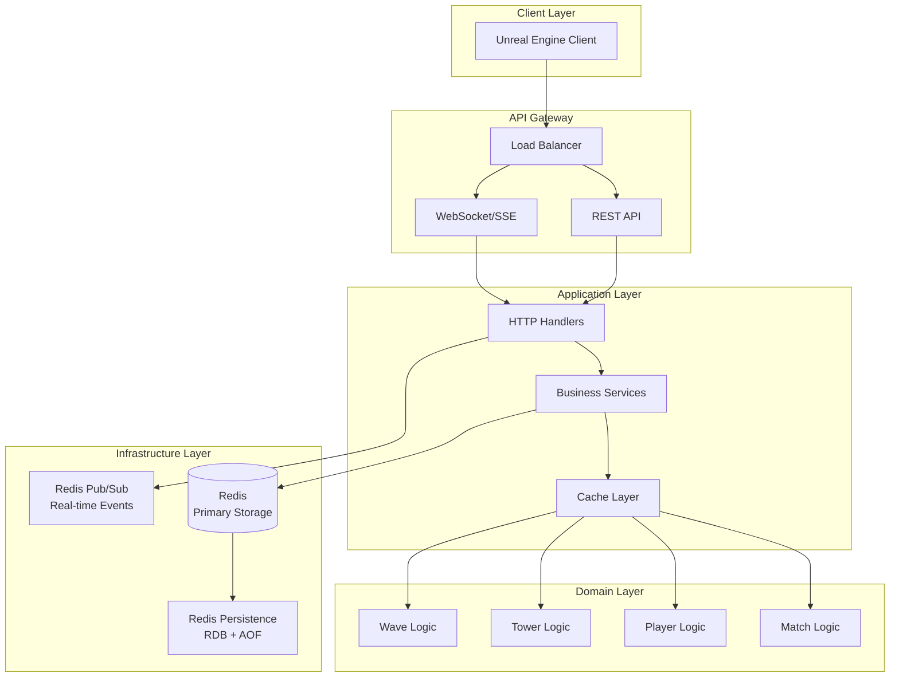
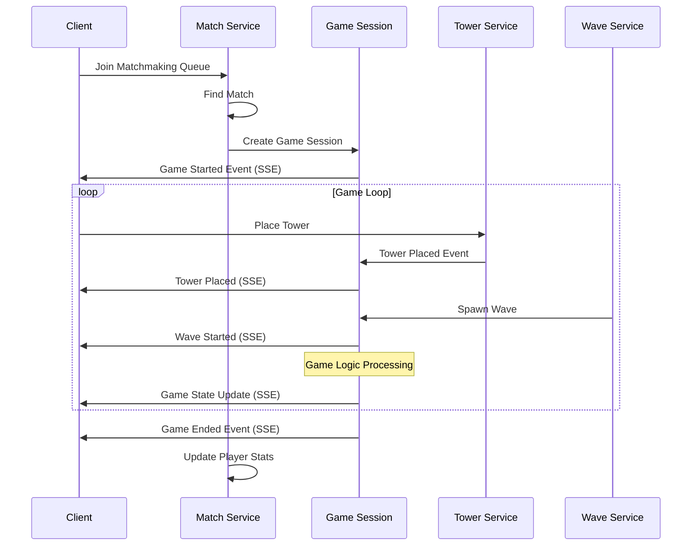

# Defense Allies Server (함께 막아요)

[](https://golang.org/)
[](LICENSE)

**Defense Allies**는 협력 기반 실시간 타워 디펜스 게임의 백엔드 서버입니다.

## 🎮 게임 개요

- **장르**: 협력 멀티플레이어 타워 디펜스
- **플랫폼**: PC (언리얼 엔진 클라이언트)
- **매치 시스템**: 실시간 매칭 및 게임 세션 관리
- **핵심 특징**: 팀워크 기반 방어 전략, 실시간 협력 플레이

## 🏗️ 아키텍처

본 프로젝트는 **Redis 중심의 단순화된 아키텍처**를 채택하여 빠른 개발과 높은 성능을 추구합니다.



## 🛠️ 기술 스택

### 백엔드
- **언어**: Go 1.21+
- **웹 프레임워크**: net/http (표준 라이브러리) + Gorilla Mux
- **아키텍처**: Clean Architecture + Domain-Driven Design
- **데이터베이스**: Redis (Primary Storage + Cache + Pub/Sub)
- **데이터 지속성**: Redis RDB + AOF (Append Only File)
- **실시간 통신**: WebSocket + Server-Sent Events
- **메시징**: Redis Pub/Sub

### Redis 활용 전략
- **Primary Storage**: 모든 게임 데이터를 Redis에 저장
- **Cache Layer**: 빈번히 접근하는 데이터 캐싱
- **Session Management**: 게임 세션 및 플레이어 상태 관리
- **Real-time Events**: Redis Pub/Sub를 통한 실시간 이벤트 처리
- **Data Persistence**: RDB 스냅샷 + AOF 로그를 통한 데이터 영속성 보장

### 데이터 형식
- **JSON 중심**: 모든 API 통신 및 데이터 저장
- **실시간 이벤트**: WebSocket + Server-Sent Events (SSE)
- **API**: RESTful JSON API

### 개발 도구
- **의존성 관리**: Go Modules
- **Redis 클라이언트**: go-redis/redis
- **테스팅**: Testify + Redis 테스트 컨테이너
- **문서화**: godoc + OpenAPI 3.0
- **모니터링**: Redis 내장 모니터링 + Prometheus (예정)

## 📁 프로젝트 구조

```
defense-allies-server/
├── server/                        # 백엔드 서버
│   ├── cmd/
│   │   └── server/
│   │       └── main.go            # 애플리케이션 엔트리포인트
│   ├── internal/
│   │   ├── domain/                # 도메인 레이어
│   │   │   ├── match/             # 매치 관리 로직
│   │   │   │   ├── service.go
│   │   │   │   ├── models.go
│   │   │   │   └── repository.go
│   │   │   ├── player/            # 플레이어 관리
│   │   │   │   ├── service.go
│   │   │   │   ├── models.go
│   │   │   │   └── repository.go
│   │   │   ├── tower/             # 타워 시스템
│   │   │   ├── enemy/             # 적 관리
│   │   │   ├── wave/              # 웨이브 시스템
│   │   │   └── session/           # 게임 세션
│   │   ├── handlers/              # HTTP 핸들러
│   │   │   ├── match_handler.go
│   │   │   ├── player_handler.go
│   │   │   ├── game_handler.go
│   │   │   └── websocket_handler.go
│   │   ├── services/              # 비즈니스 서비스
│   │   │   ├── match_service.go
│   │   │   ├── player_service.go
│   │   │   ├── game_service.go
│   │   │   └── realtime_service.go
│   │   ├── repository/            # 데이터 접근 레이어
│   │   │   ├── redis/             # Redis 구현체
│   │   │   │   ├── client.go
│   │   │   │   ├── match_repo.go
│   │   │   │   ├── player_repo.go
│   │   │   │   └── session_repo.go
│   │   │   └── interfaces.go      # Repository 인터페이스
│   │   ├── models/                # 데이터 모델
│   │   │   ├── match.go
│   │   │   ├── player.go
│   │   │   ├── tower.go
│   │   │   └── game_state.go
│   │   └── middleware/            # HTTP 미들웨어
│   │       ├── auth.go
│   │       ├── cors.go
│   │       └── logging.go
│   ├── pkg/                       # 공통 패키지
│   │   ├── redis/                 # Redis 유틸리티
│   │   ├── websocket/             # WebSocket 유틸리티
│   │   ├── utils/                 # 공통 유틸리티
│   │   └── monitoring/            # 모니터링 유틸리티
│   ├── configs/                   # 설정 파일
│   │   ├── config.go
│   │   ├── local.yaml
│   │   ├── staging.yaml
│   │   └── production.yaml
│   ├── deployments/               # 배포 관련
│   │   ├── docker/
│   │   │   ├── Dockerfile
│   │   │   └── docker-compose.yml
│   │   └── k8s/
│   └── tests/                     # 테스트
│       ├── unit/
│       ├── integration/
│       └── load/
├── client/                        # 웹 클라이언트 (React)
│   ├── public/                    # 정적 파일
│   │   ├── index.html
│   │   ├── favicon.ico
│   │   └── manifest.json
│   ├── src/                       # React 소스 코드
│   │   ├── components/            # 재사용 가능한 컴포넌트
│   │   │   ├── common/            # 공통 컴포넌트
│   │   │   ├── game/              # 게임 관련 컴포넌트
│   │   │   │   ├── GameBoard.tsx
│   │   │   │   ├── Tower.tsx
│   │   │   │   ├── Enemy.tsx
│   │   │   │   └── GameUI.tsx
│   │   │   ├── lobby/             # 로비 컴포넌트
│   │   │   │   ├── PlayerList.tsx
│   │   │   │   ├── MatchMaking.tsx
│   │   │   │   └── RoomSettings.tsx
│   │   │   └── auth/              # 인증 컴포넌트
│   │   │       ├── Login.tsx
│   │   │       └── Register.tsx
│   │   ├── pages/                 # 페이지 컴포넌트
│   │   │   ├── HomePage.tsx
│   │   │   ├── GamePage.tsx
│   │   │   ├── LobbyPage.tsx
│   │   │   └── ProfilePage.tsx
│   │   ├── hooks/                 # 커스텀 훅
│   │   │   ├── useWebSocket.ts
│   │   │   ├── useGameState.ts
│   │   │   └── useAuth.ts
│   │   ├── services/              # API 서비스
│   │   │   ├── api.ts             # API 클라이언트
│   │   │   ├── authService.ts     # 인증 서비스
│   │   │   ├── gameService.ts     # 게임 서비스
│   │   │   └── websocketService.ts # WebSocket 서비스
│   │   ├── store/                 # 상태 관리 (Redux/Zustand)
│   │   │   ├── slices/            # Redux 슬라이스
│   │   │   │   ├── authSlice.ts
│   │   │   │   ├── gameSlice.ts
│   │   │   │   └── lobbySlice.ts
│   │   │   └── index.ts
│   │   ├── types/                 # TypeScript 타입 정의
│   │   │   ├── game.ts
│   │   │   ├── player.ts
│   │   │   └── api.ts
│   │   ├── utils/                 # 유틸리티 함수
│   │   │   ├── constants.ts
│   │   │   ├── helpers.ts
│   │   │   └── validators.ts
│   │   ├── styles/                # 스타일 파일
│   │   │   ├── globals.css
│   │   │   ├── components/
│   │   │   └── pages/
│   │   ├── App.tsx                # 메인 앱 컴포넌트
│   │   ├── index.tsx              # 엔트리 포인트
│   │   └── setupTests.ts          # 테스트 설정
│   ├── package.json               # 의존성 관리
│   ├── package-lock.json
│   ├── tsconfig.json              # TypeScript 설정
│   ├── tailwind.config.js         # Tailwind CSS 설정
│   ├── vite.config.ts             # Vite 설정
│   └── .env.example               # 환경 변수 예시
└── doc/                          # 프로젝트 문서
    ├── api/                      # API 문서
    │   ├── openapi.yaml          # OpenAPI 스펙
    │   └── postman/              # Postman 컬렉션
    ├── architecture/             # 아키텍처 문서
    │   ├── system-design.md      # 시스템 설계
    │   ├── database-schema.md    # 데이터베이스 스키마
    │   └── deployment.md         # 배포 가이드
    ├── game-design/              # 게임 디자인 문서
    │   ├── game-mechanics.md     # 게임 메커니즘
    │   ├── tower-system.md       # 타워 시스템
    │   └── multiplayer.md        # 멀티플레이어 설계
    ├── development/              # 개발 가이드
    │   ├── setup.md              # 개발 환경 설정
    │   ├── coding-standards.md   # 코딩 표준
    │   └── testing.md            # 테스트 가이드
    └── assets/                   # 문서용 이미지/다이어그램
        ├── diagrams/             # 아키텍처 다이어그램
        └── screenshots/          # 스크린샷
```

## 🏗️ 서버 아키텍처 구성

Defense Allies Server는 3개의 핵심 서버와 지원 서버로 구성됩니다:

### 🛡️ **GuardianApp (인증 서버)**
*"성문 수비대 - 모든 입장을 통제하는 관문"*
- 플레이어 인증 및 권한 관리
- JWT 토큰 발급 및 검증
- 세션 관리 및 보안
- 라우트: `/api/v1/auth/*`

### 🏙️ **TimeSquareApp (게임 서버)**
*"타임스퀘어 - 모든 플레이어가 모이는 활동 중심지"*
- 실시간 타워 디펜스 게임 로직
- 매치메이킹 및 협력 플레이
- SSE 기반 실시간 이벤트 스트리밍
- 라우트: `/api/v1/game/*`, `/api/v1/events/*`

### ⚡ **CommandApp (운영 서버)**
*"사령부 - 전체 시스템을 관리하는 통제 센터"*
- 시스템 모니터링 및 관리
- 관리자 도구 및 백오피스
- 통계, 분석 및 리포팅
- 라우트: `/api/v1/admin/*`, `/api/v1/stats/*`

### 🏥 **HealthApp (지원 서버)**
- 헬스체크 및 시스템 상태 모니터링
- 라우트: `/health`, `/metrics`

## 🎯 핵심 도메인

### 게임 매치 플로우



### Redis 데이터 구조

1. **Match Data**: 매치메이킹 큐 및 게임 세션 정보
   - `match:queue:*` - 매치메이킹 큐
   - `match:session:*` - 활성 게임 세션
   - `match:history:*` - 매치 기록

2. **Player Data**: 플레이어 상태 및 통계
   - `player:*` - 플레이어 기본 정보
   - `player:stats:*` - 플레이어 통계
   - `player:session:*` - 현재 세션 정보

3. **Game State**: 실시간 게임 상태
   - `game:state:*` - 게임 상태 스냅샷
   - `game:towers:*` - 타워 배치 정보
   - `game:waves:*` - 웨이브 진행 상황

4. **Real-time Events**: 실시간 이벤트 처리
   - Redis Pub/Sub 채널을 통한 실시간 통신
   - `events:game:*` - 게임 이벤트 채널
   - `events:match:*` - 매치 이벤트 채널

## 🚀 시작하기

### 필수 요구사항

- Go 1.21 이상
- Redis 7.0+ (RDB + AOF 지속성 설정 권장)

### 설치 및 실행

```bash
# 레포지토리 클론
git clone https://github.com/homveloper/defense-allies-server.git
cd defense-allies-server

# 의존성 설치
go mod download

# Redis 서버 시작 (로컬 개발용)
redis-server --appendonly yes --save 60 1000

# 개발 서버 실행
cd server
go run cmd/server/main.go
```

### Docker로 실행

```bash
# Docker Compose로 Redis + 서버 실행
docker-compose up -d

# 개별 컨테이너 실행
docker run -d --name redis -p 6379:6379 redis:7-alpine redis-server --appendonly yes
docker run -p 8080:8080 --link redis:redis defense-allies-server
```

### 환경 변수 설정

```bash
# .env 파일 생성
REDIS_HOST=localhost
REDIS_PORT=6379
REDIS_PASSWORD=
REDIS_DB=0
SERVER_PORT=8080
SERVER_HOST=localhost
```

## 📚 API 문서

### 주요 엔드포인트

```yaml
# 🛡️ GuardianApp (인증 서버)
POST /api/v1/auth/register           # 플레이어 등록
POST /api/v1/auth/login              # 로그인
POST /api/v1/auth/logout             # 로그아웃
GET  /api/v1/auth/profile            # 프로필 조회
POST /api/v1/auth/refresh            # 토큰 갱신

# 🏙️ TimeSquareApp (게임 서버)
POST /api/v1/game/match/join         # 매치 참가
GET  /api/v1/game/match/status       # 매치 상태
POST /api/v1/game/match/leave        # 매치 떠나기
GET  /api/v1/game/{gameId}/state     # 게임 상태
POST /api/v1/game/{gameId}/towers    # 타워 배치
POST /api/v1/game/{gameId}/actions   # 게임 액션
GET  /api/v1/events/subscribe        # SSE 이벤트 구독

# ⚡ CommandApp (운영 서버)
GET  /api/v1/admin/stats             # 시스템 통계
GET  /api/v1/admin/players           # 플레이어 관리
GET  /api/v1/admin/games             # 게임 관리
POST /api/v1/admin/config            # 설정 변경
GET  /api/v1/stats/leaderboard       # 리더보드

# 🏥 HealthApp (지원 서버)
GET  /health                         # 기본 헬스체크
GET  /health/detailed                # 상세 헬스체크
GET  /metrics                        # 시스템 메트릭
```

자세한 API 문서는 [doc/api/](doc/api/) 폴더를 참조하세요.

## 🧪 테스트

```bash
# 서버 디렉토리로 이동
cd server

# 단위 테스트
go test ./...

# 통합 테스트
go test -tags=integration ./tests/integration/...

# 부하 테스트
go test -tags=load ./tests/load/...

# 커버리지 확인
go test -coverprofile=coverage.out ./...
go tool cover -html=coverage.out
```

## 📊 모니터링

### 핵심 메트릭

- **게임 성능**: 매치 생성 시간, 게임 세션 지속 시간
- **서버 성능**: API 응답 시간, 이벤트 처리 지연
- **비즈니스 메트릭**: 동시 접속자 수, 매치 성공률

### 헬스체크

```bash
# 서버 상태 확인
curl http://localhost:8080/health

# 상세 상태 확인
curl http://localhost:8080/health/detailed
```

## 🤝 기여하기

1. Fork the repository
2. Create a feature branch (`git checkout -b feature/amazing-feature`)
3. Commit your changes (`git commit -m 'Add amazing feature'`)
4. Push to the branch (`git push origin feature/amazing-feature`)
5. Open a Pull Request

## 📋 로드맵

### Phase 1: 기본 인프라 구축 (1개월)
- [x] 프로젝트 초기 설정
- [x] Redis 기반 아키텍처 설계
- [ ] Redis 클라이언트 및 연결 관리
- [ ] 기본 플레이어 관리 시스템
- [ ] 매치메이킹 큐 시스템

### Phase 2: 게임 로직 구현 (1.5개월)
- [ ] 기본 타워 디펜스 게임 로직
- [ ] 실시간 게임 상태 관리
- [ ] WebSocket 기반 실시간 통신
- [ ] 게임 세션 관리

### Phase 3: 고급 기능 (지속적)
- [ ] 플레이어 통계 및 랭킹 (Redis Sorted Sets)
- [ ] 게임 리플레이 시스템
- [ ] 실시간 관전 기능
- [ ] 성능 최적화 및 모니터링

### Redis 최적화 계획
- [ ] Redis 클러스터링 (확장성)
- [ ] Redis Streams를 활용한 이벤트 로깅
- [ ] Redis 메모리 최적화
- [ ] 백업 및 복구 전략

## 📄 라이선스

이 프로젝트는 [MIT License](LICENSE) 하에 배포됩니다.

## 📞 연락처

- **개발팀**: dev@defense-allies.com
- **이슈 트래킹**: [GitHub Issues](https://github.com/homveloper/defense-allies-server/issues)
- **문서**: [프로젝트 문서](doc/)

---

**Defense Allies** - 함께하는 방어의 재미! 🛡️⚔️