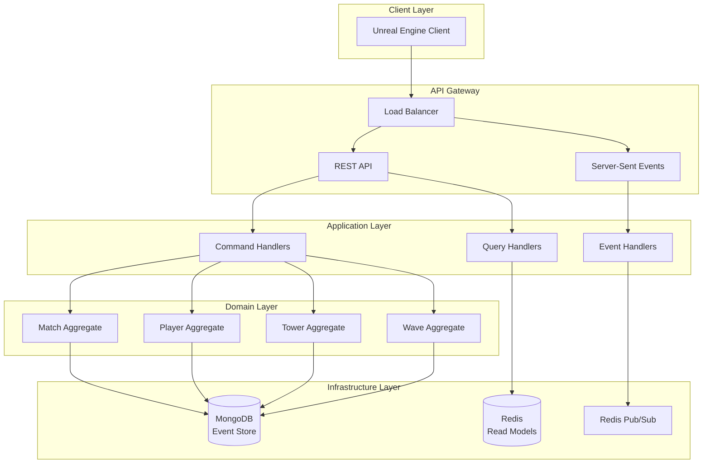
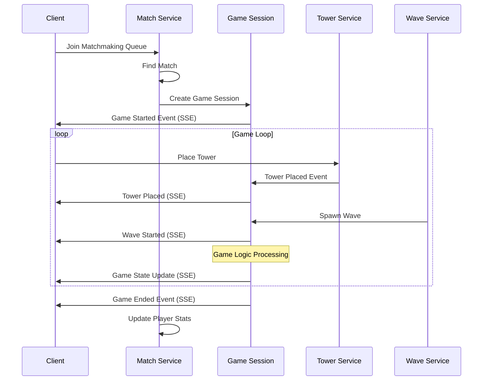

# Defense Allies Server (함께 막아요)

[](https://golang.org/)
[](LICENSE)

**Defense Allies**는 협력 기반 실시간 타워 디펜스 게임의 백엔드 서버입니다.

## 🎮 게임 개요

- **장르**: 협력 멀티플레이어 타워 디펜스
- **플랫폼**: PC (언리얼 엔진 클라이언트)
- **매치 시스템**: 실시간 매칭 및 게임 세션 관리
- **핵심 특징**: 팀워크 기반 방어 전략, 실시간 협력 플레이

## 🏗️ 아키텍처

본 프로젝트는 **Event Sourcing + CQRS** 패턴을 기반으로 한 **Clean Architecture**를 채택합니다.



## 🛠️ 기술 스택

### 백엔드
- **언어**: Go 1.21+
- **웹 프레임워크**: net/http (표준 라이브러리)
- **아키텍처**: Clean Architecture + DDD + Event Sourcing + CQRS
- **데이터베이스**: MongoDB (Event Store), Redis (Read Models & Cache)
- **메시징**: Redis Pub/Sub
- **통신**: HTTP REST API + Server-Sent Events

### 데이터 형식
- **JSON 중심**: JSON, JSON-RPC, JSON-Logic, JSON-Merge-Patch
- **실시간 이벤트**: Server-Sent Events (SSE)
- **API**: RESTful JSON API

### 개발 도구
- **의존성 관리**: Go Modules
- **테스팅**: Testify
- **문서화**: godoc + OpenAPI 3.0
- **모니터링**: Prometheus + Grafana (예정)

## 📁 프로젝트 구조

```
defense-allies-server/
├── cmd/
│   └── server/
│       └── main.go                 # 애플리케이션 엔트리포인트
├── internal/
│   ├── domain/                     # 도메인 레이어
│   │   ├── match/                  # 매치 관리
│   │   │   ├── aggregate.go
│   │   │   ├── events.go
│   │   │   └── repository.go
│   │   ├── player/                 # 플레이어 관리
│   │   ├── tower/                  # 타워 시스템
│   │   ├── enemy/                  # 적 관리
│   │   ├── wave/                   # 웨이브 시스템
│   │   └── session/                # 게임 세션
│   ├── application/                # 애플리케이션 레이어
│   │   ├── commands/               # Command Handlers
│   │   ├── queries/                # Query Handlers
│   │   └── events/                 # Event Handlers
│   ├── infrastructure/             # 인프라스트럭처 레이어
│   │   ├── eventstore/             # Event Store 구현
│   │   ├── readmodel/              # Read Model 구현
│   │   ├── messaging/              # Message Bus 구현
│   │   └── integration/            # 외부 시스템 연동
│   └── interfaces/                 # 인터페이스 레이어
│       ├── http/                   # HTTP API
│       ├── sse/                    # Server-Sent Events
│       └── health/                 # 헬스체크
├── pkg/                           # 공통 패키지
│   ├── eventstore/                # Event Store 추상화
│   ├── messaging/                 # Message Bus 추상화
│   └── monitoring/                # 모니터링 유틸리티
├── config/                        # 설정 파일
│   ├── local.yaml
│   ├── staging.yaml
│   └── production.yaml
├── deployments/                   # 배포 관련
│   ├── docker/
│   └── k8s/
├── docs/                         # 문서
│   ├── api/                      # API 문서
│   ├── architecture/             # 아키텍처 문서
│   └── game-design/              # 게임 디자인 문서
└── tests/                        # 테스트
    ├── unit/
    ├── integration/
    └── load/
```

## 🎯 핵심 도메인

### 게임 매치 플로우



### 주요 Aggregates

1. **Match Aggregate**: 매치메이킹 및 게임 세션 관리
2. **Player Aggregate**: 플레이어 상태 및 통계 관리
3. **Tower Aggregate**: 타워 배치 및 업그레이드 관리
4. **Wave Aggregate**: 적 웨이브 생성 및 관리
5. **Session Aggregate**: 실시간 게임 세션 상태 관리

## 🚀 시작하기

### 필수 요구사항

- Go 1.21 이상
- MongoDB 6.0+
- Redis 7.0+

### 설치 및 실행

```bash
# 레포지토리 클론
git clone https://github.com/homveloper/defense-allies-server.git
cd defense-allies-server

# 의존성 설치
go mod download

# 로컬 설정 파일 생성
cp config/local.yaml.example config/local.yaml

# 개발 서버 실행
go run cmd/server/main.go
```

### Docker로 실행

```bash
# Docker Compose로 전체 스택 실행
docker-compose up -d

# 서버만 실행
docker run -p 8080:8080 defense-allies-server
```

## 📚 API 문서

### 주요 엔드포인트

```yaml
# 매치메이킹
POST /api/v1/matchmaking/queue
GET  /api/v1/matchmaking/status

# 게임 세션
POST /api/v1/games/{gameId}/towers
GET  /api/v1/games/{gameId}/state
POST /api/v1/games/{gameId}/actions

# 실시간 이벤트
GET  /api/v1/events/subscribe
```

자세한 API 문서는 [docs/api/](docs/api/) 폴더를 참조하세요.

## 🧪 테스트

```bash
# 단위 테스트
go test ./...

# 통합 테스트
go test -tags=integration ./tests/integration/...

# 부하 테스트
go test -tags=load ./tests/load/...

# 커버리지 확인
go test -coverprofile=coverage.out ./...
go tool cover -html=coverage.out
```

## 📊 모니터링

### 핵심 메트릭

- **게임 성능**: 매치 생성 시간, 게임 세션 지속 시간
- **서버 성능**: API 응답 시간, 이벤트 처리 지연
- **비즈니스 메트릭**: 동시 접속자 수, 매치 성공률

### 헬스체크

```bash
# 서버 상태 확인
curl http://localhost:8080/health

# 상세 상태 확인
curl http://localhost:8080/health/detailed
```

## 🤝 기여하기

1. Fork the repository
2. Create a feature branch (`git checkout -b feature/amazing-feature`)
3. Commit your changes (`git commit -m 'Add amazing feature'`)
4. Push to the branch (`git push origin feature/amazing-feature`)
5. Open a Pull Request

## 📋 로드맵

### Phase 1: 기본 게임 서버 (2개월)
- [x] 프로젝트 초기 설정
- [ ] Event Sourcing + CQRS 인프라 구축
- [ ] 매치메이킹 시스템
- [ ] 기본 타워 디펜스 게임 로직

### Phase 2: 실시간 멀티플레이어 (1개월)
- [ ] Server-Sent Events 실시간 통신
- [ ] 협력 플레이 메커니즘
- [ ] 게임 밸런싱

### Phase 3: 고급 기능 (지속적)
- [ ] 플레이어 통계 및 랭킹
- [ ] 토너먼트 시스템
- [ ] 실시간 관전 기능

## 📄 라이선스

이 프로젝트는 [MIT License](LICENSE) 하에 배포됩니다.

## 📞 연락처

- **개발팀**: dev@defense-allies.com
- **이슈 트래킹**: [GitHub Issues](https://github.com/homveloper/defense-allies-server/issues)
- **문서**: [프로젝트 Wiki](https://github.com/homveloper/defense-allies-server/wiki)

---

**Defense Allies** - 함께하는 방어의 재미! 🛡️⚔️