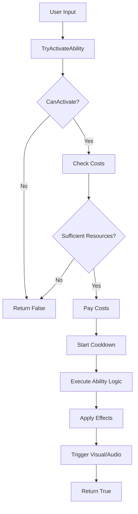
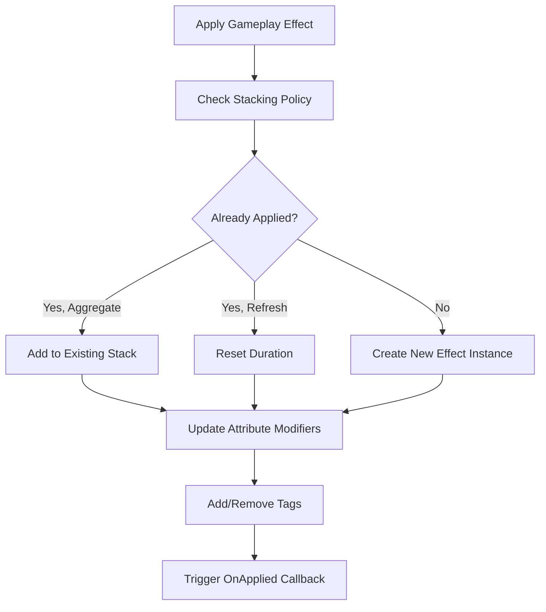

# Minimal Legion - Gameplay Ability System (GAS) Architecture

## 📋 Overview

This document outlines the design and architecture for a minimal Gameplay Ability System (GAS) inspired by Unreal Engine's GAS, tailored for the Minimal Legion game using Phaser 3 and TypeScript.

## 🎯 Goals

- **Modular Design**: Components that can be mixed and matched
- **Performance**: Optimized for web games with 60fps
- **Flexibility**: Easy to extend with new abilities and effects
- **Clean Code**: Well-structured, testable, and maintainable
- **Phaser Integration**: Seamless integration with existing Phaser entities

## 🏗️ Core Architecture Components

### 1. Ability System Component (ASC)
The central hub that manages all ability-related functionality for an entity.

```typescript
interface IAbilitySystemComponent {
  // Core Properties
  owner: Phaser.GameObjects.GameObject;
  attributes: Map<string, GameplayAttribute>;
  abilities: Map<string, GameplayAbility>;
  activeEffects: Map<string, GameplayEffect>;
  tags: Set<string>;
  
  // Core Methods
  grantAbility(ability: GameplayAbility): void;
  tryActivateAbility(abilityId: string, payload?: any): boolean;
  applyGameplayEffect(effect: GameplayEffectSpec): void;
  removeGameplayEffect(effectId: string): void;
  update(deltaTime: number): void;
}
```

### 2. Gameplay Attributes
Numeric properties like Health, Mana, Attack Power, etc.

```typescript
interface GameplayAttribute {
  name: string;
  baseValue: number;
  currentValue: number;
  modifiers: AttributeModifier[];
  
  // Computed properties
  readonly finalValue: number;
  readonly maxValue?: number;
}

interface AttributeModifier {
  id: string;
  operation: 'add' | 'multiply' | 'override';
  magnitude: number;
  source: string;
}
```

### 3. Gameplay Abilities
Represent skills, spells, attacks, or any activatable behavior.

```typescript
abstract class GameplayAbility {
  abstract id: string;
  abstract name: string;
  abstract description: string;
  
  // Costs and Requirements
  costs: AbilityCost[];
  cooldown: number;
  requiredTags: string[];
  blockedByTags: string[];
  
  // Lifecycle Methods
  abstract canActivate(context: AbilityContext): boolean;
  abstract activate(context: AbilityContext): Promise<boolean>;
  abstract onAbilityEnd(context: AbilityContext): void;
  
  // Utility Methods
  protected createGameplayEffect(spec: GameplayEffectSpec): GameplayEffect;
  protected applyEffectToTarget(target: IAbilitySystemComponent, effect: GameplayEffect): void;
}
```

### 4. Gameplay Effects
Modify attributes, apply tags, or create temporary/permanent changes.

```typescript
interface GameplayEffect {
  id: string;
  name: string;
  duration: number; // -1 for infinite
  period: number; // for periodic effects
  
  // Modifiers
  attributeModifiers: AttributeModifier[];
  grantedTags: string[];
  removedTags: string[];
  
  // Stacking
  stackingPolicy: 'none' | 'aggregate' | 'refresh';
  maxStacks: number;
  
  // Lifecycle
  onApplied?(target: IAbilitySystemComponent): void;
  onRemoved?(target: IAbilitySystemComponent): void;
  onPeriodic?(target: IAbilitySystemComponent): void;
}
```

### 5. Gameplay Tags
Hierarchical string-based tags for state management and conditional logic.

```typescript
class GameplayTagSystem {
  private tags: Set<string> = new Set();
  
  addTag(tag: string): void;
  removeTag(tag: string): void;
  hasTag(tag: string): boolean;
  hasAnyTag(tags: string[]): boolean;
  hasAllTags(tags: string[]): boolean;
  
  // Hierarchical support: "Character.State.Stunned" matches "Character.State.*"
  matchesPattern(pattern: string): boolean;
}
```

## 🔄 System Flow

### Ability Activation Flow


### Effect Application Flow


## 📁 File Structure

```
src/components/minimal-legion/systems/ability-system/
├── core/
│   ├── AbilitySystemComponent.ts      # Main ASC implementation
│   ├── GameplayAttribute.ts           # Attribute system
│   ├── GameplayAbility.ts             # Base ability class
│   ├── GameplayEffect.ts              # Effect system
│   └── GameplayTagSystem.ts           # Tag management
├── abilities/
│   ├── player/
│   │   ├── FireballAbility.ts         # Example player ability
│   │   ├── HealingAbility.ts          # Example healing ability
│   │   └── ShieldAbility.ts           # Example defensive ability
│   └── enemy/
│       ├── ChargeAbility.ts           # Example enemy ability
│       └── SummonAbility.ts           # Example summoning ability
├── effects/
│   ├── DamageEffect.ts                # Instant damage effect
│   ├── HealOverTimeEffect.ts          # Periodic healing
│   ├── BuffEffect.ts                  # Stat modifications
│   └── DebuffEffect.ts                # Negative effects
├── types/
│   ├── AbilityTypes.ts                # Core type definitions
│   └── EffectTypes.ts                 # Effect-related types
└── utils/
    ├── AbilityFactory.ts              # Factory for creating abilities
    ├── EffectFactory.ts               # Factory for creating effects
    └── AttributeCalculator.ts         # Attribute calculation utilities
```

## 🎮 Integration with Existing Systems

### Player Integration
```typescript
// Enhanced Player class with ASC
export class Player extends Phaser.GameObjects.Container {
  public abilitySystem: AbilitySystemComponent;
  
  constructor(scene: Phaser.Scene, x: number, y: number) {
    super(scene, x, y);
    
    // Initialize ability system
    this.abilitySystem = new AbilitySystemComponent(this);
    
    // Setup base attributes
    this.abilitySystem.addAttribute('health', 100, 100);
    this.abilitySystem.addAttribute('mana', 50, 50);
    this.abilitySystem.addAttribute('attackPower', 25);
    
    // Grant starting abilities
    this.abilitySystem.grantAbility(new BasicAttackAbility());
  }
}
```

### Enemy Integration
```typescript
// Enhanced Enemy class with ASC
export class Enemy extends Phaser.GameObjects.Container {
  public abilitySystem: AbilitySystemComponent;
  
  constructor(scene: Phaser.Scene, x: number, y: number, enemyType: EnemyTypeConfig) {
    super(scene, x, y);
    
    this.abilitySystem = new AbilitySystemComponent(this);
    
    // Setup attributes based on enemy type
    this.setupAttributesFromType(enemyType);
    
    // Grant abilities based on enemy type
    this.setupAbilitiesFromType(enemyType);
  }
}
```

## 📊 Performance Considerations

### Optimization Strategies
1. **Object Pooling**: Reuse effect and ability instances
2. **Lazy Evaluation**: Calculate attribute values only when needed
3. **Event Batching**: Group multiple attribute changes
4. **Memory Management**: Clean up expired effects and cooldowns
5. **Update Frequency**: Different update rates for different systems

### Memory Management
```typescript
class PerformanceOptimizations {
  // Pool for reusing effect instances
  private effectPool: Map<string, GameplayEffect[]> = new Map();
  
  // Batch attribute updates
  private attributeUpdateQueue: AttributeUpdate[] = [];
  
  // Clean up expired effects
  cleanupExpiredEffects(): void;
  
  // Process batched updates
  processBatchedUpdates(): void;
}
```

## 🧪 Testing Strategy

### Unit Tests
- Individual component functionality
- Attribute calculations
- Effect stacking logic
- Tag system operations

### Integration Tests
- Ability activation flow
- Effect application and removal
- Cross-component interactions

### Performance Tests
- Load testing with many active effects
- Memory leak detection
- Frame rate impact measurement

## 🔮 Future Extensions

### Planned Features
1. **Networked Abilities**: Multiplayer support
2. **Animation Integration**: Seamless animation triggers
3. **UI Integration**: Ability bars and cooldown displays
4. **Save/Load**: Persistent ability configurations
5. **Mod Support**: Pluggable ability definitions

### Extensibility Points
- Custom attribute types
- Custom effect behaviors
- Custom activation conditions
- Visual effect hooks
- Audio integration points

## 📝 Implementation Notes

### Phase 1: Core System
- Implement basic ASC, attributes, and simple abilities
- Focus on player abilities first
- Basic testing and validation

### Phase 2: Effects System
- Implement gameplay effects
- Add duration, stacking, and periodic effects
- Integrate with visual feedback

### Phase 3: Advanced Features
- Enemy ability integration
- Complex ability interactions
- Performance optimizations

### Phase 4: Polish
- UI integration
- Animation synchronization
- Comprehensive testing
- Documentation completion

---

*This architecture document will be updated as the system evolves during implementation.*