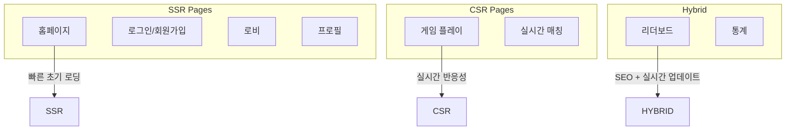
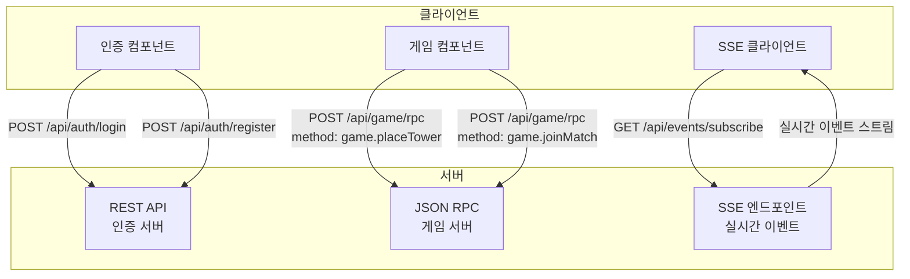

# Defense Allies Client App 설계 문서

## 📋 개요

Defense Allies의 웹 클라이언트는 React + Next.js 기반의 현대적인 웹 애플리케이션으로, 실시간 협력 타워 디펜스 게임을 제공합니다.

## 🛠️ 기술 스택

### 핵심 프레임워크
- **React 18+**: 컴포넌트 기반 UI 라이브러리
- **Next.js 14+**: 풀스택 React 프레임워크
  - App Router 사용 (최신 라우팅 시스템)
  - Server-Side Rendering (SSR) for SEO & 초기 로딩 최적화
  - Client-Side Rendering (CSR) for 게임 플레이 부분
- **TypeScript**: 정적 타입 검사 및 개발 생산성 향상

### 스타일링
- **Tailwind CSS**: 유틸리티 퍼스트 CSS 프레임워크
  - 빠른 개발 속도
  - 일관된 디자인 시스템
  - 반응형 디자인 지원
- **CSS Modules**: 컴포넌트별 스타일 격리
  - 게임 UI 컴포넌트의 복잡한 스타일링
  - 네임스페이스 충돌 방지

### 상태 관리
- **Zustand**: 경량 상태 관리 라이브러리
  - Redux보다 간단한 API
  - TypeScript 친화적
  - 게임 상태 관리에 최적화
- **TanStack Query (React Query)**: 서버 상태 관리
  - API 캐싱 및 동기화
  - 백그라운드 업데이트
  - 오프라인 지원

### 실시간 통신
- **REST API**: 인증 관련 HTTP 통신
- **JSON RPC**: 게임 서버 API 통신 (HTTP POST 기반)
- **Server-Sent Events (SSE)**: 서버→클라이언트 실시간 이벤트 스트리밍

### 빌드 시스템
- **Turbopack**: Next.js 14+의 새로운 번들러
  - Webpack 대비 최대 10배 빠른 빌드
  - 증분 빌드 지원
  - 개발 서버 Hot Reload 최적화

### 테스팅
- **Jest**: 단위 테스트 프레임워크
- **React Testing Library**: React 컴포넌트 테스트
- **Playwright**: E2E 테스트
  - 크로스 브라우저 테스트
  - 게임 플로우 자동화 테스트
- **MSW (Mock Service Worker)**: API 모킹

### 게임 렌더링
- **React Three Fiber**: React용 Three.js 렌더러
- **@react-three/drei**: R3F 유틸리티 라이브러리
- **@react-three/postprocessing**: 포스트 프로세싱 효과
- **@react-spring/three**: 3D 애니메이션 라이브러리
- **Three.js**: WebGL 3D 라이브러리

### 개발 도구
- **ESLint + Prettier**: 코드 품질 및 포맷팅
- **Husky + lint-staged**: Git 훅 관리
- **Storybook**: 컴포넌트 문서화 및 개발

## 🏗️ 아키텍처 설계

### 렌더링 전략



### 폴더 구조

```
client/
├── app/                          # Next.js App Router
│   ├── (auth)/                   # 인증 관련 페이지 그룹
│   │   ├── login/
│   │   └── register/
│   ├── (game)/                   # 게임 관련 페이지 그룹
│   │   ├── lobby/
│   │   ├── play/
│   │   └── spectate/
│   ├── api/                      # API Routes (Next.js)
│   │   ├── auth/
│   │   └── proxy/                # 백엔드 프록시
│   ├── globals.css
│   ├── layout.tsx                # 루트 레이아웃
│   ├── page.tsx                  # 홈페이지
│   └── loading.tsx               # 로딩 UI
├── components/                   # 재사용 가능한 컴포넌트
│   ├── ui/                       # 기본 UI 컴포넌트
│   │   ├── Button.tsx
│   │   ├── Modal.tsx
│   │   └── Input.tsx
│   ├── game/                     # 게임 관련 컴포넌트
│   │   ├── GameBoard/
│   │   │   ├── index.tsx
│   │   │   ├── GameBoard.module.css
│   │   │   └── GameBoard.stories.tsx
│   │   ├── Tower/
│   │   ├── Enemy/
│   │   └── GameUI/
│   ├── lobby/                    # 로비 컴포넌트
│   │   ├── PlayerList/
│   │   ├── MatchMaking/
│   │   └── RoomSettings/
│   └── layout/                   # 레이아웃 컴포넌트
│       ├── Header/
│       ├── Sidebar/
│       └── Footer/
├── hooks/                        # 커스텀 훅
│   ├── useSSE.ts                 # Server-Sent Events 훅
│   ├── useJsonRPC.ts             # JSON RPC 통신 훅
│   ├── useGameState.ts           # 게임 상태 훅
│   ├── useAuth.ts                # 인증 훅
│   └── useLocalStorage.ts        # 로컬 스토리지 훅
├── lib/                          # 유틸리티 라이브러리
│   ├── api.ts                    # REST API 클라이언트
│   ├── jsonrpc.ts                # JSON RPC 클라이언트
│   ├── sse.ts                    # Server-Sent Events 클라이언트
│   ├── auth.ts                   # 인증 유틸리티
│   ├── game-engine.ts            # 게임 엔진 로직
│   └── utils.ts                  # 공통 유틸리티
├── stores/                       # Zustand 스토어
│   ├── authStore.ts              # 인증 상태
│   ├── gameStore.ts              # 게임 상태
│   ├── lobbyStore.ts             # 로비 상태
│   └── uiStore.ts                # UI 상태
├── types/                        # TypeScript 타입 정의
│   ├── api.ts                    # REST API 타입
│   ├── jsonrpc.ts                # JSON RPC 타입
│   ├── sse.ts                    # SSE 이벤트 타입
│   ├── game.ts                   # 게임 타입
│   └── player.ts                 # 플레이어 타입
├── styles/                       # 글로벌 스타일
│   ├── globals.css
│   └── components.css
├── public/                       # 정적 파일
│   ├── images/
│   ├── sounds/
│   └── icons/
├── __tests__/                    # 테스트 파일
│   ├── components/
│   ├── hooks/
│   ├── lib/
│   └── e2e/                      # Playwright E2E 테스트
├── .storybook/                   # Storybook 설정
├── next.config.js                # Next.js 설정
├── tailwind.config.js            # Tailwind CSS 설정
├── tsconfig.json                 # TypeScript 설정
├── jest.config.js                # Jest 설정
├── playwright.config.ts          # Playwright 설정
└── package.json
```

## 🎮 게임 렌더링 아키텍처

### React Three Fiber 기반 2D 게임 렌더링

React Three Fiber(R3F)를 사용하여 2D 타워 디펜스 게임을 구현합니다. 3D 엔진의 성능과 유연성을 활용하면서도 간단한 2D 기하학적 도형으로 게임을 구현합니다.

#### 1. **React Three Fiber + 2D Sprites** (권장 방식)

```typescript
import { Canvas } from '@react-three/fiber';
import { OrthographicCamera } from '@react-three/drei';
import * as THREE from 'three';

// React Three Fiber 기반 게임 보드
interface GameBoardProps {
  gameState: GameState;
  onTowerPlace: (position: Position, towerType: TowerType) => void;
}

const GameBoard: React.FC<GameBoardProps> = ({ gameState, onTowerPlace }) => {
  return (
    <div className="game-container" style={{ width: '800px', height: '600px' }}>
      <Canvas>
        {/* 2D 뷰를 위한 직교 카메라 */}
        <OrthographicCamera
          makeDefault
          position={[0, 0, 10]}
          zoom={1}
          left={-400}
          right={400}
          top={300}
          bottom={-300}
        />

        {/* 조명 */}
        <ambientLight intensity={0.8} />
        <directionalLight position={[10, 10, 5]} intensity={0.5} />

        {/* 게임 요소들 */}
        <GameScene
          gameState={gameState}
          onTowerPlace={onTowerPlace}
        />
      </Canvas>
    </div>
  );
};

// 게임 씬 컴포넌트
const GameScene: React.FC<{ gameState: GameState; onTowerPlace: Function }> = ({
  gameState,
  onTowerPlace
}) => {
  return (
    <group>
      {/* 맵 배경 (평면) */}
      <MapBackground />

      {/* 경로 */}
      <GamePath points={gameState.path} />

      {/* 타워들 */}
      {gameState.towers.map(tower => (
        <Tower3D
          key={tower.id}
          tower={tower}
          onClick={() => onTowerPlace(tower.position, tower.type)}
        />
      ))}

      {/* 적들 */}
      {gameState.enemies.map(enemy => (
        <Enemy3D
          key={enemy.id}
          enemy={enemy}
        />
      ))}

      {/* 투사체들 */}
      {gameState.projectiles.map(projectile => (
        <Projectile3D
          key={projectile.id}
          projectile={projectile}
        />
      ))}
    </group>
  );
};

// 2D 스타일 타워 컴포넌트 (3D 공간에서 평면으로)
const Tower3D: React.FC<{ tower: TowerData; onClick: () => void }> = ({
  tower,
  onClick
}) => {
  const meshRef = useRef<THREE.Mesh>(null);

  return (
    <group position={[tower.x, tower.y, 0]}>
      {/* 타워 사거리 표시 (원형 평면) */}
      <mesh rotation={[-Math.PI / 2, 0, 0]} position={[0, 0, -0.1]}>
        <ringGeometry args={[tower.range - 2, tower.range, 32]} />
        <meshBasicMaterial
          color="green"
          transparent
          opacity={0.2}
        />
      </mesh>

      {/* 타워 본체 (정사각형 평면) */}
      <mesh
        ref={meshRef}
        onClick={onClick}
        position={[0, 0, 0]}
      >
        <planeGeometry args={[40, 40]} />
        <meshBasicMaterial color={tower.color} />
      </mesh>

      {/* 타워 레벨 텍스트 (Sprite 사용) */}
      <TowerLevelText level={tower.level} />
    </group>
  );
};

// 2D 스타일 적 컴포넌트
const Enemy3D: React.FC<{ enemy: EnemyData }> = ({ enemy }) => {
  const meshRef = useRef<THREE.Mesh>(null);

  // 적 이동 애니메이션
  useFrame(() => {
    if (meshRef.current) {
      meshRef.current.position.x = enemy.x;
      meshRef.current.position.y = enemy.y;
    }
  });

  return (
    <group>
      {/* 적 본체 (원형 평면) */}
      <mesh ref={meshRef} position={[enemy.x, enemy.y, 0]}>
        <circleGeometry args={[16, 16]} />
        <meshBasicMaterial color={enemy.color} />
      </mesh>

      {/* 체력바 */}
      <HealthBar
        position={[enemy.x, enemy.y + 25, 0]}
        health={enemy.health}
        maxHealth={enemy.maxHealth}
      />
    </group>
  );
};

// 투사체 컴포넌트
const Projectile3D: React.FC<{ projectile: ProjectileData }> = ({ projectile }) => {
  return (
    <mesh position={[projectile.x, projectile.y, 0]}>
      <sphereGeometry args={[4, 8, 8]} />
      <meshBasicMaterial color="yellow" />
    </mesh>
  );
};

// 맵 배경
const MapBackground: React.FC = () => {
  return (
    <mesh rotation={[-Math.PI / 2, 0, 0]} position={[0, 0, -1]}>
      <planeGeometry args={[800, 600]} />
      <meshBasicMaterial color="#2d5a27" />
    </mesh>
  );
};

// 게임 경로
const GamePath: React.FC<{ points: Position[] }> = ({ points }) => {
  const pathGeometry = useMemo(() => {
    const curve = new THREE.CatmullRomCurve3(
      points.map(p => new THREE.Vector3(p.x, p.y, 0))
    );
    return new THREE.TubeGeometry(curve, 64, 20, 8, false);
  }, [points]);

  return (
    <mesh geometry={pathGeometry} position={[0, 0, -0.5]}>
      <meshBasicMaterial color="#8B4513" />
    </mesh>
  );
};

// 체력바 컴포넌트
const HealthBar: React.FC<{
  position: [number, number, number];
  health: number;
  maxHealth: number;
}> = ({ position, health, maxHealth }) => {
  const healthPercent = health / maxHealth;

  return (
    <group position={position}>
      {/* 배경 */}
      <mesh>
        <planeGeometry args={[30, 4]} />
        <meshBasicMaterial color="red" />
      </mesh>
      {/* 체력 */}
      <mesh position={[-(30 * (1 - healthPercent)) / 2, 0, 0.01]}>
        <planeGeometry args={[30 * healthPercent, 4]} />
        <meshBasicMaterial color="green" />
      </mesh>
    </group>
  );
};
```

#### 2. **React Three Fiber + 애니메이션** (고급 효과)

```typescript
import { useSpring, animated } from '@react-spring/three';
import { useFrame } from '@react-three/fiber';

// 애니메이션이 적용된 타워 컴포넌트
const AnimatedTower: React.FC<{ tower: TowerData }> = ({ tower }) => {
  const [hovered, setHovered] = useState(false);

  // 스프링 애니메이션
  const { scale, color } = useSpring({
    scale: hovered ? 1.2 : 1,
    color: hovered ? '#ff6b6b' : tower.color,
    config: { tension: 300, friction: 10 }
  });

  return (
    <animated.group
      position={[tower.x, tower.y, 0]}
      scale={scale}
      onPointerEnter={() => setHovered(true)}
      onPointerLeave={() => setHovered(false)}
    >
      <animated.mesh>
        <boxGeometry args={[40, 40, 10]} />
        <animated.meshBasicMaterial color={color} />
      </animated.mesh>
    </animated.group>
  );
};

// 파티클 시스템을 활용한 폭발 효과
const ExplosionEffect: React.FC<{ position: Position }> = ({ position }) => {
  const particlesRef = useRef<THREE.Points>(null);
  const [particles] = useState(() => {
    const positions = new Float32Array(100 * 3);
    const velocities = new Float32Array(100 * 3);

    for (let i = 0; i < 100; i++) {
      positions[i * 3] = position.x;
      positions[i * 3 + 1] = position.y;
      positions[i * 3 + 2] = 0;

      velocities[i * 3] = (Math.random() - 0.5) * 10;
      velocities[i * 3 + 1] = (Math.random() - 0.5) * 10;
      velocities[i * 3 + 2] = Math.random() * 5;
    }

    return { positions, velocities };
  });

  useFrame(() => {
    if (particlesRef.current) {
      const positions = particlesRef.current.geometry.attributes.position.array as Float32Array;

      for (let i = 0; i < 100; i++) {
        positions[i * 3] += particles.velocities[i * 3] * 0.1;
        positions[i * 3 + 1] += particles.velocities[i * 3 + 1] * 0.1;
        positions[i * 3 + 2] += particles.velocities[i * 3 + 2] * 0.1;
      }

      particlesRef.current.geometry.attributes.position.needsUpdate = true;
    }
  });

  return (
    <points ref={particlesRef}>
      <bufferGeometry>
        <bufferAttribute
          attach="attributes-position"
          count={100}
          array={particles.positions}
          itemSize={3}
        />
      </bufferGeometry>
      <pointsMaterial color="orange" size={2} />
    </points>
  );
};
```

#### 3. **React Three Fiber + 인스턴싱** (대량 객체 최적화)

```typescript
import { InstancedMesh } from '@react-three/drei';

// 대량의 적을 효율적으로 렌더링
const EnemyInstances: React.FC<{ enemies: EnemyData[] }> = ({ enemies }) => {
  const meshRef = useRef<THREE.InstancedMesh>(null);
  const tempObject = useMemo(() => new THREE.Object3D(), []);

  useFrame(() => {
    if (!meshRef.current) return;

    enemies.forEach((enemy, index) => {
      tempObject.position.set(enemy.x, enemy.y, 0);
      tempObject.scale.setScalar(enemy.size);
      tempObject.updateMatrix();

      meshRef.current!.setMatrixAt(index, tempObject.matrix);
      meshRef.current!.setColorAt(index, new THREE.Color(enemy.color));
    });

    meshRef.current.instanceMatrix.needsUpdate = true;
    if (meshRef.current.instanceColor) {
      meshRef.current.instanceColor.needsUpdate = true;
    }
  });

  return (
    <instancedMesh ref={meshRef} args={[undefined, undefined, enemies.length]}>
      <circleGeometry args={[16, 16]} />
      <meshBasicMaterial />
    </instancedMesh>
  );
};
```

#### 4. **React Three Fiber + 포스트 프로세싱** (시각 효과)

```typescript
import { EffectComposer, Bloom, Noise } from '@react-three/postprocessing';

const GameBoardWithEffects: React.FC = () => {
  return (
    <Canvas>
      <OrthographicCamera makeDefault position={[0, 0, 10]} />

      {/* 게임 씬 */}
      <GameScene />

      {/* 포스트 프로세싱 효과 */}
      <EffectComposer>
        <Bloom
          intensity={0.5}
          luminanceThreshold={0.9}
          luminanceSmoothing={0.025}
        />
        <Noise opacity={0.02} />
      </EffectComposer>
    </Canvas>
  );
};

// 글로우 효과가 있는 타워
const GlowTower: React.FC<{ tower: TowerData }> = ({ tower }) => {
  return (
    <group position={[tower.x, tower.y, 0]}>
      {/* 메인 타워 */}
      <mesh>
        <boxGeometry args={[40, 40, 10]} />
        <meshBasicMaterial color={tower.color} />
      </mesh>

      {/* 글로우 효과 (밝은 색상으로 블룸 효과 트리거) */}
      <mesh scale={1.2}>
        <boxGeometry args={[40, 40, 10]} />
        <meshBasicMaterial
          color={tower.isActive ? '#ffffff' : tower.color}
          transparent
          opacity={0.3}
        />
      </mesh>
    </group>
  );
};
```

### React Three Fiber 성능 최적화 전략

1. **React.memo**: 불필요한 리렌더링 방지
2. **useMemo/useCallback**: 계산 비용이 큰 연산 메모이제이션
3. **Three.js 최적화**:
   - **인스턴싱**: 동일한 지오메트리의 대량 객체 렌더링
   - **LOD (Level of Detail)**: 거리에 따른 디테일 조절
   - **Frustum Culling**: 화면 밖 객체 렌더링 제외
   - **Object Pooling**: 객체 재사용으로 GC 압박 감소
4. **코드 스플리팅**: 게임 모듈 지연 로딩
5. **useFrame 최적화**: 불필요한 프레임 업데이트 방지

```typescript
// 성능 최적화 예시
const OptimizedGameScene: React.FC = () => {
  // 객체 풀링
  const enemyPool = useMemo(() => new Array(100).fill(null).map(() => ({
    mesh: new THREE.Mesh(),
    inUse: false
  })), []);

  // LOD 시스템
  const TowerWithLOD: React.FC<{ tower: TowerData; distance: number }> = ({
    tower,
    distance
  }) => {
    const geometry = useMemo(() => {
      if (distance < 100) {
        return <cylinderGeometry args={[20, 20, 40, 16]} />; // 고품질
      } else if (distance < 200) {
        return <cylinderGeometry args={[20, 20, 40, 8]} />; // 중품질
      } else {
        return <boxGeometry args={[40, 40, 40]} />; // 저품질
      }
    }, [distance]);

    return (
      <mesh position={[tower.x, tower.y, 0]}>
        {geometry}
        <meshBasicMaterial color={tower.color} />
      </mesh>
    );
  };

  return <group>{/* 게임 요소들 */}</group>;
};
```

## 🔄 상태 관리 설계

### Zustand 스토어 구조

```typescript
// 게임 상태 스토어
interface GameStore {
  // 상태
  gameState: GameState | null;
  isPlaying: boolean;
  selectedTower: TowerType | null;

  // 액션
  setGameState: (state: GameState) => void;
  placeTower: (position: Position, type: TowerType) => void;
  selectTower: (type: TowerType) => void;

  // 비동기 액션
  joinGame: (gameId: string) => Promise<void>;
  leaveGame: () => Promise<void>;
}
```

### 서버 상태 관리 (TanStack Query + JSON RPC)

```typescript
// JSON RPC 기반 게임 API 훅
export const useGameState = (gameId: string) => {
  return useQuery({
    queryKey: ['game', gameId],
    queryFn: () => jsonRpcCall('game.getState', { gameId }),
    enabled: !!gameId,
    // SSE로 실시간 업데이트되므로 폴링 불필요
  });
};

export const usePlaceTower = () => {
  const queryClient = useQueryClient();

  return useMutation({
    mutationFn: ({ gameId, position, towerType }) =>
      jsonRpcCall('game.placeTower', { gameId, position, towerType }),
    onSuccess: () => {
      // SSE 이벤트로 상태가 업데이트되므로 즉시 무효화하지 않음
    },
  });
};

// REST API 기반 인증 훅
export const useLogin = () => {
  return useMutation({
    mutationFn: (credentials) => restApiCall('/api/auth/login', credentials),
    onSuccess: (data) => {
      // JWT 토큰 저장
      localStorage.setItem('token', data.token);
    },
  });
};
```

## 🔄 통신 아키텍처

### HTTP 기반 통신 전략



### 통신 방식별 역할

#### 1. REST API (인증 관련)
```typescript
// 인증 API 예시
interface AuthAPI {
  login: (credentials: LoginCredentials) => Promise<AuthResponse>;
  register: (userData: RegisterData) => Promise<AuthResponse>;
  logout: () => Promise<void>;
  refreshToken: () => Promise<TokenResponse>;
}

// 사용 예시
const authApi = {
  login: async (credentials) => {
    const response = await fetch('/api/auth/login', {
      method: 'POST',
      headers: { 'Content-Type': 'application/json' },
      body: JSON.stringify(credentials),
    });
    return response.json();
  },
};
```

#### 2. JSON RPC (게임 서버 API)
```typescript
// JSON RPC 클라이언트
interface JsonRpcRequest {
  jsonrpc: '2.0';
  method: string;
  params: any;
  id: string | number;
}

interface JsonRpcResponse {
  jsonrpc: '2.0';
  result?: any;
  error?: JsonRpcError;
  id: string | number;
}

// 게임 API 메서드
const gameRpcMethods = {
  'game.joinMatch': (params: { playerId: string }) => Promise<MatchInfo>,
  'game.placeTower': (params: { gameId: string, position: Position, towerType: TowerType }) => Promise<void>,
  'game.upgradeTower': (params: { gameId: string, towerId: string }) => Promise<void>,
  'game.getState': (params: { gameId: string }) => Promise<GameState>,
};

// JSON RPC 호출 함수
async function jsonRpcCall(method: string, params: any): Promise<any> {
  const request: JsonRpcRequest = {
    jsonrpc: '2.0',
    method,
    params,
    id: Date.now(),
  };

  const response = await fetch('/api/game/rpc', {
    method: 'POST',
    headers: {
      'Content-Type': 'application/json',
      'Authorization': `Bearer ${getToken()}`,
    },
    body: JSON.stringify(request),
  });

  const result: JsonRpcResponse = await response.json();

  if (result.error) {
    throw new Error(result.error.message);
  }

  return result.result;
}
```

#### 3. Server-Sent Events (실시간 이벤트)
```typescript
// SSE 이벤트 타입
interface SSEEvent {
  type: 'game.stateUpdate' | 'game.towerPlaced' | 'game.waveStarted' | 'match.playerJoined';
  data: any;
  timestamp: number;
}

// SSE 클라이언트
class SSEClient {
  private eventSource: EventSource | null = null;
  private listeners: Map<string, Function[]> = new Map();

  connect(gameId: string): void {
    this.eventSource = new EventSource(`/api/events/subscribe?gameId=${gameId}`, {
      headers: {
        'Authorization': `Bearer ${getToken()}`,
      },
    });

    this.eventSource.onmessage = (event) => {
      const sseEvent: SSEEvent = JSON.parse(event.data);
      this.handleEvent(sseEvent);
    };

    this.eventSource.onerror = (error) => {
      console.error('SSE connection error:', error);
      // 재연결 로직
      setTimeout(() => this.connect(gameId), 5000);
    };
  }

  private handleEvent(event: SSEEvent): void {
    const listeners = this.listeners.get(event.type) || [];
    listeners.forEach(listener => listener(event.data));
  }

  on(eventType: string, listener: Function): void {
    if (!this.listeners.has(eventType)) {
      this.listeners.set(eventType, []);
    }
    this.listeners.get(eventType)!.push(listener);
  }

  disconnect(): void {
    if (this.eventSource) {
      this.eventSource.close();
      this.eventSource = null;
    }
  }
}

// React 훅으로 SSE 사용
function useSSE(gameId: string) {
  const [sseClient] = useState(() => new SSEClient());

  useEffect(() => {
    if (gameId) {
      sseClient.connect(gameId);
    }

    return () => sseClient.disconnect();
  }, [gameId, sseClient]);

  const subscribe = useCallback((eventType: string, listener: Function) => {
    sseClient.on(eventType, listener);
  }, [sseClient]);

  return { subscribe };
}
```

### 통신 최적화 전략

1. **요청 배칭**: 여러 JSON RPC 호출을 하나의 배치로 처리
2. **캐싱**: TanStack Query로 API 응답 캐싱
3. **재연결**: SSE 연결 끊김 시 자동 재연결
4. **에러 처리**: 네트워크 오류 시 재시도 로직
5. **토큰 갱신**: JWT 토큰 만료 시 자동 갱신

## 📱 반응형 디자인

### 브레이크포인트 전략

```javascript
// tailwind.config.js
module.exports = {
  theme: {
    screens: {
      'mobile': '320px',
      'tablet': '768px',
      'desktop': '1024px',
      'wide': '1440px',
    },
  },
};
```

### 게임 UI 적응형 레이아웃

- **모바일**: 세로 모드, 터치 최적화 UI
- **태블릿**: 가로/세로 모드 지원, 제스처 인터페이스
- **데스크톱**: 마우스/키보드 최적화, 멀티 모니터 지원

## 🔐 보안 고려사항

### 클라이언트 보안

1. **API 토큰 관리**: httpOnly 쿠키 사용
2. **XSS 방지**: Content Security Policy 설정
3. **게임 치팅 방지**:
   - 중요한 게임 로직은 서버에서 검증
   - 클라이언트는 UI 렌더링만 담당
4. **Rate Limiting**: API 호출 제한

### Next.js 보안 설정

```javascript
// next.config.js
module.exports = {
  experimental: {
    turbo: {
      rules: {
        '*.svg': {
          loaders: ['@svgr/webpack'],
          as: '*.js',
        },
      },
    },
  },
  headers: async () => [
    {
      source: '/(.*)',
      headers: [
        {
          key: 'X-Content-Type-Options',
          value: 'nosniff',
        },
        {
          key: 'X-Frame-Options',
          value: 'DENY',
        },
      ],
    },
  ],
};
```

## 🚀 배포 전략

### Vercel 배포 (권장)

- **자동 배포**: Git 푸시 시 자동 배포
- **프리뷰 배포**: PR별 미리보기 환경
- **Edge Functions**: 글로벌 CDN 활용
- **Analytics**: 성능 모니터링

### 환경별 설정

```bash
# 환경 변수
NEXT_PUBLIC_API_URL=http://localhost:8080
NEXT_PUBLIC_WS_URL=ws://localhost:8080
NEXT_PUBLIC_ENVIRONMENT=development
```

## 📊 모니터링 및 분석

### 성능 모니터링

- **Core Web Vitals**: LCP, FID, CLS 추적
- **게임 성능**: FPS, 메모리 사용량 모니터링
- **에러 추적**: Sentry 연동

### 사용자 분석

- **게임 플레이 분석**: 플레이 시간, 승률, 이탈률
- **UI/UX 분석**: 클릭 히트맵, 사용자 플로우

이 문서는 Defense Allies 클라이언트 앱의 기술적 기반을 제공하며, 실제 구현 시 세부사항은 프로젝트 요구사항에 따라 조정될 수 있습니다.
