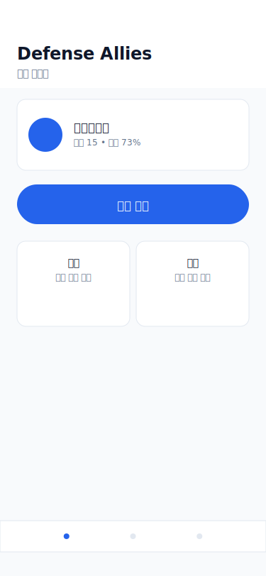
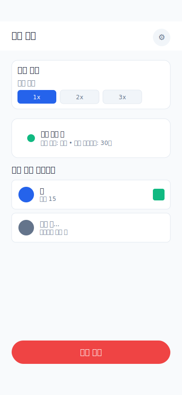
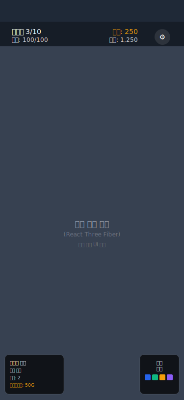
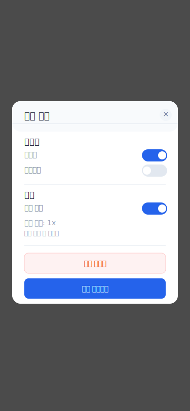
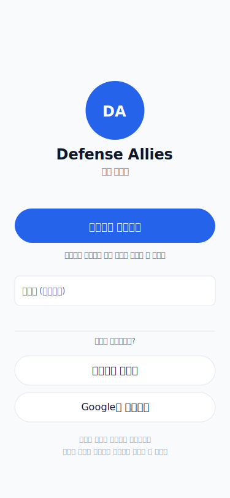
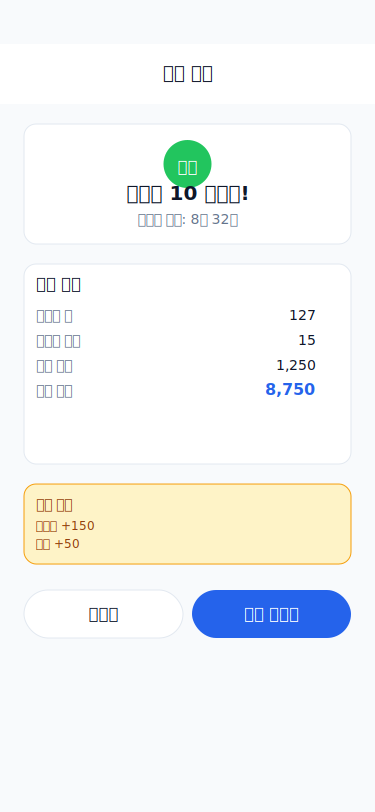

# Defense Allies UI/UX 설계 문서

## 🎯 설계 철학

### 핵심 목표
- **모바일 우선**: 세로 화면 비율 최적화
- **미니멀 디자인**: 불필요한 요소 제거, 핵심 기능에 집중
- **한 화면 한 목적**: 각 화면은 하나의 명확한 목적만 수행
- **직관적 네비게이션**: 최소한의 탭과 버튼으로 모든 기능 접근

### 디자인 원칙
1. **Less is More**: 정보 밀도 최소화
2. **Touch First**: 터치 인터페이스 우선 설계
3. **Visual Hierarchy**: 명확한 시각적 계층 구조
4. **Consistent**: 일관된 디자인 시스템

## 🎨 톤앤매너

### 컬러 팔레트
```
Primary Colors:
- Main: #2563EB (Blue-600) - 신뢰감, 안정감
- Secondary: #10B981 (Emerald-500) - 성장, 성공
- Accent: #F59E0B (Amber-500) - 주의, 강조

Neutral Colors:
- Background: #F8FAFC (Slate-50) - 깔끔한 배경
- Surface: #FFFFFF - 카드, 패널
- Text Primary: #0F172A (Slate-900) - 주요 텍스트
- Text Secondary: #64748B (Slate-500) - 보조 텍스트
- Border: #E2E8F0 (Slate-200) - 구분선

Game Colors:
- Success: #22C55E (Green-500) - 승리, 완료
- Warning: #EF4444 (Red-500) - 위험, 실패
- Info: #3B82F6 (Blue-500) - 정보, 알림
```

### 타이포그래피
```
Font Family: 'Inter', 'Pretendard', sans-serif

Heading Scale:
- H1: 24px / 32px (1.5rem / 2rem) - 페이지 제목
- H2: 20px / 28px (1.25rem / 1.75rem) - 섹션 제목
- H3: 18px / 24px (1.125rem / 1.5rem) - 서브 섹션

Body Scale:
- Large: 16px / 24px (1rem / 1.5rem) - 중요한 본문
- Regular: 14px / 20px (0.875rem / 1.25rem) - 일반 본문
- Small: 12px / 16px (0.75rem / 1rem) - 보조 정보

Weight:
- Bold: 600 - 제목, 강조
- Medium: 500 - 버튼, 라벨
- Regular: 400 - 일반 텍스트
```

### 스페이싱 시스템
```
Base Unit: 4px

Scale:
- xs: 4px (0.25rem)
- sm: 8px (0.5rem)
- md: 16px (1rem)
- lg: 24px (1.5rem)
- xl: 32px (2rem)
- 2xl: 48px (3rem)
```

## 📱 화면 구조

### 기본 레이아웃 (세로 화면)
```
Viewport: 375px × 812px (iPhone 13 기준)
Safe Area: 상단 44px, 하단 34px 여백

Layout Structure:
┌─────────────────────┐
│    Status Bar       │ 44px
├─────────────────────┤
│                     │
│    Main Content     │ 690px
│                     │
├─────────────────────┤
│   Bottom Nav        │ 44px
├─────────────────────┤
│    Safe Area        │ 34px
└─────────────────────┘
```

### 네비게이션 구조
```mermaid
graph TD
    A[홈 화면] --> B[로비]
    A --> C[프로필]
    A --> D[설정]

    B --> E[매치메이킹]
    B --> F[친구 목록]

    E --> G[게임 플레이]
    G --> H[게임 결과]
    H --> B

    C --> I[통계]
    C --> J[업적]

    D --> K[계정]
    D --> L[알림]
    D --> M[도움말]
```

## 🏠 화면별 설계

### 1. 홈 화면



### 2. 게임 로비



**핵심 특징**:
- **게임 속도 선택**: 매치 시작 전 모든 플레이어가 동일한 속도로 플레이
- **실시간 매칭**: 선택한 게임 속도에 맞는 플레이어와 매칭
- **투명한 정보**: 현재 설정과 예상 대기시간 표시

### 3. 인게임 UI



**핵심 특징**:
- **게임 영역 최대화**: 전체 화면의 88% 활용 (718px/812px)
- **미니멀 상단 바**: 핵심 정보만 표시 (웨이브, 체력, 골드, 점수)
- **오버레이 UI**: 타워 선택과 정보가 게임 화면 내부에 통합
- **설정 접근**: 우상단 설정 버튼으로 게임 옵션 및 나가기

**UI 구성**:
- **상단 정보 바** (50px): 게임 진행 상황과 리소스 정보
- **게임 영역** (718px): React Three Fiber 렌더링 + 오버레이 UI
- **타워 선택 패널**: 우하단 컴팩트한 타워 선택 인터페이스
- **타워 정보 패널**: 좌하단 선택된 타워의 상세 정보

### 3-1. 인게임 설정 모달



**설정 옵션**:
- **사운드 제어**: 효과음, 배경음악 토글
- **게임 옵션**: 화면 진동 설정
- **게임 정보**: 현재 게임 속도 표시 (읽기 전용)
- **게임 나가기**: 현재 게임 종료 및 로비 복귀

**게임 속도 정책**:
- 매치 시작 전 로비에서 선택
- 모든 플레이어가 동일한 속도로 플레이
- 게임 중 변경 불가 (공정성 보장)

## 🎮 인터랙션 패턴

### 터치 제스처
```mermaid
graph LR
    A[탭] --> B[타워 선택/배치]
    C[롱프레스] --> D[타워 정보/업그레이드]
    E[스와이프] --> F[게임 화면 이동]
    G[핀치] --> H[줌 인/아웃]
    I[드래그] --> J[타워 드래그 배치]
```

### 인게임 인터랙션
- **타워 배치**: 타워 선택 → 게임 맵 탭
- **타워 업그레이드**: 배치된 타워 탭 → 정보 패널 → 업그레이드 버튼
- **게임 설정**: 우상단 설정 버튼 → 모달 오픈
- **게임 나가기**: 설정 모달 → 게임 나가기 → 확인

### 피드백 시스템
- **햅틱**: 중요한 액션 시 진동 피드백
- **사운드**: 미니멀한 효과음
- **비주얼**: 부드러운 애니메이션과 상태 변화

## 📐 컴포넌트 시스템

### 기본 컴포넌트
```
Button Variants:
- Primary: 주요 액션 (게임 시작)
- Secondary: 보조 액션 (설정)
- Danger: 위험한 액션 (게임 종료)
- Ghost: 최소한의 액션 (취소)

Card Types:
- Default: 일반 정보 카드
- Interactive: 클릭 가능한 카드
- Status: 상태 표시 카드

Input Types:
- Text: 텍스트 입력
- Search: 검색 입력
- Select: 선택 입력
```

## 🔄 화면 플로우

### 사용자 여정 맵
```mermaid
journey
    title 게임 플레이 여정 (게스트 사용자)
    section 첫 진입
      앱 실행: 5: 사용자
      게스트로 시작 탭: 5: 사용자
      닉네임 입력 (선택): 4: 사용자
      홈 화면 진입: 5: 사용자
    section 게임 시작
      게임 시작 버튼 탭: 5: 사용자
      매치메이킹 대기: 3: 사용자
      상대방 매칭: 5: 사용자
    section 게임 플레이
      게임 화면 로드: 4: 사용자
      타워 배치: 5: 사용자
      웨이브 진행: 4: 사용자
      게임 완료: 5: 사용자
    section 결과 및 재플레이
      결과 확인: 4: 사용자
      다시 플레이: 5: 사용자
    section 계정 연동 (선택)
      프로필 확인: 3: 사용자
      계정 연동 고려: 2: 사용자
      Google 연동: 4: 사용자
```

### 정보 아키텍처
```mermaid
graph TD
    A[앱 시작] --> B{기존 계정 존재?}
    B -->|있음| C[홈 화면]
    B -->|없음| D[로그인 화면]

    D --> E[게스트로 시작] --> F[닉네임 입력] --> C
    D --> G[계정 로그인] --> C
    D --> H[Google 로그인] --> C

    C --> I[게임 시작]
    C --> J[프로필]
    C --> K[설정]

    I --> L[매치메이킹]
    L --> M[게임 로비]
    M --> N[인게임]
    N --> O[게임 결과]
    O --> P{다시 플레이?}
    P -->|예| L
    P -->|아니오| C

    J --> Q[통계]
    J --> R[업적]
    J --> S[계정 연동]

    K --> T[게임 설정]
    K --> U[알림 설정]
    K --> V[계정 관리]
```

## 🎯 상세 화면 설계

### 4. 로그인 화면



**핵심 특징**:
- **게스트 우선**: 회원가입 없이 바로 게임 시작
- **빠른 진입**: 닉네임만 입력하면 즉시 플레이 가능
- **선택적 계정**: 나중에 계정 연동으로 데이터 보관
- **미니멀 UI**: 필수 요소만 표시하여 진입 장벽 최소화

### 5. 게임 결과 화면



## 🧩 컴포넌트 라이브러리

### 버튼 컴포넌트
```mermaid
graph TD
    A[Button] --> B[Primary]
    A --> C[Secondary]
    A --> D[Danger]
    A --> E[Ghost]

    B --> F[Large - 48px]
    B --> G[Medium - 40px]
    B --> H[Small - 32px]

    F --> I[Full Width]
    F --> J[Auto Width]
```

### 카드 컴포넌트
```mermaid
graph TD
    A[Card] --> B[Default]
    A --> C[Interactive]
    A --> D[Status]

    B --> E[Padding: 16px]
    B --> F[Border Radius: 12px]
    B --> G[Shadow: sm]

    C --> H[Hover Effect]
    C --> I[Active State]

    D --> J[Success]
    D --> K[Warning]
    D --> L[Error]
    D --> M[Info]
```

## 📱 반응형 설계

### 브레이크포인트
```
Mobile Portrait: 375px (기본)
Mobile Landscape: 667px
Tablet Portrait: 768px
Tablet Landscape: 1024px
```

### 적응형 레이아웃
```mermaid
graph LR
    A[Mobile Portrait] --> B[Single Column]
    C[Mobile Landscape] --> D[Game Optimized]
    E[Tablet] --> F[Two Column]
```

## ♿ 접근성 고려사항

### WCAG 2.1 준수
- **색상 대비**: 최소 4.5:1 비율 유지
- **터치 타겟**: 최소 44px × 44px 크기
- **포커스 표시**: 명확한 포커스 링
- **스크린 리더**: 적절한 ARIA 라벨

### 다크 모드 지원
```
Dark Mode Colors:
- Background: #0F172A (Slate-900)
- Surface: #1E293B (Slate-800)
- Text Primary: #F8FAFC (Slate-50)
- Text Secondary: #94A3B8 (Slate-400)
- Border: #334155 (Slate-700)
```

이 설계는 모바일 우선, 미니멀 디자인을 중심으로 한 Defense Allies의 완전한 UI/UX 시스템을 제공합니다.
