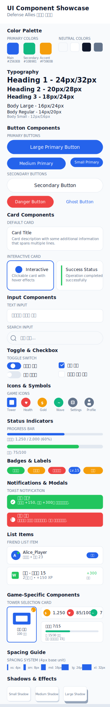
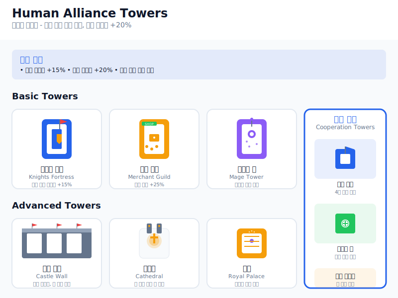
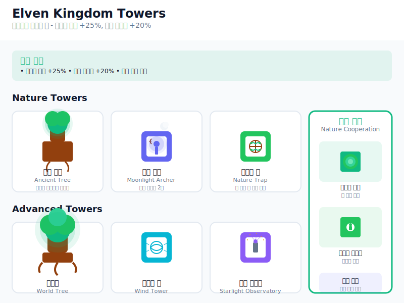
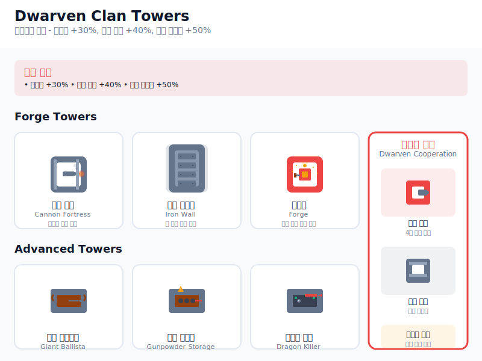
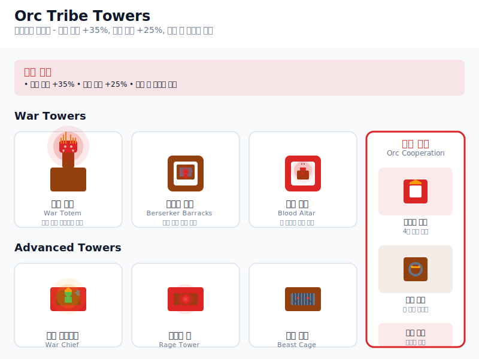
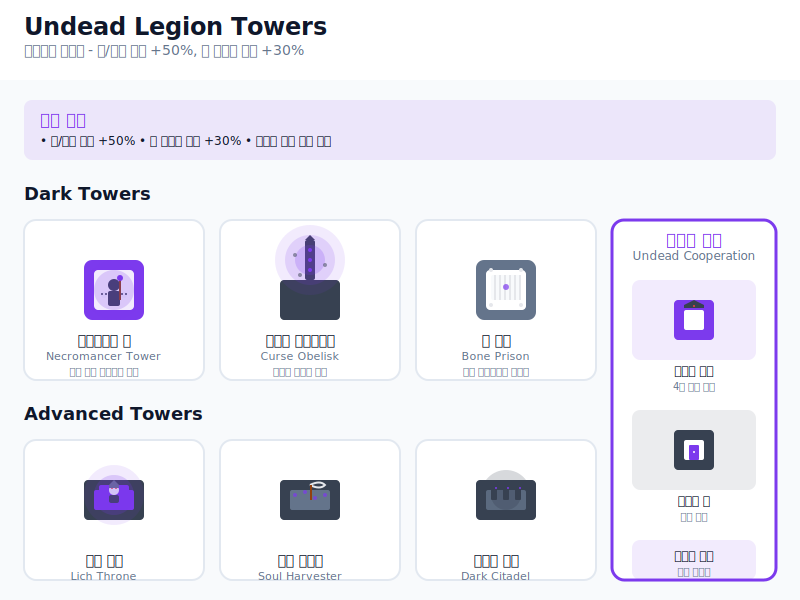
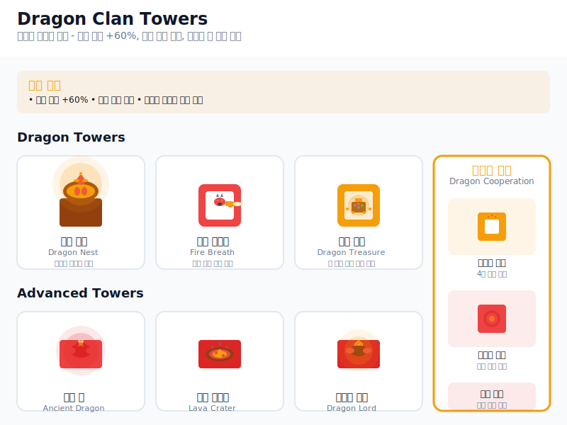
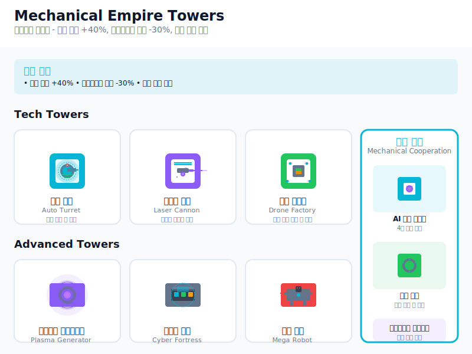

# Defense Allies UI/UX 설계 문서

## 🎯 설계 철학

### 핵심 목표
- **모바일 우선**: 세로 화면 비율 최적화
- **미니멀 디자인**: 불필요한 요소 제거, 핵심 기능에 집중
- **한 화면 한 목적**: 각 화면은 하나의 명확한 목적만 수행
- **직관적 네비게이션**: 최소한의 탭과 버튼으로 모든 기능 접근

### 디자인 원칙
1. **Less is More**: 정보 밀도 최소화
2. **Touch First**: 터치 인터페이스 우선 설계
3. **Visual Hierarchy**: 명확한 시각적 계층 구조
4. **Consistent**: 일관된 디자인 시스템


## 🎨 톤앤매너

### 컬러 팔레트
```
Primary Colors:
- Main: #2563EB (Blue-600) - 신뢰감, 안정감
- Secondary: #10B981 (Emerald-500) - 성장, 성공
- Accent: #F59E0B (Amber-500) - 주의, 강조

Neutral Colors:
- Background: #F8FAFC (Slate-50) - 깔끔한 배경
- Surface: #FFFFFF - 카드, 패널
- Text Primary: #0F172A (Slate-900) - 주요 텍스트
- Text Secondary: #64748B (Slate-500) - 보조 텍스트
- Border: #E2E8F0 (Slate-200) - 구분선

Game Colors:
- Success: #22C55E (Green-500) - 승리, 완료
- Warning: #EF4444 (Red-500) - 위험, 실패
- Info: #3B82F6 (Blue-500) - 정보, 알림
```

### 타이포그래피
```
Font Family: 'Inter', 'Pretendard', sans-serif

Heading Scale:
- H1: 24px / 32px (1.5rem / 2rem) - 페이지 제목
- H2: 20px / 28px (1.25rem / 1.75rem) - 섹션 제목
- H3: 18px / 24px (1.125rem / 1.5rem) - 서브 섹션

Body Scale:
- Large: 16px / 24px (1rem / 1.5rem) - 중요한 본문
- Regular: 14px / 20px (0.875rem / 1.25rem) - 일반 본문
- Small: 12px / 16px (0.75rem / 1rem) - 보조 정보

Weight:
- Bold: 600 - 제목, 강조
- Medium: 500 - 버튼, 라벨
- Regular: 400 - 일반 텍스트
```

### 스페이싱 시스템
```
Base Unit: 4px

Scale:
- xs: 4px (0.25rem)
- sm: 8px (0.5rem)
- md: 16px (1rem)
- lg: 24px (1.5rem)
- xl: 32px (2rem)
- 2xl: 48px (3rem)
```

## 📱 화면 구조

### 기본 레이아웃 (세로 화면)
```
Viewport: 375px × 812px (iPhone 13 기준)
Safe Area: 상단 44px, 하단 34px 여백

Layout Structure:
┌─────────────────────┐
│    Status Bar       │ 44px
├─────────────────────┤
│                     │
│    Main Content     │ 690px
│                     │
├─────────────────────┤
│   Bottom Nav        │ 44px
├─────────────────────┤
│    Safe Area        │ 34px
└─────────────────────┘
```

### 네비게이션 구조


## 🏠 화면별 설계

### 1. 홈 화면


### 2. 게임 로비


**핵심 특징**:
- **게임 속도 선택**: 매치 시작 전 모든 플레이어가 동일한 속도로 플레이
- **실시간 매칭**: 선택한 게임 속도에 맞는 플레이어와 매칭
- **투명한 정보**: 현재 설정과 예상 대기시간 표시

### 3. 인게임 UI


**핵심 특징**:
- **게임 영역 최대화**: 전체 화면의 88% 활용 (718px/812px)
- **미니멀 상단 바**: 핵심 정보만 표시 (웨이브, 체력, 골드, 점수)
- **오버레이 UI**: 타워 선택과 정보가 게임 화면 내부에 통합
- **설정 접근**: 우상단 설정 버튼으로 게임 옵션 및 나가기

**UI 구성**:
- **상단 정보 바** (50px): 게임 진행 상황과 리소스 정보
- **게임 영역** (718px): React Three Fiber 렌더링 + 오버레이 UI
- **타워 선택 패널**: 우하단 컴팩트한 타워 선택 인터페이스
- **타워 정보 패널**: 좌하단 선택된 타워의 상세 정보

### 3-1. 인게임 설정 모달


**설정 옵션**:
- **사운드 제어**: 효과음, 배경음악 토글
- **게임 옵션**: 화면 진동 설정
- **게임 정보**: 현재 게임 속도 표시 (읽기 전용)
- **게임 나가기**: 현재 게임 종료 및 로비 복귀

**게임 속도 정책**:
- 매치 시작 전 로비에서 선택
- 모든 플레이어가 동일한 속도로 플레이
- 게임 중 변경 불가 (공정성 보장)

## 🎮 인터랙션 패턴

### 터치 제스처


### 인게임 인터랙션
- **타워 배치**: 타워 선택 → 게임 맵 탭
- **타워 업그레이드**: 배치된 타워 탭 → 정보 패널 → 업그레이드 버튼
- **게임 설정**: 우상단 설정 버튼 → 모달 오픈
- **게임 나가기**: 설정 모달 → 게임 나가기 → 확인

### 피드백 시스템
- **햅틱**: 중요한 액션 시 진동 피드백
- **사운드**: 미니멀한 효과음
- **비주얼**: 부드러운 애니메이션과 상태 변화

## 📐 컴포넌트 시스템

### 기본 컴포넌트
```
Button Variants:
- Primary: 주요 액션 (게임 시작)
- Secondary: 보조 액션 (설정)
- Danger: 위험한 액션 (게임 종료)
- Ghost: 최소한의 액션 (취소)

Card Types:
- Default: 일반 정보 카드
- Interactive: 클릭 가능한 카드
- Status: 상태 표시 카드

Input Types:
- Text: 텍스트 입력
- Search: 검색 입력
- Select: 선택 입력
```

## 🔄 화면 플로우

### 사용자 여정 맵


### 정보 아키텍처


## 🎯 상세 화면 설계

### 4. 로그인 화면


**핵심 특징**:
- **게스트 우선**: 회원가입 없이 바로 게임 시작
- **빠른 진입**: 닉네임만 입력하면 즉시 플레이 가능
- **선택적 계정**: 나중에 계정 연동으로 데이터 보관
- **미니멀 UI**: 필수 요소만 표시하여 진입 장벽 최소화

### 5. 게임 결과 화면


### 6. 프로필 화면 (Profile Screen)


사용자 프로필, 통계, 업적 및 계정 연동 옵션을 제공합니다.

### 7. 설정 화면 (Settings Screen)


계정 관리, 알림 설정, 게임 관련 환경설정, 도움말 및 앱 정보 등을 제공합니다.

### 8. 친구 목록 화면 (Friend List Screen)


사용자의 친구 목록을 표시하고, 친구 추가 및 관리 기능을 제공합니다.

### 9. 매치메이킹 화면 (Matchmaking Screen)


게임 로비에서 매칭 시작 후 상대방을 찾는 동안 표시되는 화면입니다.

## 🧩 컴포넌트 라이브러리

### 버튼 컴포넌트


### 카드 컴포넌트


### 비주얼 컴포넌트 쇼케이스 (Visual Component Showcase)



Defense Allies의 완전한 UI 컴포넌트 라이브러리를 보여주는 종합 쇼케이스입니다. 다음 요소들을 포함합니다:

**기본 컴포넌트**:
- 컬러 팔레트 (Primary, Secondary, Neutral colors)
- 타이포그래피 시스템 (Heading 1-3, Body text variants)
- 버튼 컴포넌트 (Primary, Secondary, Danger, Ghost)
- 카드 컴포넌트 (Default, Interactive, Status)

**입력 및 상호작용**:
- 텍스트 입력 필드
- 검색 입력 필드
- 토글 스위치 및 체크박스

**게임 특화 요소**:
- 게임 아이콘 (타워, 체력, 골드, 웨이브)
- 상태 표시기 (진행률 바, 체력 바)
- 배지 및 라벨 (온라인 상태, 레벨, 랭크)
- 알림 시스템 (성공/오류 토스트)

**리스트 및 데이터 표시**:
- 친구 목록 아이템
- 게임 기록 아이템
- 타워 선택 카드
- 리소스 디스플레이

**디자인 시스템**:
- 스페이싱 가이드 (4px 기반 시스템)
- 그림자 효과 (Small, Medium, Large)

이 쇼케이스는 개발자와 디자이너가 일관된 UI를 구현할 수 있도록 하는 완전한 참조 가이드입니다.

### 타워 디자인 모크업 (Tower Design Mockups)

각 종족별 타워 디자인을 시각화한 상세 모크업 컬렉션입니다:

#### 인간 연합 (Human Alliance)

- **종족 특성**: 균형과 적응성, 모든 타워 건설 가능, 협력 보너스 +20%
- **기본 타워**: 기사단 요새, 상인 길드, 마법사 탑
- **고급 타워**: 성벽 요새, 대성당, 왕궁
- **협력 타워**: 연합 요새, 평화의 탑, 통합 지휘소

#### 엘프 왕국 (Elven Kingdom)

- **종족 특성**: 정밀함과 자연의 힘, 원거리 공격 +25%, 타워 사거리 +20%
- **기본 타워**: 고대 나무, 달빛 궁수, 자연의 덫
- **고급 타워**: 세계수, 바람의 탑, 별빛 관측소
- **협력 타워**: 생명의 나무, 자연의 수호자, 엘프 연합

#### 드워프 클랜 (Dwarven Clan)

- **종족 특성**: 견고함과 화력, 방어력 +30%, 폭발 공격 +40%, 타워 내구도 +50%
- **기본 타워**: 화포 요새, 철벽 방어막, 용광로
- **고급 타워**: 거대 발리스타, 화약 저장고, 드래곤 킬러
- **협력 타워**: 거대 화포, 요새 도시, 마스터 포지

#### 오크 부족 (Orc Tribe)

- **종족 특성**: 공격성과 재생력, 공격 속도 +35%, 체력 재생 +25%, 전투 중 공격력 증가
- **기본 타워**: 전쟁 토템, 광전사 막사, 피의 제단
- **고급 타워**: 전쟁 우두머리, 분노의 탑, 야수 우리
- **협력 타워**: 대족장 요새, 전쟁 드럼, 혈맹 제단

#### 언데드 군단 (Undead Legion)

- **종족 특성**: 지속성과 디버프, 독/저주 공격 +50%, 적 디버프 효과 +30%
- **기본 타워**: 네크로맨서 탑, 저주의 오벨리스크, 뼈 감옥
- **고급 타워**: 리치 왕좌, 영혼 수확기, 어둠의 성채
- **협력 타워**: 죽음의 군주, 영혼의 문, 영원한 저주

#### 드래곤 종족 (Dragon Clan)

- **종족 특성**: 압도적 화력과 위엄, 화염 공격 +60%, 공중 유닛 특화, 보스급 적 추가 피해
- **기본 타워**: 용의 둥지, 화염 브레스, 용의 보물
- **고급 타워**: 고대 용, 용암 분화구, 드래곤 로드
- **협력 타워**: 용왕의 궁전, 화염의 심장, 용의 분노

#### 천사 군단 (Angel Legion)

- **종족 특성**: 신성함과 치유, 신성 공격 +45%, 팀 치유 +40%, 악 속성 적에게 추가 피해
- **기본 타워**: 수호천사, 신성한 빛, 치유의 성소
- **고급 타워**: 대천사, 천국의 문, 신의 심판
- **협력 타워**: 천상의 요새, 신성한 합창, 최후의 심판

#### 기계 문명 (Mechanical Empire)

- **종족 특성**: 기술력과 자동화, 자동 수리 +40%, 업그레이드 비용 -30%, 연쇄 반응 공격
- **기본 타워**: 자동 터렛, 레이저 캐논, 드론 팩토리
- **고급 타워**: 플라즈마 제너레이터, 사이버 요새, 메가 로봇
- **협력 타워**: AI 중앙 컴퓨터, 나노 스웜, 테크놀로지 네트워크

각 타워 디자인은 종족의 고유한 특성과 테마를 반영하며, 게임 내에서 시각적으로 구별 가능하도록 설계되었습니다.

## 📱 반응형 설계

### 브레이크포인트
```
Mobile Portrait: 375px (기본)
Mobile Landscape: 667px
Tablet Portrait: 768px
Tablet Landscape: 1024px
```

### 적응형 레이아웃


## ♿ 접근성 고려사항

### WCAG 2.1 준수
- **색상 대비**: 최소 4.5:1 비율 유지
- **터치 타겟**: 최소 44px × 44px 크기
- **포커스 표시**: 명확한 포커스 링
- **스크린 리더**: 적절한 ARIA 라벨

### 다크 모드 지원
```
Dark Mode Colors:
- Background: #0F172A (Slate-900)
- Surface: #1E293B (Slate-800)
- Text Primary: #F8FAFC (Slate-50)
- Text Secondary: #94A3B8 (Slate-400)
- Border: #334155 (Slate-700)
```

이 설계는 모바일 우선, 미니멀 디자인을 중심으로 한 Defense Allies의 완전한 UI/UX 시스템을 제공합니다.
