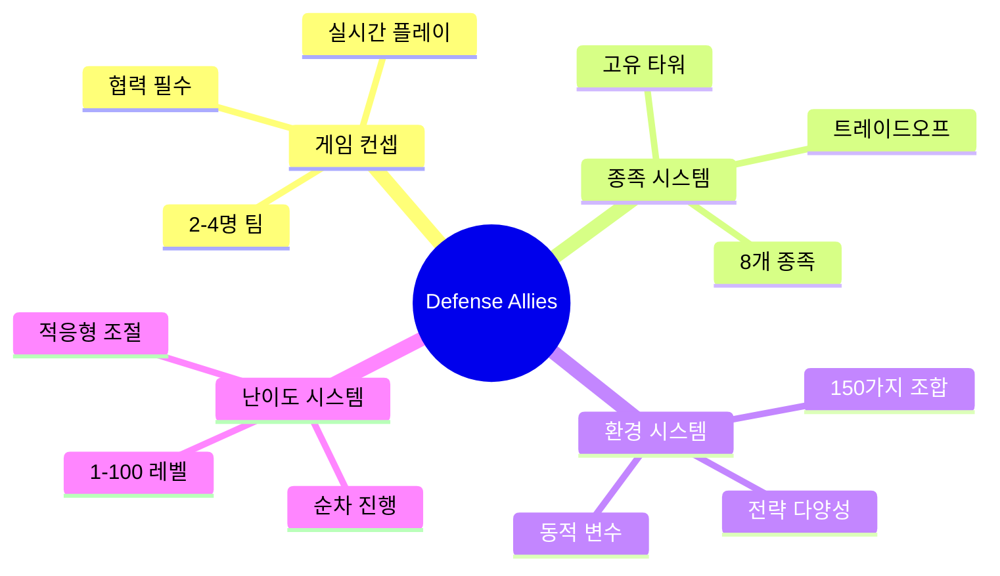
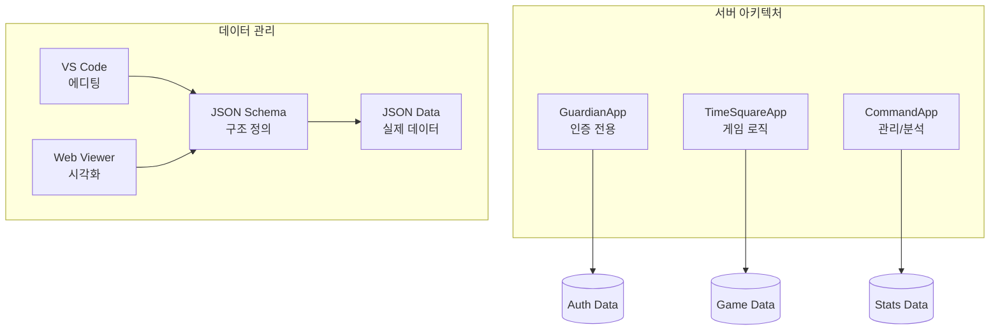

# Defense Allies 회의록 및 논의 기록

## 📋 개요
이 폴더는 Defense Allies 프로젝트 개발 과정에서 진행된 주요 회의와 논의 사항들을 기록합니다.

## 📚 회의록 목록

### 🎮 [게임 디자인 회의 #001](./game-design-meeting-001.md)
**날짜**: 2024년 (초기 기획 단계)  
**주제**: 협력 기반 실시간 타워 디펜스 게임 핵심 시스템 설계

#### 주요 결정사항
- ✅ **게임 컨셉**: 협력 기반 실시간 타워 디펜스
- ✅ **종족 시스템**: 8개 종족, 각각 고유한 트레이드오프
- ✅ **환경 변수**: 150가지 조합으로 매 게임 다른 변수 제공
- ✅ **난이도 시스템**: 1-100 단계 수치화된 순차 진행
- ✅ **핵심 가치**: "개인 플레이로는 절대 클리어 불가능"

#### 확정된 종족 목록
1. 휴먼 연합 (균형과 적응성)
2. 엘프 왕국 (정밀함과 자연의 힘)
3. 드워프 클랜 (견고함과 화력)
4. 오크 부족 (공격성과 재생력)
5. 언데드 군단 (지속성과 디버프)
6. 드래곤 종족 (압도적 화력과 위엄)
7. 기계 문명 (기술력과 자동화)
8. 정령 종족 (원소 조작과 변화)

### 🏗️ [기술 아키텍처 회의 #002](./technical-architecture-meeting-002.md)
**날짜**: 2024년 (기술 설계 단계)  
**주제**: 서버 아키텍처 및 데이터 관리 방식 결정

#### 주요 결정사항
- ✅ **서버 역할 재정의**: Guardian(인증 전용), TimeSquare(게임 로직), Command(관리)
- ✅ **정적 데이터 포맷**: JSON Schema + JSON 선택
- ✅ **개발 도구**: VS Code + https://json-schema.app/
- ✅ **검증 시스템**: 실시간 스키마 검증 + 관계 무결성 검증

#### 기술 스택 비교 결과
| 포맷 | 성능 | 개발속도 | 외부편집 | 1인개발 적합성 | 선택 |
|------|------|----------|----------|----------------|------|
| Protocol Buffers | ⭐⭐⭐⭐⭐ | ⭐⭐ | ⭐ | ⭐⭐ | ❌ |
| FlatBuffers | ⭐⭐⭐⭐⭐ | ⭐ | ⭐ | ⭐ | ❌ |
| MessagePack | ⭐⭐⭐⭐ | ⭐⭐⭐ | ⭐⭐ | ⭐⭐⭐ | ❌ |
| YAML | ⭐⭐ | ⭐⭐⭐⭐ | ⭐⭐⭐⭐⭐ | ⭐⭐⭐⭐ | ❌ |
| **JSON Schema + JSON** | ⭐⭐⭐ | ⭐⭐⭐⭐⭐ | ⭐⭐⭐⭐⭐ | ⭐⭐⭐⭐⭐ | ✅ |

## 🎯 핵심 결정사항 요약

### 게임 시스템

### 기술 아키텍처

## 📋 추후 논의 예정 사항

### 🎮 게임 컨텐츠 설계
- [ ] **종족별 상세 밸런싱**: 수치적 밸런스 매트릭스
- [ ] **타워 시스템 상세 설계**: 종족별 고유 타워 스펙
- [ ] **환경 효과 매트릭스**: 종족×환경 조합별 효과
- [ ] **협력 메커니즘 구체화**: 실시간 협력 시스템 상세

### 🛠️ 기술 구현
- [ ] **JSON Schema 설계**: 실제 데이터 스키마 작성
- [ ] **서버 구조 리팩토링**: Guardian 역할 축소 구현
- [ ] **검증 시스템 구축**: 관계 무결성 검증 도구
- [ ] **개발 환경 설정**: VS Code 확장 및 워크플로우

### 📊 데이터 설계
- [ ] **타워 데이터 스키마**: 스탯, 시너지, 능력 정의
- [ ] **종족 데이터 스키마**: 특성, 보너스, 관계 정의
- [ ] **환경 데이터 스키마**: 효과, 조합, 확률 정의
- [ ] **난이도 데이터 스키마**: 스케일링 공식, 보상 체계

## 🔄 회의 진행 방식

### 회의록 작성 규칙
1. **제목 형식**: `{주제}-meeting-{번호}.md`
2. **필수 포함 사항**: 날짜, 참석자, 목적, 주요 결정사항
3. **결정사항 표시**: ✅ 확정, 🔄 논의중, ❌ 기각
4. **액션 아이템**: 구체적인 다음 단계 명시

### 논의 우선순위
1. **🔥 긴급**: 개발 블로커 해결
2. **⭐ 중요**: 핵심 시스템 설계
3. **📋 일반**: 세부 사항 및 최적화
4. **💡 아이디어**: 향후 고려사항

## 📞 연락 및 피드백

### 회의 요청
- **방식**: GitHub Issues 또는 직접 연락
- **사전 준비**: 논의 주제 및 자료 미리 공유
- **시간**: 1-2시간 내외 (주제에 따라 조절)

### 문서 업데이트
- **실시간 반영**: 결정사항 즉시 관련 문서 업데이트
- **버전 관리**: Git을 통한 변경 이력 추적
- **크로스 레퍼런스**: 관련 문서 간 상호 참조 유지

---

**마지막 업데이트**: 2024년  
**다음 예정 회의**: 컨텐츠 기획 단계 - 실제 데이터 스키마 설계
