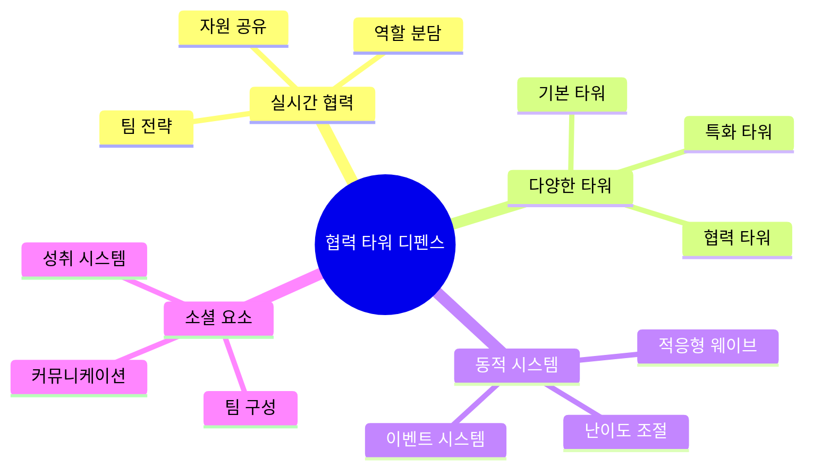
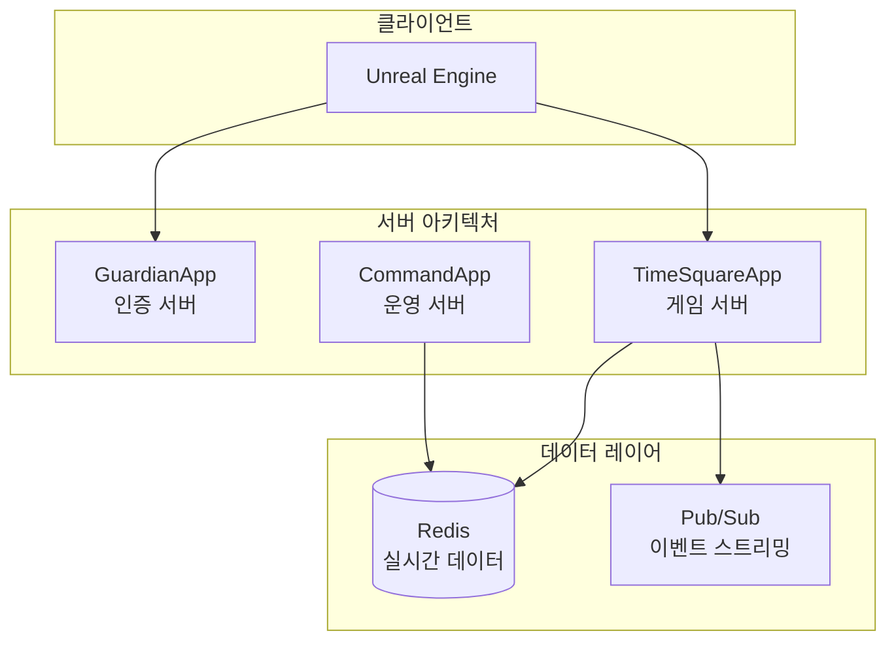

# Defense Allies 게임 디자인 문서

## 📚 문서 개요

이 폴더는 **Defense Allies (함께 막아요)** 협력 기반 실시간 타워 디펜스 게임의 완전한 기획서를 포함합니다.

## 📋 문서 구성

### 🎮 [게임플레이 기획서](./cooperative-tower-defense-gameplay.md)
**핵심 게임 메커니즘과 협력 시스템 설계**

#### 주요 내용
- 🎯 게임 개요 및 목표
- 🗺️ 게임 맵 구조
- 👥 협력 시스템 설계
- 🏗️ 타워 시스템
- 🌊 웨이브 시스템
- ⚡ 실시간 이벤트 시스템
- 📊 진행도 및 보상 시스템
- 🎮 게임플레이 플로우
- 🔧 기술적 구현 요소

#### 핵심 특징


### 🔧 [기술적 구현 가이드](./technical-implementation.md)
**서버 아키텍처와 실시간 시스템 구현 방안**

#### 주요 내용
- 🏗️ 서버 아키텍처 연동
- 📊 Redis 데이터 구조
- 🔄 실시간 협력 시스템
- 🎮 게임 로직 구현
- 📈 성과 측정 및 분석
- 🔧 최적화 및 성능

#### 📊 게임 정적 데이터 포맷
**선택된 기술**: JSON Schema + JSON
- **스키마**: 데이터 구조 및 관계 정의
- **데이터**: 타워, 종족, 환경, 난이도 정보
- **도구**: VS Code + https://json-schema.app/
- **검증**: 실시간 무결성 및 관계 검증

#### 기술 스택 연동


### ⚖️ [밸런싱 및 UX 가이드](./balancing-and-ux.md)
**게임 밸런스와 사용자 경험 최적화**

#### 주요 내용
- ⚖️ 게임 밸런싱
- 🎨 사용자 경험 설계
- 🎓 학습 곡선 관리
- 🏆 동기부여 시스템
- 🌐 소셜 기능

#### 밸런싱 철학
```yaml
balancing_principles:
  cooperation_necessity: "개인 플레이로는 클리어 불가능"
  role_equality: "모든 역할이 동등하게 중요"
  strategy_diversity: "다양한 전략이 유효"
  growth_curve: "자연스러운 난이도 증가"
```

## 🎯 게임의 핵심 가치

### 🤝 진정한 협력
- **필수적 협력**: 혼자서는 절대 클리어할 수 없는 설계
- **상호 의존성**: 각 플레이어의 역할이 팀 성공에 필수적
- **실시간 소통**: 순간순간의 의사결정이 팀 운명을 좌우

### 🎮 재미있는 게임플레이
- **역동적 전투**: 매 웨이브마다 새로운 도전과 전략
- **성장의 재미**: 개인과 팀 모두의 지속적인 발전
- **창의적 전략**: 정해진 답이 없는 다양한 해결책

### 🌟 지속적인 동기부여
- **단계적 학습**: 자연스러운 실력 향상 곡선
- **사회적 연결**: 팀원들과의 유대감 형성
- **성취감**: 개인과 팀 차원의 다양한 성취 요소

## 🚀 개발 로드맵

### Phase 1: 기본 시스템 구축
- [ ] 기본 게임 로직 구현
- [ ] 실시간 멀티플레이어 시스템
- [ ] 기본 타워 및 적 시스템
- [ ] 자원 관리 시스템

### Phase 2: 협력 시스템 구현
- [ ] 자원 공유 메커니즘
- [ ] 핑 및 커뮤니케이션 시스템
- [ ] 타워 시너지 시스템
- [ ] 협력 성과 측정

### Phase 3: 고급 기능 및 최적화
- [ ] 동적 난이도 조절
- [ ] 고급 협력 메커니즘
- [ ] 성과 분석 및 통계
- [ ] 사용자 경험 최적화

### Phase 4: 소셜 및 확장 기능
- [ ] 팀 시스템 및 길드
- [ ] 토너먼트 모드
- [ ] 시즌 시스템
- [ ] 커뮤니티 기능

## 📊 성공 지표

### 게임플레이 지표
- **협력 참여율**: 플레이어들의 협력 행동 빈도
- **팀 성공률**: 협력을 통한 게임 클리어 비율
- **재접속률**: 같은 팀으로 다시 플레이하는 비율

### 사용자 경험 지표
- **학습 완료율**: 튜토리얼 및 온보딩 완료 비율
- **세션 지속 시간**: 평균 게임 플레이 시간
- **사용자 만족도**: 게임 내 피드백 및 평가

### 비즈니스 지표
- **사용자 유지율**: 일/주/월 단위 사용자 유지
- **바이럴 계수**: 친구 초대 및 추천 비율
- **커뮤니티 활성도**: 사용자 간 상호작용 수준

## 🔗 관련 문서

### 기술 문서
- [서버 아키텍처 설계](../architecture/serverapp-design.md)
- [RPC 핸들러 구현](../rpc-handler.md)

### 프로젝트 문서
- [프로젝트 README](../../README.md)
- [API 문서](../api/) (예정)

---

**Defense Allies**는 단순한 게임을 넘어서, 플레이어들이 진정한 협력의 가치를 경험하고 함께 성장할 수 있는 플랫폼을 목표로 합니다. 🛡️⚔️

> "혼자서는 할 수 없지만, 함께라면 무엇이든 가능하다"
