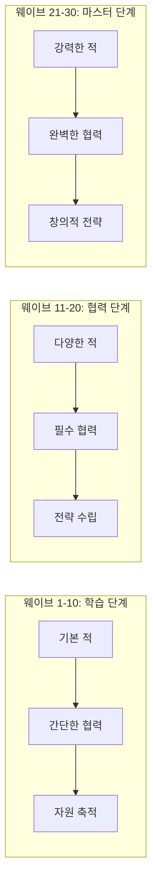
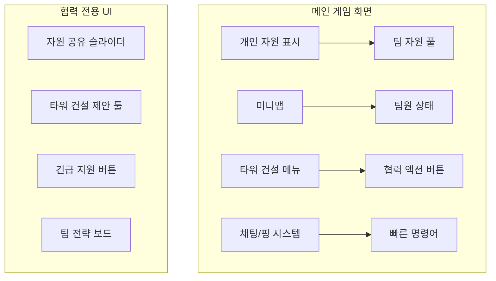
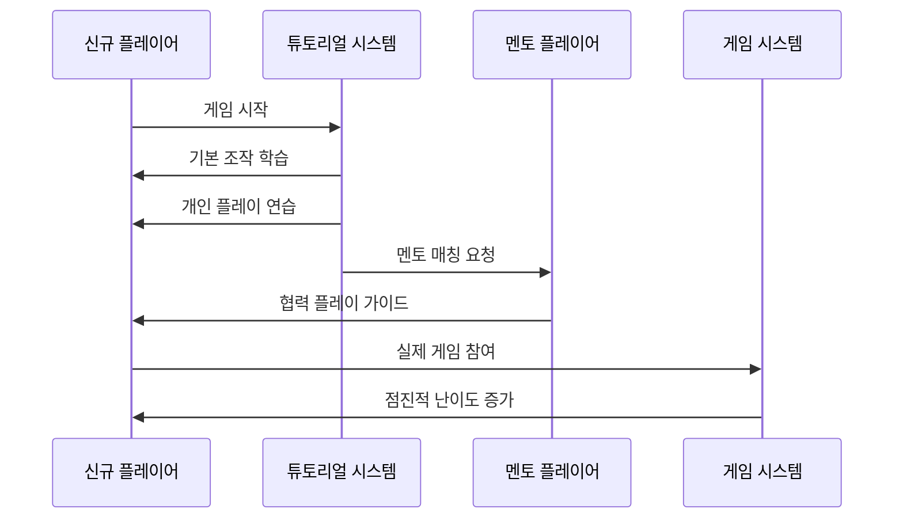
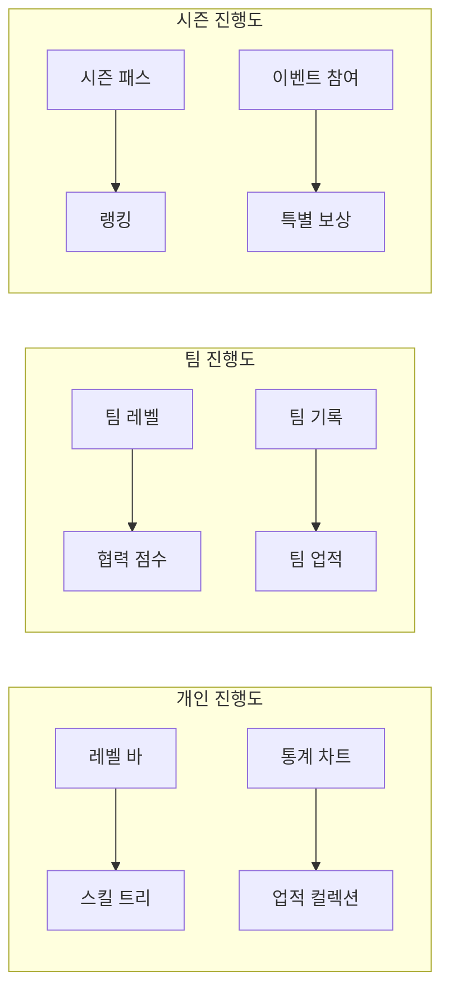

# 게임 밸런싱 및 사용자 경험 가이드

## ⚖️ 게임 밸런싱

### 🎯 밸런싱 목표

#### 핵심 원칙
1. **협력 필수성**: 개인 플레이로는 클리어 불가능한 난이도
2. **역할 균형**: 모든 역할이 동등하게 중요함
3. **전략 다양성**: 다양한 전략이 유효하도록 설계
4. **성장 곡선**: 플레이어 실력 향상에 따른 자연스러운 난이도 증가

### 📊 자원 밸런싱

#### 자원 획득 비율
```yaml
# 기본 자원 획득량 (웨이브당)
base_resources:
  gold_per_enemy: 10-15
  crystal_per_wave: 20-30
  team_points_per_cooperation: 5-10

# 협력 보너스 배율
cooperation_multipliers:
  perfect_teamwork: 1.5x
  good_teamwork: 1.2x
  basic_teamwork: 1.0x
  poor_teamwork: 0.8x

# 자원 공유 제한
sharing_limits:
  max_share_per_turn: 30% of current resources
  cooldown_between_shares: 10 seconds
  emergency_share_bonus: 2x limit during crisis
```

#### 타워 비용 구조
```yaml
tower_costs:
  basic_towers:
    archer: { gold: 100, crystal: 0 }
    cannon: { gold: 150, crystal: 10 }
    magic: { gold: 120, crystal: 15 }
  
  specialized_towers:
    tank_wall: { gold: 200, crystal: 20, role: "tanker" }
    sniper: { gold: 300, crystal: 30, role: "dealer" }
    heal_tower: { gold: 250, crystal: 25, role: "supporter" }
    freeze_tower: { gold: 180, crystal: 35, role: "controller" }
  
  mega_towers:
    fortress: { gold: 800, crystal: 100, team_points: 50, players_required: 3 }
    laser_cannon: { gold: 1000, crystal: 150, team_points: 75, players_required: 4 }
```

### 🌊 웨이브 밸런싱

#### 난이도 곡선


#### 적 유닛 밸런싱
```yaml
enemy_balance:
  wave_1_10:
    basic_enemy: { hp: 50-100, speed: 1.0, reward: 10 }
    tank_enemy: { hp: 150-200, speed: 0.7, reward: 15 }
    fast_enemy: { hp: 30-50, speed: 1.5, reward: 12 }
  
  wave_11_20:
    basic_enemy: { hp: 100-200, speed: 1.2, reward: 15 }
    tank_enemy: { hp: 300-500, speed: 0.8, reward: 25 }
    fast_enemy: { hp: 60-100, speed: 1.8, reward: 18 }
    special_enemy: { hp: 250, speed: 1.0, ability: "heal_others", reward: 30 }
  
  wave_21_30:
    elite_enemy: { hp: 500-800, speed: 1.0, ability: "damage_reduction", reward: 40 }
    boss_enemy: { hp: 2000-5000, speed: 0.5, ability: "multiple_abilities", reward: 100 }
```

### 🎮 협력 밸런싱

#### 협력 인센티브 시스템
```yaml
cooperation_incentives:
  resource_sharing:
    bonus_multiplier: 1.1x for both players
    efficiency_bonus: +10% resource generation for 30 seconds
  
  joint_tower_building:
    cost_reduction: 20% discount for mega towers
    build_speed: 2x faster construction
  
  mutual_support:
    defense_bonus: +15% damage for supported area
    emergency_response: Instant resource transfer during crisis
  
  strategic_coordination:
    synergy_bonus: +25% effectiveness for coordinated actions
    timing_bonus: +30% reward for perfectly timed cooperation
```

## 🎨 사용자 경험 (UX) 설계

### 🖥️ 인터페이스 설계

#### 협력 중심 UI 요소


#### UI 우선순위
1. **팀 상태 가시성**: 모든 팀원의 상태를 한눈에 파악
2. **협력 액션 접근성**: 협력 기능을 쉽게 사용할 수 있도록
3. **실시간 피드백**: 협력 행동에 대한 즉각적인 반응
4. **직관적 소통**: 복잡한 타이핑 없이 의사소통 가능

### 📱 모바일 친화적 설계

#### 터치 인터페이스 최적화
```yaml
touch_interface:
  gesture_controls:
    tap: "타워 선택/배치"
    long_press: "상세 정보 보기"
    swipe: "카메라 이동"
    pinch: "줌 인/아웃"
    two_finger_tap: "빠른 핑"
  
  button_sizing:
    minimum_size: 44px x 44px
    spacing: 8px minimum
    touch_target: 48px x 48px (including padding)
  
  layout_adaptation:
    portrait_mode: "세로 모드 최적화"
    landscape_mode: "가로 모드 최적화"
    tablet_mode: "태블릿 전용 레이아웃"
```

### 🔊 오디오 및 시각적 피드백

#### 협력 피드백 시스템
```yaml
feedback_system:
  visual_feedback:
    resource_sharing: "골드 입자 효과로 이동 표시"
    tower_synergy: "연결된 타워들 간 빛줄기 효과"
    team_action: "팀 색상으로 하이라이트"
    success_moment: "화면 전체 성공 이펙트"
  
  audio_feedback:
    cooperation_success: "하모니 사운드"
    resource_received: "긍정적인 알림음"
    team_achievement: "팀 승리 팡파레"
    emergency_alert: "긴급 상황 경고음"
  
  haptic_feedback:
    cooperation_action: "부드러운 진동"
    emergency_situation: "강한 진동 패턴"
    success_moment: "리듬감 있는 진동"
```

### 🎓 학습 곡선 관리

#### 온보딩 시스템


#### 단계별 학습 목표
```yaml
learning_stages:
  stage_1_basics:
    duration: "1-2 게임"
    objectives:
      - "기본 타워 건설 학습"
      - "자원 관리 이해"
      - "적 유형 파악"
    
  stage_2_cooperation:
    duration: "3-5 게임"
    objectives:
      - "자원 공유 경험"
      - "핑 시스템 사용"
      - "역할 이해"
    
  stage_3_strategy:
    duration: "6-10 게임"
    objectives:
      - "타워 시너지 활용"
      - "팀 전략 수립"
      - "고급 협력 기술"
    
  stage_4_mastery:
    duration: "지속적"
    objectives:
      - "창의적 전략 개발"
      - "완벽한 팀워크"
      - "리더십 발휘"
```

### 🏆 동기부여 시스템

#### 성취감 제공 요소
```yaml
achievement_system:
  individual_achievements:
    - "첫 타워 건설"
    - "100 적 처치"
    - "완벽한 웨이브 클리어"
    - "자원 효율성 마스터"
  
  cooperation_achievements:
    - "첫 자원 공유"
    - "완벽한 타이밍 협력"
    - "팀 시너지 마스터"
    - "리더십 발휘"
  
  team_achievements:
    - "무손실 클리어"
    - "기록 단축"
    - "창의적 전략 달성"
    - "완벽한 팀워크"
  
  seasonal_achievements:
    - "시즌 챌린지 완료"
    - "토너먼트 참가"
    - "커뮤니티 기여"
```

#### 진행도 시각화


### 🌐 소셜 기능

#### 커뮤니티 구축
```yaml
social_features:
  team_formation:
    - "친구 초대 시스템"
    - "팀 생성 및 관리"
    - "정기 팀 활동"
  
  communication:
    - "게임 내 채팅"
    - "음성 채팅 지원"
    - "이모티콘 시스템"
  
  sharing:
    - "게임 하이라이트 공유"
    - "전략 가이드 작성"
    - "리플레이 시스템"
  
  mentoring:
    - "신규 플레이어 멘토링"
    - "스킬 공유 세션"
    - "커뮤니티 이벤트"
```

---

이 밸런싱 및 UX 가이드는 플레이어들이 협력의 재미를 충분히 느끼면서도 지속적으로 게임을 즐길 수 있는 환경을 만들기 위한 설계 방향을 제시합니다.
