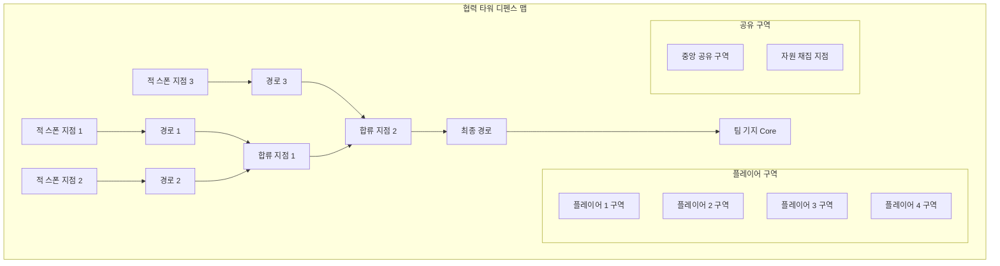
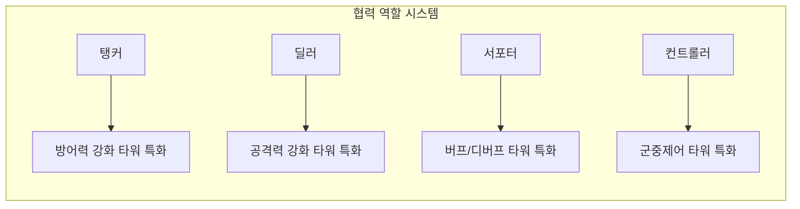
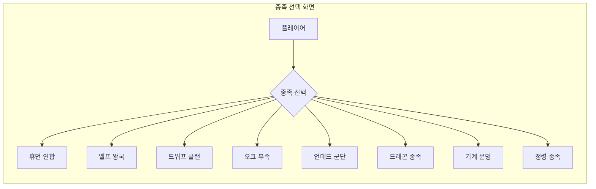
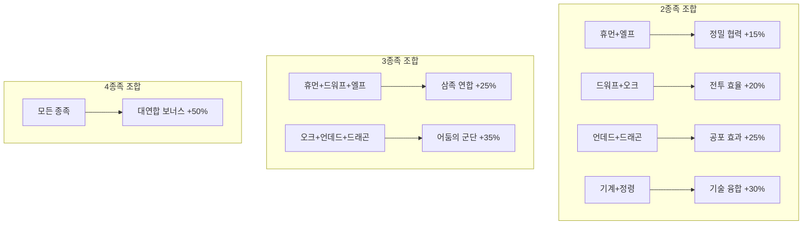
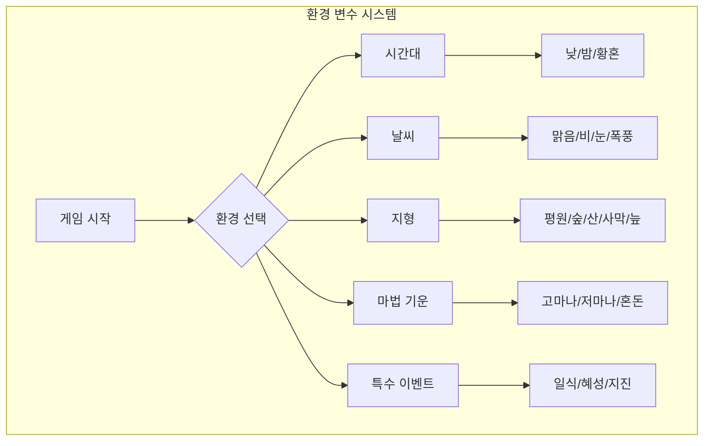
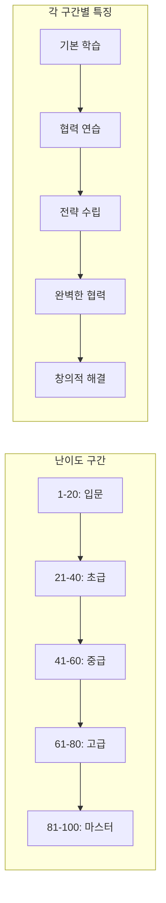
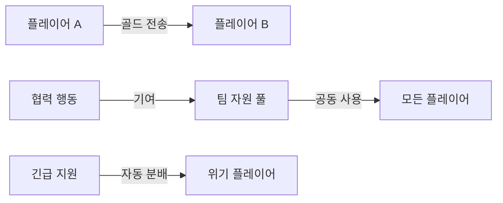
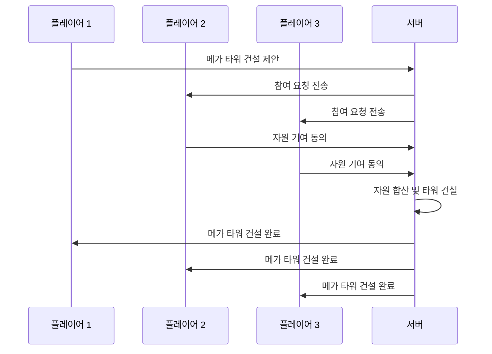

# 협력 기반 실시간 타워 디펜스 게임 기획서

## 📋 게임 개요

### 🎯 핵심 컨셉
**"Defense Allies (함께 막아요)"**는 2-4명의 플레이어가 실시간으로 협력하여 적의 침입을 막는 타워 디펜스 게임입니다.

### 🎮 게임 장르 및 특징
- **장르**: 협력 멀티플레이어 실시간 타워 디펜스
- **플레이어 수**: 2-4명 (협력 플레이)
- **게임 시간**: 15-30분 (웨이브 수에 따라 조절)
- **핵심 특징**:
  - 실시간 협력 전략 수립
  - 자원 공유 및 역할 분담
  - 동적 난이도 조절
  - 팀워크 기반 승리 조건

## 🎯 게임 목표

### 주요 목표
1. **기지 방어**: 팀의 공통 기지(Core)를 적으로부터 보호
2. **웨이브 클리어**: 모든 적 웨이브를 성공적으로 방어
3. **협력 달성**: 팀원들과의 효과적인 협력을 통한 승리

### 승리 조건
- 모든 웨이브를 성공적으로 방어
- 기지 체력이 0이 되기 전까지 생존

### 패배 조건
- 기지 체력이 0에 도달
- 모든 플레이어가 게임을 포기

## 🗺️ 게임 맵 구조

### 맵 레이아웃


### 구역 특징
1. **개인 구역**: 각 플레이어가 주로 관리하는 영역
2. **공유 구역**: 모든 플레이어가 건설 가능한 전략적 요충지
3. **자원 지점**: 추가 자원을 획득할 수 있는 특별 구역

## 👥 협력 시스템

### 🤝 핵심 협력 메커니즘

#### 1. 자원 공유 시스템
- **골드 공유**: 플레이어 간 골드 전송 가능
- **공유 자원 풀**: 팀 전체가 사용할 수 있는 공통 자원
- **자원 요청**: 다른 플레이어에게 자원 지원 요청

#### 2. 역할 분담 시스템


#### 3. 실시간 커뮤니케이션
- **핑 시스템**: 맵 상의 특정 위치에 신호 전송
- **빠른 채팅**: 미리 정의된 전략적 메시지
- **타워 건설 제안**: 다른 플레이어에게 타워 건설 제안

### 🎯 협력 전략 요소

#### 1. 타워 시너지 시스템
- **연계 효과**: 인접한 타워들 간의 상호 버프
- **콤보 공격**: 특정 타워 조합으로 강력한 공격 발동
- **팀 스킬**: 플레이어들이 함께 발동하는 강력한 능력

#### 2. 동적 역할 변경
- **상황 적응**: 게임 진행에 따른 역할 유연성
- **긴급 지원**: 위기 상황에서 다른 구역 지원
- **전략 재편**: 실시간 전략 수정 및 적응

## 🏗️ 종족 기반 타워 시스템

### 🌟 종족 선택 시스템

#### 게임 시작 시 종족 선택
플레이어는 게임 입장 시 원하는 종족을 선택하며, 각 종족은 고유한 특성과 트레이드오프를 가집니다.



### 🎭 종족별 특성 시스템

#### 1. 휴먼 연합 (Human Alliance)
```yaml
human_alliance:
  specialty: "균형과 적응성"
  strengths:
    - "모든 타워 건설 가능"
    - "자원 효율성 +15%"
    - "협력 보너스 +20%"
  weaknesses:
    - "특화 능력 부족"
    - "극한 상황 대응력 -10%"
  unique_towers:
    - "기사단 요새": 주변 타워 방어력 증가
    - "상인 길드": 자원 생성 및 공유 효율 증가
    - "마법사 탑": 다양한 마법 공격 지원
```

#### 2. 엘프 왕국 (Elven Kingdom)
```yaml
elven_kingdom:
  specialty: "정밀함과 자연의 힘"
  strengths:
    - "원거리 공격 +25%"
    - "타워 사거리 +20%"
    - "자연 마법 면역"
  weaknesses:
    - "근접 방어 -20%"
    - "건설 속도 -15%"
    - "중장갑 적에게 -10% 데미지"
  unique_towers:
    - "고대 나무": 시간이 지날수록 강해지는 성장형 타워
    - "달빛 궁수": 밤에 공격력 2배 증가
    - "자연의 덫": 적을 속박하고 지속 피해
```

#### 3. 드워프 클랜 (Dwarven Clan)
```yaml
dwarven_clan:
  specialty: "견고함과 화력"
  strengths:
    - "방어력 +30%"
    - "폭발 공격 +40%"
    - "타워 내구도 +50%"
  weaknesses:
    - "이동 속도 -25%"
    - "마법 저항 -20%"
    - "건설 비용 +15%"
  unique_towers:
    - "화포 요새": 강력한 범위 공격
    - "철벽 방어막": 적의 진행을 완전 차단
    - "용광로": 주변 타워에 화염 속성 부여
```

#### 4. 오크 부족 (Orc Tribe)
```yaml
orc_tribe:
  specialty: "공격성과 재생력"
  strengths:
    - "공격 속도 +35%"
    - "체력 재생 +25%"
    - "전투 중 공격력 증가"
  weaknesses:
    - "정확도 -20%"
    - "마법 공격 -30%"
    - "자원 관리 -15%"
  unique_towers:
    - "전쟁 토템": 주변 타워 공격 속도 증가
    - "광전사 막사": 적과 근접 전투하는 유닛 생성
    - "피의 제단": 적 처치 시 체력과 공격력 증가
```

#### 5. 언데드 군단 (Undead Legion)
```yaml
undead_legion:
  specialty: "지속성과 디버프"
  strengths:
    - "독/저주 공격 +50%"
    - "적 디버프 효과 +30%"
    - "파괴된 타워 부활 가능"
  weaknesses:
    - "신성 공격에 +50% 피해"
    - "치유 효과 -100%"
    - "낮 시간 -20% 효율"
  unique_towers:
    - "네크로맨서 탑": 죽은 적을 아군으로 부활
    - "저주의 오벨리스크": 광범위 디버프 효과
    - "뼈 감옥": 적을 일시적으로 무력화
```

#### 6. 드래곤 종족 (Dragon Clan)
```yaml
dragon_clan:
  specialty: "압도적 화력과 위엄"
  strengths:
    - "화염 공격 +60%"
    - "공중 유닛 특화"
    - "보스급 적에게 추가 피해"
  weaknesses:
    - "건설 비용 +50%"
    - "건설 시간 +40%"
    - "얼음 공격에 +30% 피해"
  unique_towers:
    - "용의 둥지": 강력한 드래곤 소환
    - "화염 브레스": 직선 관통 화염 공격
    - "용의 보물": 팀 전체 자원 대폭 증가
```

#### 7. 기계 문명 (Mechanical Empire)
```yaml
mechanical_empire:
  specialty: "기술력과 자동화"
  strengths:
    - "자동 수리 및 업그레이드"
    - "전기 공격 +40%"
    - "타워 연결 시너지 +50%"
  weaknesses:
    - "EMP 공격에 +100% 피해"
    - "자연 환경에서 -25% 효율"
    - "초기 설정 시간 필요"
  unique_towers:
    - "AI 제어 센터": 다른 타워들을 자동 최적화
    - "레이저 포탑": 즉발 정확한 공격
    - "에너지 네트워크": 타워 간 에너지 공유
```

#### 8. 정령 종족 (Elemental Spirits)
```yaml
elemental_spirits:
  specialty: "원소 조작과 변화"
  strengths:
    - "원소 공격 +45%"
    - "환경 적응 +100%"
    - "타워 속성 변경 가능"
  weaknesses:
    - "물리 공격 -30%"
    - "안정성 부족 (랜덤 요소)"
    - "복잡한 조작 필요"
  unique_towers:
    - "원소 융합체": 여러 원소를 조합한 공격
    - "정령 소환진": 상황에 맞는 정령 소환
    - "원소 변환기": 적의 속성을 역이용
```

### 🔄 종족 시너지 시스템

#### 팀 구성에 따른 보너스


## 🎲 환경 변수 시스템

### 🌍 동적 환경 요소

#### 매 게임마다 변화하는 환경
게임 시작 시 랜덤하게 선택되는 환경 요소들이 종족별 버프/디버프를 제공합니다.



### 🌅 시간대 시스템
```yaml
time_periods:
  dawn:
    duration: "5분"
    effects:
      human_alliance: "+10% 자원 생성"
      elven_kingdom: "+15% 정확도"
      undead_legion: "-20% 모든 능력"
      dragon_clan: "+5% 화염 공격"

  day:
    duration: "10분"
    effects:
      human_alliance: "+5% 모든 능력"
      elven_kingdom: "+10% 사거리"
      dwarven_clan: "+15% 건설 속도"
      undead_legion: "-15% 공격력"
      mechanical_empire: "+20% 에너지 효율"

  dusk:
    duration: "5분"
    effects:
      elven_kingdom: "+25% 공격력"
      orc_tribe: "+15% 공격 속도"
      dragon_clan: "+10% 모든 능력"
      elemental_spirits: "+20% 원소 공격"

  night:
    duration: "10분"
    effects:
      undead_legion: "+30% 모든 능력"
      orc_tribe: "+20% 재생력"
      dragon_clan: "+15% 화염 공격"
      human_alliance: "-10% 시야"
      dwarven_clan: "-5% 정확도"
```

### 🌦️ 날씨 시스템
```yaml
weather_conditions:
  clear:
    probability: 30%
    effects:
      all_races: "기본 상태"

  rain:
    probability: 20%
    effects:
      elven_kingdom: "+20% 자연 마법"
      dwarven_clan: "-15% 화포 효율"
      mechanical_empire: "-10% 전기 공격"
      elemental_spirits: "+25% 물 원소"

  snow:
    probability: 15%
    effects:
      dragon_clan: "-25% 화염 공격"
      undead_legion: "+15% 얼음 저항"
      dwarven_clan: "+10% 방어력"
      elemental_spirits: "+30% 얼음 원소"

  storm:
    probability: 10%
    effects:
      mechanical_empire: "+40% 전기 공격"
      elven_kingdom: "-20% 원거리 정확도"
      dragon_clan: "-15% 비행 능력"
      elemental_spirits: "+50% 번개 원소"

  sandstorm:
    probability: 15%
    effects:
      all_races: "-30% 시야"
      dwarven_clan: "+20% 방어력"
      elemental_spirits: "+35% 바람/땅 원소"
      mechanical_empire: "-20% 정밀도"

  fog:
    probability: 10%
    effects:
      undead_legion: "+25% 은신 효과"
      elven_kingdom: "-25% 사거리"
      human_alliance: "-15% 협력 효율"
      orc_tribe: "+15% 근접 공격"
```

### 🏔️ 지형 시스템
```yaml
terrain_types:
  plains:
    description: "평원 - 균형잡힌 환경"
    effects:
      human_alliance: "+10% 이동 속도"
      all_races: "기본 건설 비용"

  forest:
    description: "숲 - 자연의 힘이 강한 곳"
    effects:
      elven_kingdom: "+25% 모든 능력"
      dwarven_clan: "-15% 건설 속도"
      mechanical_empire: "-20% 효율"
      elemental_spirits: "+20% 자연 원소"

  mountains:
    description: "산맥 - 견고하고 험준한 지형"
    effects:
      dwarven_clan: "+30% 모든 능력"
      dragon_clan: "+15% 둥지 효과"
      orc_tribe: "-10% 이동 속도"
      elven_kingdom: "-15% 건설 효율"

  desert:
    description: "사막 - 뜨겁고 건조한 환경"
    effects:
      dragon_clan: "+20% 화염 공격"
      undead_legion: "+15% 지속력"
      elven_kingdom: "-25% 자연 마법"
      mechanical_empire: "-15% 냉각 효율"

  swamp:
    description: "늪지 - 어둡고 축축한 환경"
    effects:
      undead_legion: "+35% 모든 능력"
      orc_tribe: "+20% 독 공격"
      human_alliance: "-20% 이동 속도"
      dwarven_clan: "-25% 화포 효율"
```

## 📊 단계별 난이도 시스템

### 🎯 수치화된 난이도 레벨

#### 난이도 1-100 단계 시스템


### 📈 난이도별 상세 설정

#### 입문 단계 (난이도 1-20)
```yaml
beginner_levels:
  level_range: 1-20
  objectives:
    - "기본 조작 학습"
    - "종족 특성 이해"
    - "간단한 협력 경험"

  enemy_scaling:
    base_health: 50-200
    base_damage: 10-30
    speed_multiplier: 0.8-1.0
    special_abilities: "없음"

  environmental_effects:
    intensity: "약함 (±5-10%)"
    complexity: "단순 (1-2개 요소)"

  cooperation_requirements:
    resource_sharing: "선택적"
    joint_actions: "기본적"
    timing_precision: "관대함"

  rewards:
    experience_multiplier: 1.0
    unlock_content: "기본 타워, 기본 업그레이드"
```

#### 초급 단계 (난이도 21-40)
```yaml
novice_levels:
  level_range: 21-40
  objectives:
    - "종족 시너지 활용"
    - "환경 적응 학습"
    - "팀 전략 기초"

  enemy_scaling:
    base_health: 200-500
    base_damage: 30-70
    speed_multiplier: 1.0-1.2
    special_abilities: "기본 (힐링, 방어막)"

  environmental_effects:
    intensity: "보통 (±10-15%)"
    complexity: "중간 (2-3개 요소)"

  cooperation_requirements:
    resource_sharing: "권장"
    joint_actions: "필요"
    timing_precision: "보통"

  rewards:
    experience_multiplier: 1.2
    unlock_content: "고급 타워, 종족 특화 업그레이드"
```

#### 중급 단계 (난이도 41-60)
```yaml
intermediate_levels:
  level_range: 41-60
  objectives:
    - "복합 전략 수립"
    - "동적 환경 대응"
    - "고급 협력 기술"

  enemy_scaling:
    base_health: 500-1200
    base_damage: 70-150
    speed_multiplier: 1.2-1.5
    special_abilities: "중급 (분열, 재생, 버프)"

  environmental_effects:
    intensity: "강함 (±15-25%)"
    complexity: "복잡 (3-4개 요소)"

  cooperation_requirements:
    resource_sharing: "필수"
    joint_actions: "정밀함 요구"
    timing_precision: "엄격"

  rewards:
    experience_multiplier: 1.5
    unlock_content: "마스터 타워, 협력 스킬"
```

#### 고급 단계 (난이도 61-80)
```yaml
advanced_levels:
  level_range: 61-80
  objectives:
    - "완벽한 팀워크"
    - "창의적 문제 해결"
    - "극한 상황 대응"

  enemy_scaling:
    base_health: 1200-3000
    base_damage: 150-300
    speed_multiplier: 1.5-2.0
    special_abilities: "고급 (면역, 적응, 소환)"

  environmental_effects:
    intensity: "매우 강함 (±25-40%)"
    complexity: "매우 복잡 (4-5개 요소)"

  cooperation_requirements:
    resource_sharing: "최적화 필요"
    joint_actions: "완벽한 동기화"
    timing_precision: "밀리초 단위"

  rewards:
    experience_multiplier: 2.0
    unlock_content: "전설 타워, 궁극 스킬"
```

#### 마스터 단계 (난이도 81-100)
```yaml
master_levels:
  level_range: 81-100
  objectives:
    - "불가능을 가능하게"
    - "새로운 전략 창조"
    - "완벽한 하모니"

  enemy_scaling:
    base_health: 3000-10000
    base_damage: 300-800
    speed_multiplier: 2.0-3.0
    special_abilities: "마스터 (진화, 학습, 반격)"

  environmental_effects:
    intensity: "극한 (±40-60%)"
    complexity: "카오스 (5-7개 요소, 상호작용)"

  cooperation_requirements:
    resource_sharing: "완벽한 최적화"
    joint_actions: "예술적 수준"
    timing_precision: "직감적 동기화"

  rewards:
    experience_multiplier: 3.0
    unlock_content: "신화 타워, 종족 진화"
```

## 🌊 웨이브 시스템

### 적 유닛 타입

#### 1. 기본 적
- **러셔**: 빠른 이동속도, 낮은 체력
- **탱커**: 느린 이동속도, 높은 체력
- **플라이어**: 공중 유닛, 특정 타워만 공격 가능

#### 2. 특수 적
- **스플리터**: 죽을 때 여러 개체로 분열
- **힐러**: 다른 적을 치료
- **실더**: 다른 적에게 보호막 제공

#### 3. 보스 적
- **메가 탱커**: 극도로 높은 체력, 팀 집중 공격 필요
- **스웜 마스터**: 지속적으로 소형 적 생성
- **어댑터**: 플레이어 전략에 따라 능력 변화

## ⚡ 실시간 이벤트 시스템

### 이벤트 타입

#### 1. 협력 이벤트
- **긴급 지원 요청**: 플레이어가 위기 상황에서 도움 요청
- **자원 공유 제안**: 자원이 풍부한 플레이어가 나눔 제안
- **전략 투표**: 팀 전략 결정을 위한 실시간 투표

#### 2. 게임 이벤트
- **보너스 웨이브**: 추가 자원 획득 기회
- **환경 변화**: 맵 일부 변경으로 새로운 전략 필요
- **파워업**: 임시 강화 효과

#### 3. 소셜 이벤트
- **MVP 선정**: 웨이브별 최고 기여도 플레이어
- **팀워크 보너스**: 협력 행동에 대한 추가 보상
- **연계 달성**: 특정 협력 목표 달성 시 보상

## 📊 진행도 및 보상 시스템

### 개인 진행도
- **레벨 시스템**: 경험치 획득을 통한 레벨업
- **스킬 트리**: 개인 특화 능력 개발
- **업적 시스템**: 다양한 도전 과제

### 팀 진행도
- **팀 레벨**: 함께 플레이한 시간에 따른 팀 레벨
- **협력 점수**: 협력 행동에 따른 점수 시스템
- **팀 업적**: 팀 단위로 달성하는 특별 업적

### 보상 시스템
- **개인 보상**: 개인 성과에 따른 보상
- **팀 보상**: 팀 성과에 따른 추가 보상
- **시즌 보상**: 시즌별 특별 보상

## 🎮 게임플레이 플로우

### 매치 시작
1. **매치메이킹**: 비슷한 실력의 플레이어 매칭
2. **역할 선택**: 선호하는 역할 선택 (유연하게 변경 가능)
3. **맵 로딩**: 게임 맵 및 초기 설정 로드

### 게임 진행
1. **준비 단계**: 초기 타워 배치 및 전략 논의
2. **웨이브 진행**: 실시간 협력을 통한 방어
3. **중간 휴식**: 웨이브 간 전략 수정 및 업그레이드

### 게임 종료
1. **결과 화면**: 개인 및 팀 성과 표시
2. **보상 지급**: 성과에 따른 보상 획득
3. **다음 게임**: 같은 팀으로 연속 플레이 옵션

## 🔧 기술적 구현 요소

### 📊 게임 정적 데이터 관리
**선택된 포맷: JSON Schema + JSON**
- **스키마 정의**: JSON Schema로 데이터 구조 및 관계 정의
- **실제 데이터**: JSON 포맷으로 게임 데이터 저장
- **검증 시스템**: 실시간 데이터 무결성 및 관계 검증
- **에디팅 도구**: VS Code + 웹 기반 JSON Schema 뷰어

**정적 데이터 범위**:
- 종족별 타워 데이터 (8개 종족 × 다수 타워)
- 환경 시스템 데이터 (150가지 조합)
- 난이도 레벨 데이터 (1-100 레벨)
- 로컬라이제이션 키 (다국어 지원)

### 실시간 동기화
- **게임 상태 동기화**: 모든 플레이어 간 실시간 상태 공유
- **입력 지연 최소화**: 빠른 반응을 위한 최적화
- **충돌 해결**: 동시 입력에 대한 처리

### 서버 아키텍처
- **GuardianApp**: 사용자 인증 전용
- **TimeSquareApp**: 실시간 게임 로직 처리
- **CommandApp**: 관리자 도구 및 분석
- **Redis Pub/Sub**: 실시간 이벤트 전송
- **SSE**: 클라이언트로의 실시간 데이터 스트리밍

### 데이터 관리
- **정적 데이터**: JSON Schema + JSON 포맷
- **게임 상태**: Redis를 통한 실시간 상태 저장
- **플레이어 액션**: 모든 플레이어 행동 로깅
- **성과 추적**: 개인 및 팀 성과 데이터 수집

## 🎯 상세 게임 메커니즘

### 💰 자원 관리 시스템

#### 자원 타입
1. **골드**: 타워 건설 및 업그레이드의 기본 자원
2. **크리스탈**: 특수 타워 및 스킬 사용 자원
3. **팀 포인트**: 협력 행동으로 획득하는 공유 자원

#### 자원 획득 방법
- **적 처치**: 기본 골드 획득
- **웨이브 클리어**: 보너스 골드 및 크리스탈
- **협력 보너스**: 팀워크 행동 시 추가 자원
- **자원 지점**: 맵의 특별 구역에서 채집

#### 자원 공유 메커니즘


### 🎮 실시간 협력 메커니즘

#### 1. 핑 시스템
- **위험 핑**: 적 집중 공격 경고
- **지원 요청 핑**: 도움이 필요한 위치 표시
- **전략 핑**: 타워 건설 제안 위치
- **자원 핑**: 자원 공유 제안

#### 2. 빠른 커뮤니케이션
```
"도움 필요!" - 긴급 지원 요청
"자원 보내줘" - 자원 지원 요청
"여기 타워 짓자" - 건설 제안
"좋은 아이디어!" - 동의 표현
"다른 전략 어때?" - 전략 변경 제안
```

#### 3. 자동 협력 시스템
- **스마트 지원**: AI가 위기 상황 감지 시 자동 지원 제안
- **자원 균형**: 자원 불균형 시 자동 재분배 제안
- **역할 추천**: 게임 상황에 따른 최적 역할 제안

### 🏗️ 고급 타워 시스템

#### 타워 연계 시스템
1. **물리적 연계**: 인접한 타워들의 상호 강화
2. **속성 연계**: 같은 속성 타워들의 시너지 효과
3. **역할 연계**: 다른 역할의 타워들 간 협력 효과

#### 메가 타워 건설


### 🌊 동적 난이도 시스템

#### 적응형 웨이브
- **팀 성과 분석**: 실시간 팀 성과 모니터링
- **난이도 조절**: 성과에 따른 적 강도 조절
- **약점 공략**: 팀의 약한 부분을 노리는 적 등장

#### 협력 난이도 보너스
- **완벽한 협력**: 모든 플레이어가 효과적으로 협력 시 보너스
- **역할 분담**: 각자의 역할을 충실히 수행 시 추가 보상
- **창의적 전략**: 독창적인 전략 사용 시 특별 보상

### 📈 성과 측정 시스템

#### 개인 성과 지표
- **DPS (Damage Per Second)**: 초당 피해량
- **방어 효율성**: 투입 자원 대비 방어 성과
- **협력 점수**: 다른 플레이어와의 협력 정도
- **전략 기여도**: 팀 전략에 대한 기여

#### 팀 성과 지표
- **시너지 점수**: 팀 전체의 협력 효과
- **자원 효율성**: 팀 자원 사용의 효율성
- **적응력**: 상황 변화에 대한 대응 능력
- **생존 시간**: 기지 방어 지속 시간

### 🎊 특별 이벤트 및 모드

#### 시즌 이벤트
- **협력 챌린지**: 특별한 협력 미션
- **메가 보스**: 초강력 보스와의 대결
- **타임 어택**: 제한 시간 내 클리어 도전

#### 특별 게임 모드
- **서바이벌 모드**: 무한 웨이브 도전
- **퍼즐 모드**: 특정 조건 하에서 방어
- **토너먼트 모드**: 팀 간 경쟁 모드

---

이 기획서는 협력 기반 실시간 타워 디펜스 게임의 핵심 요소들을 정의하며, 플레이어들이 진정한 팀워크를 통해 즐거운 게임 경험을 할 수 있도록 설계되었습니다.
