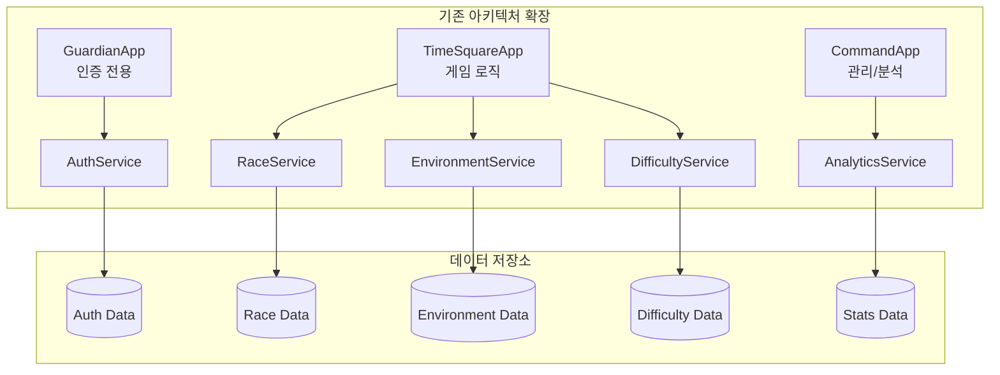

# Defense Allies 상세 구현 계획서

## 🎯 MVP 개발 계획 (8주)

### Week 1-2: 기반 시스템 설계 및 구현

#### 📊 게임 정적 데이터 포맷 결정
**선택된 포맷: JSON Schema + JSON**
- **스키마 정의**: JSON Schema로 데이터 구조 및 관계 정의
- **실제 데이터**: JSON 포맷으로 게임 데이터 저장
- **장점**:
  - 단일 포맷으로 개발부터 배포까지 일관성
  - 외부 에디팅 도구 지원 (VS Code, 웹 에디터)
  - 실시간 검증 및 관계 무결성 확인
  - 빠른 개발 및 디버깅

**정적 데이터 범위**:
- 타워 데이터 (스탯, 비용, 레벨링, 시너지)
- 종족 데이터 (특성, 보너스, 고유 타워)
- 환경 데이터 (시간대, 날씨, 지형 효과)
- 난이도 데이터 (레벨별 스케일링, 보상)
- 로컬라이제이션 데이터 (다국어 지원)

#### 🏗️ 서버 아키텍처 확장

#### 📋 Week 1 작업 목록
**기획팀 작업**
- [ ] 4개 핵심 종족 상세 스펙 확정 (휴먼, 엘프, 드워프, 오크)
- [ ] 기본 환경 조합 3가지 선정 및 효과 정의
- [ ] 난이도 1-20 레벨 상세 수치 확정
- [ ] MVP 범위 최종 검토 및 승인

**개발팀 작업**
- [ ] **GuardianApp**: 인증 시스템 강화 및 JWT 관리 개선
- [ ] **TimeSquareApp**: 종족/환경/난이도 Redis 스키마 설계
- [ ] **CommandApp**: 관리자 도구 및 분석 시스템 기반 구조
- [ ] 기본 데이터 모델 구조체 정의 (서버별 분리)
- [ ] 서비스 인터페이스 설계 (서버 간 통신 포함)
- [ ] 기존 서버 앱에 새로운 서비스 통합

#### 📋 Week 2 작업 목록
**기획팀 작업**
- [ ] 종족별 타워 밸런스 시트 작성
- [ ] 환경 효과 매트릭스 완성
- [ ] 협력 메커니즘 상세 플로우 정의
- [ ] UI/UX 와이어프레임 초안

**개발팀 작업**
- [ ] **GuardianApp**: 사용자 인증 API 완성 및 보안 강화
- [ ] **TimeSquareApp**: 종족 시스템 기본 CRUD 구현
- [ ] **TimeSquareApp**: 환경 시스템 기본 로직 구현
- [ ] **TimeSquareApp**: 난이도 계산 알고리즘 구현
- [ ] **CommandApp**: 기본 관리자 도구 인터페이스
- [ ] 각 서버별 단위 테스트 작성

### Week 3-4: 핵심 게임 로직 구현

#### 🎮 게임 로직 우선순위
1. **종족 선택 및 매칭** (Week 3)
2. **환경 생성 및 적용** (Week 3)
3. **기본 타워 시스템** (Week 4)
4. **난이도 적용** (Week 4)

#### 📋 Week 3 작업 목록
**기획팀 작업**
- [ ] 매칭 알고리즘 요구사항 정의
- [ ] 종족별 시작 자원 밸런싱
- [ ] 환경 변화 타이밍 설계
- [ ] 플레이어 피드백 수집 방법 설계

**개발팀 작업**
- [ ] 매치메이킹 서비스에 종족 고려 로직 추가
- [ ] 게임 시작 시 환경 생성 로직
- [ ] 종족별 버프/디버프 적용 시스템
- [ ] 실시간 이벤트 스트리밍 확장

#### 📋 Week 4 작업 목록
**기획팀 작업**
- [ ] 타워 건설 권한 매트릭스 완성
- [ ] 종족별 고유 타워 최종 스펙
- [ ] 난이도별 적 스펙 검증
- [ ] 초기 밸런싱 테스트 계획

**개발팀 작업**
- [ ] 종족별 타워 건설 시스템
- [ ] 환경 효과가 적용된 타워 스탯 계산
- [ ] 난이도에 따른 웨이브 생성
- [ ] 통합 테스트 환경 구축

### Week 5-6: 협력 시스템 구현

#### 🤝 협력 메커니즘 구현 순서
1. **기본 자원 공유** (Week 5)
2. **종족 간 시너지** (Week 5)
3. **협력 타워 건설** (Week 6)
4. **팀 능력 발동** (Week 6)

#### 📋 Week 5 작업 목록
**기획팀 작업**
- [ ] 자원 공유 제한 및 쿨다운 설정
- [ ] 종족 조합별 시너지 효과 수치화
- [ ] 협력 성공/실패 피드백 설계
- [ ] 협력 점수 계산 공식 정의

**개발팀 작업**
- [ ] 실시간 자원 공유 시스템
- [ ] 종족 시너지 계산 엔진
- [ ] 협력 액션 검증 로직
- [ ] 협력 이벤트 브로드캐스팅

#### 📋 Week 6 작업 목록
**기획팀 작업**
- [ ] 협력 타워 건설 조건 및 비용
- [ ] 팀 능력 발동 조건 및 효과
- [ ] 협력 실패 시 페널티 설계
- [ ] 사용자 가이드 초안 작성

**개발팀 작업**
- [ ] 다중 플레이어 타워 건설 시스템
- [ ] 팀 능력 발동 및 쿨다운 관리
- [ ] 협력 상태 실시간 동기화
- [ ] 성능 최적화 1차

### Week 7-8: UI/UX 및 통합 테스트

#### 🎨 사용자 인터페이스 구현
1. **종족 선택 화면** (Week 7)
2. **게임 내 HUD 확장** (Week 7)
3. **환경 정보 표시** (Week 8)
4. **협력 인터페이스** (Week 8)

#### 📋 Week 7 작업 목록
**기획팀 작업**
- [ ] 종족 선택 UI 최종 디자인
- [ ] 게임 내 정보 표시 우선순위
- [ ] 사용자 테스트 시나리오 작성
- [ ] 밸런싱 1차 조정

**개발팀 작업**
- [ ] 종족 선택 화면 구현
- [ ] 종족별 HUD 요소 추가
- [ ] 환경 상태 표시 위젯
- [ ] 클라이언트-서버 통신 최적화

#### 📋 Week 8 작업 목록
**기획팀 작업**
- [ ] 내부 플레이테스트 진행
- [ ] 밸런싱 데이터 수집 및 분석
- [ ] 사용자 피드백 정리
- [ ] Beta 버전 기획 수정사항 도출

**개발팀 작업**
- [ ] 협력 인터페이스 구현
- [ ] 전체 시스템 통합 테스트
- [ ] 성능 테스트 및 최적화
- [ ] MVP 버전 배포 준비

---

## 🌟 Beta 버전 개발 계획 (Week 9-16)

### Week 9-10: 종족 시스템 확장

#### 🎭 추가 종족 구현
- [ ] 언데드 군단 구현
- [ ] 드래곤 종족 구현
- [ ] 기계 문명 구현
- [ ] 정령 종족 구현

#### 📋 주요 작업
**기획팀**
- [ ] 4개 추가 종족 상세 스펙 완성
- [ ] 8종족 간 밸런스 매트릭스 작성
- [ ] 종족별 고유 스토리 및 배경 설정
- [ ] 종족 조합 추천 시스템 설계

**개발팀**
- [ ] 새로운 종족 데이터 모델 확장
- [ ] 종족별 고유 능력 시스템 구현
- [ ] 종족 간 상호작용 로직 구현
- [ ] 종족별 애니메이션 및 이펙트 통합

### Week 11-12: 환경 시스템 완성

#### 🌍 전체 환경 조합 구현
- [ ] 시간대 시스템 (4단계)
- [ ] 날씨 시스템 (6종류)
- [ ] 지형 시스템 (5종류)
- [ ] 특수 이벤트 시스템

#### 📋 주요 작업
**기획팀**
- [ ] 150가지 환경 조합 효과 정의
- [ ] 환경 변화 시나리오 작성
- [ ] 환경별 전략 가이드 작성
- [ ] 환경 적응 보상 시스템 설계

**개발팀**
- [ ] 동적 환경 변화 시스템
- [ ] 환경 효과 실시간 적용
- [ ] 환경 예측 및 알림 시스템
- [ ] 환경 데이터 최적화

### Week 13-14: 난이도 시스템 완성

#### 📊 전체 난이도 레벨 구현
- [ ] 난이도 21-100 레벨 구현
- [ ] 적응형 난이도 알고리즘 고도화
- [ ] 개인별 학습 곡선 추적
- [ ] 팀 성과 기반 조절 시스템

#### 📋 주요 작업
**기획팀**
- [ ] 고난이도 레벨 밸런싱
- [ ] 마스터 레벨 특수 메커니즘 설계
- [ ] 난이도별 보상 체계 완성
- [ ] 플레이어 진행도 시각화 설계

**개발팀**
- [ ] 고급 난이도 알고리즘 구현
- [ ] 개인화된 난이도 추천 시스템
- [ ] 난이도 통계 및 분석 도구
- [ ] 성능 최적화 2차

### Week 15-16: 고급 기능 및 소셜 시스템

#### 🌐 소셜 기능 구현
- [ ] 팀 생성 및 관리 시스템
- [ ] 친구 초대 및 추천 시스템
- [ ] 길드 및 커뮤니티 기능
- [ ] 리더보드 및 랭킹 시스템

#### 📋 주요 작업
**기획팀**
- [ ] 소셜 기능 상세 설계
- [ ] 커뮤니티 관리 정책 수립
- [ ] 시즌 시스템 설계
- [ ] 이벤트 및 토너먼트 기획

**개발팀**
- [ ] 소셜 기능 백엔드 구현
- [ ] 실시간 알림 시스템
- [ ] 커뮤니티 관리 도구
- [ ] Beta 버전 통합 테스트

---

## 🏆 Release 버전 개발 계획 (Week 17-24)

### Week 17-20: 밸런싱 및 최적화

#### ⚖️ 대규모 밸런싱
- [ ] 전체 종족 밸런스 조정
- [ ] 환경 효과 세밀 조정
- [ ] 난이도 곡선 최적화
- [ ] 협력 메커니즘 개선

#### 🔧 성능 최적화
- [ ] 서버 성능 최적화
- [ ] 데이터베이스 쿼리 최적화
- [ ] 실시간 통신 최적화
- [ ] 메모리 사용량 최적화

### Week 21-22: 사용자 경험 개선

#### 🎨 UI/UX 개선
- [ ] 사용자 피드백 반영
- [ ] 접근성 개선
- [ ] 모바일 최적화
- [ ] 다국어 지원 완성

#### 📚 컨텐츠 완성
- [ ] 튜토리얼 시스템 완성
- [ ] 도움말 및 가이드 작성
- [ ] 종족별 스토리 컨텐츠
- [ ] 업적 및 수집 요소

### Week 23-24: 출시 준비

#### 🚀 출시 준비
- [ ] 최종 테스트 및 버그 수정
- [ ] 서버 인프라 확장
- [ ] 모니터링 시스템 구축
- [ ] 출시 마케팅 준비

#### 📈 확장 계획
- [ ] 추가 종족 개발 계획
- [ ] 새로운 게임 모드 기획
- [ ] 시즌 컨텐츠 로드맵
- [ ] 커뮤니티 이벤트 계획

---

## 🎯 성공 지표 및 마일스톤

### MVP 성공 지표
- [ ] 4개 종족 밸런스 만족도 > 70%
- [ ] 환경 시스템 이해도 > 80%
- [ ] 협력 참여율 > 60%
- [ ] 게임 완주율 > 50%

### Beta 성공 지표
- [ ] 전체 종족 사용률 균형 (각 종족 10-15%)
- [ ] 환경 적응 성공률 > 70%
- [ ] 팀 재구성률 > 40%
- [ ] 사용자 만족도 > 75%

### Release 성공 지표
- [ ] 사용자 유지율 (7일) > 60%
- [ ] 평균 세션 시간 > 25분
- [ ] 바이럴 계수 > 1.2
- [ ] 앱스토어 평점 > 4.2
