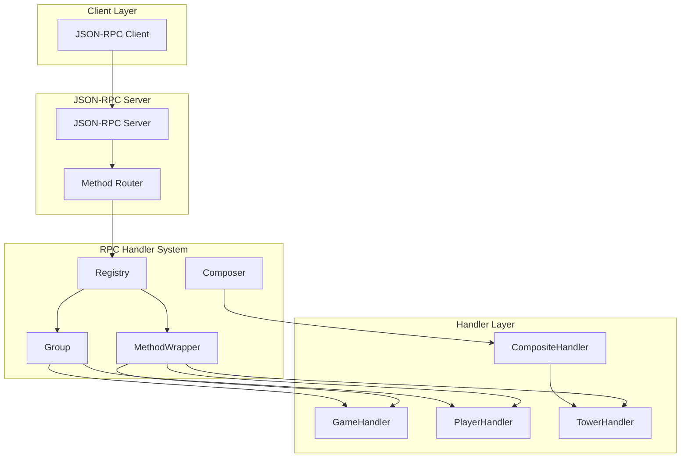
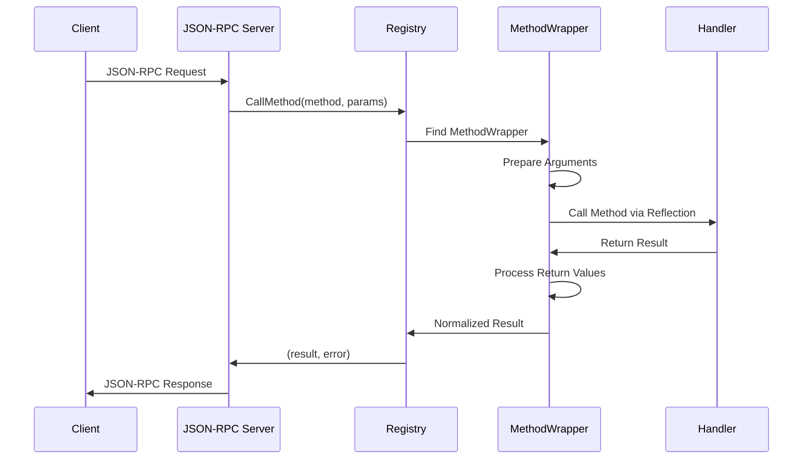
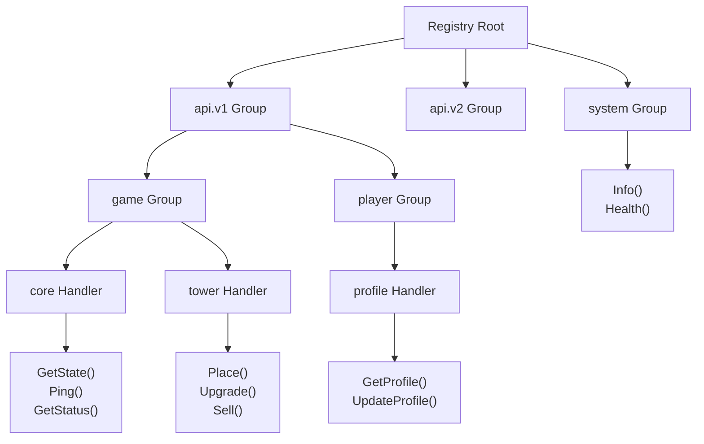

# RPC Handler System Documentation

## 📋 목차

1. [개요](#1-개요)
2. [아키텍처](#2-아키텍처)
3. [핵심 컴포넌트](#3-핵심-컴포넌트)
4. [사용법](#4-사용법)
5. [메서드 시그니처](#5-메서드-시그니처)
6. [그룹 라우팅](#6-그룹-라우팅)
7. [핸들러 조합](#7-핸들러-조합)
8. [고급 기능](#8-고급-기능)
9. [예제](#9-예제)

---

## 1. 개요

### 1.1 목적
RPC Handler System은 리플렉션 기반의 JSON-RPC 핸들러 유틸리티 패키지입니다. 구조체의 public 메서드를 자동으로 스캔하여 JSON-RPC 엔드포인트로 등록하고, 그룹 라우팅과 핸들러 조합을 지원합니다.

### 1.2 주요 특징
- **자동 메서드 스캐닝**: 리플렉션을 통한 public 메서드 자동 등록
- **유연한 시그니처**: 다양한 메서드 시그니처 지원
- **그룹 라우팅**: 계층적 API 경로 구성
- **핸들러 조합**: 여러 핸들러를 조합하여 새로운 핸들러 생성
- **JSON-RPC 통합**: 기존 JSON-RPC 서버와 완벽 호환

### 1.3 설계 원칙
- **단순성**: 최소한의 코드로 최대한의 기능
- **유연성**: 다양한 사용 패턴 지원
- **성능**: 리플렉션 오버헤드 최소화
- **확장성**: 미들웨어 및 커스터마이징 지원

---

## 2. 아키텍처

### 2.1 전체 아키텍처



### 2.2 처리 흐름



### 2.3 그룹 구조



---

## 3. 핵심 컴포넌트

### 3.1 클래스 다이어그램

```mermaid
classDiagram
    class Handler {
        <<interface>>
    }
    
    class Registry {
        -methods map[string]*MethodWrapper
        -groups map[string]*Group
        +RegisterHandler(name, handler) error
        +CallMethod(ctx, method, params) (interface{}, error)
        +Group(prefix) *Group
        +GetHandlerFunc(method) HandlerFunc
        +RegisterAllMethods(server)
    }
    
    class Group {
        -prefix string
        -handlers map[string]Handler
        -registry *Registry
        +RegisterHandler(name, handler) error
        +Group(suffix) *Group
        +RegisterComposite(composite) error
        +RegisterToServer(server)
    }
    
    class MethodWrapper {
        -method reflect.Method
        -handler reflect.Value
        -hasContext bool
        -paramType reflect.Type
        -needsParams bool
        -returnInfo returnTypeInfo
        -methodPath string
    }
    
    class returnTypeInfo {
        -hasReturn bool
        -hasError bool
        -returnIdx int
        -errorIdx int
    }
    
    class Composer {
        -handlers map[string]Handler
        +Add(name, handler) *Composer
        +Compose() Handler
    }
    
    class CompositeHandler {
        -handlers map[string]Handler
    }
    
    Registry --> Group : creates
    Registry --> MethodWrapper : contains
    Group --> Registry : references
    MethodWrapper --> returnTypeInfo : contains
    Composer --> CompositeHandler : creates
    CompositeHandler --> Handler : implements
    Handler <|-- ConcreteHandler
```

### 3.2 주요 구조체

#### Registry
```go
type Registry struct {
    methods map[string]*MethodWrapper
    groups  map[string]*Group
}
```
- **역할**: 메서드 등록 및 호출 관리
- **책임**: 리플렉션 기반 메서드 스캐닝, 메서드 호출 라우팅

#### MethodWrapper
```go
type MethodWrapper struct {
    method      reflect.Method
    handler     reflect.Value
    hasContext  bool
    paramType   reflect.Type
    needsParams bool
    returnInfo  returnTypeInfo
    methodPath  string
}
```
- **역할**: 메서드 호출을 위한 메타데이터 저장
- **책임**: 메서드 시그니처 분석, 파라미터 준비, 반환값 정규화

#### Group
```go
type Group struct {
    prefix   string
    handlers map[string]Handler
    registry *Registry
}
```
- **역할**: 계층적 API 경로 관리
- **책임**: 그룹별 핸들러 등록, 하위 그룹 생성

#### Composer
```go
type Composer struct {
    handlers map[string]Handler
}
```
- **역할**: 여러 핸들러를 하나로 조합
- **책임**: 핸들러 조합 및 CompositeHandler 생성

---

## 4. 사용법

### 4.1 기본 사용법

```go
// 1. 핸들러 구조체 정의
type GameHandler struct{}

func (g *GameHandler) GetStatus() any {
    return map[string]string{"status": "running"}
}

func (g *GameHandler) Ping() error {
    return nil
}

// 2. Registry 생성 및 핸들러 등록
registry := rpchandler.NewRegistry()
registry.RegisterHandler("game", &GameHandler{})

// 3. JSON-RPC 서버에 등록
rpcServer := jsonrpc.NewServer()
registry.RegisterAllMethods(rpcServer)

// 사용 가능한 메서드: 
// - game.GetStatus
// - game.Ping
```

### 4.2 그룹 사용법

```go
// Registry 생성
registry := rpchandler.NewRegistry()

// 그룹 생성
gameGroup := registry.Group("game")
playerGroup := registry.Group("player")

// 핸들러 등록
gameGroup.RegisterHandler("core", &GameHandler{})
gameGroup.RegisterHandler("tower", &TowerHandler{})
playerGroup.RegisterHandler("profile", &PlayerHandler{})

// 서버 등록
rpcServer := jsonrpc.NewServer()
registry.RegisterAllMethods(rpcServer)

// 사용 가능한 메서드:
// - game.core.GetStatus
// - game.core.Ping
// - game.tower.Place
// - game.tower.Upgrade
// - player.profile.GetProfile
```

### 4.3 핸들러 조합

```go
// 개별 핸들러들
gameHandler := &GameHandler{}
towerHandler := &TowerHandler{}

// 핸들러 조합
composite := rpchandler.NewComposer().
    Add("core", gameHandler).
    Add("tower", towerHandler).
    Compose()

// Registry에 등록
registry := rpchandler.NewRegistry()
gameGroup := registry.Group("game")
gameGroup.RegisterComposite(composite.(*rpchandler.CompositeHandler))
```

---

## 5. 메서드 시그니처

### 5.1 지원하는 시그니처

RPC Handler System은 다양한 메서드 시그니처를 지원하며, 자동으로 표준 형태로 정규화합니다.

#### 파라미터 패턴
```go
// 1. 파라미터 없음
func Method() error
func Method() any
func Method() (any, error)

// 2. Context만
func Method(ctx context.Context) error
func Method(ctx context.Context) any
func Method(ctx context.Context) (any, error)

// 3. 타입 지정 파라미터
func Method(ctx context.Context, params SomeStruct) error
func Method(ctx context.Context, params SomeStruct) (SomeType, error)

// 4. Raw JSON 파라미터
func Method(ctx context.Context, params json.RawMessage) error
func Method(ctx context.Context, params json.RawMessage) (any, error)

// 5. Context 없는 파라미터 (권장하지 않음)
func Method(params SomeStruct) error
```

#### 반환값 패턴
```go
// 1. Error만 반환 -> (nil, error)로 정규화
func Method() error

// 2. Any만 반환 -> (any, nil)로 정규화  
func Method() any

// 3. 표준 형태
func Method() (any, error)

// 4. 타입 지정 반환값 -> (interface{}(Type), error)로 정규화
func Method() (SomeType, error)
```

### 5.2 시그니처 변환 예시

```go
// 원본 메서드
func (h *Handler) Greeting() error {
    return nil
}

// 내부적으로 다음과 같이 처리됨
func wrappedGreeting(ctx context.Context, params json.RawMessage) (interface{}, error) {
    err := h.Greeting()
    return nil, err  // (nil, error) 형태로 정규화
}
```

---

## 6. 그룹 라우팅

### 6.1 계층적 구조

그룹 라우팅을 통해 API를 계층적으로 구성할 수 있습니다.

```go
registry := rpchandler.NewRegistry()

// 최상위 그룹
apiV1 := registry.Group("api.v1")
apiV2 := registry.Group("api.v2") 

// 중간 그룹
v1Game := apiV1.Group("game")
v1Player := apiV1.Group("player")

// 하위 그룹
v1GameCore := v1Game.Group("core")
v1GameTower := v1Game.Group("tower")

// 핸들러 등록
v1GameCore.RegisterHandler("engine", &GameEngineHandler{})
v1GameTower.RegisterHandler("management", &TowerManagementHandler{})

// 결과 경로:
// api.v1.game.core.engine.SomeMethod
// api.v1.game.tower.management.SomeMethod
```

### 6.2 선택적 등록

```go
// 특정 그룹만 서버에 등록
apiV1.RegisterToServer(rpcServer)  // V1만 활성화
// apiV2.RegisterToServer(rpcServer)  // V2는 비활성화

// 또는 전체 등록
registry.RegisterAllMethods(rpcServer)
```

### 6.3 그룹별 메서드 조회

```go
// 특정 그룹의 메서드 목록 조회
v1Methods := apiV1.GetMethodNames()
gameCoreMethods := v1GameCore.GetMethodNames()

// 프리픽스로 메서드 필터링
gameMethods := registry.GetMethodNamesWithPrefix("api.v1.game")
```

---

## 7. 핸들러 조합

### 7.1 Composer 사용

Composer를 사용하여 여러 핸들러를 하나로 조합할 수 있습니다.

```go
// 기존 핸들러들
userHandler := &UserHandler{}
authHandler := &AuthHandler{}
profileHandler := &ProfileHandler{}

// A + B = C 형태의 조합
userComposite := rpchandler.NewComposer().
    Add("auth", authHandler).
    Add("profile", profileHandler).
    Compose()

// 최종 조합 (A + B + C = D)
finalComposite := rpchandler.NewComposer().
    Add("user", userHandler).
    Add("account", userComposite).
    Compose()

// 등록
registry := rpchandler.NewRegistry()
apiGroup := registry.Group("api")
apiGroup.RegisterComposite(finalComposite.(*rpchandler.CompositeHandler))
```

### 7.2 조합 결과

```
api.user.SomeMethod         // userHandler의 메서드
api.account.auth.Login      // authHandler의 메서드  
api.account.auth.Logout
api.account.profile.Get     // profileHandler의 메서드
api.account.profile.Update
```

### 7.3 체이닝 방식

```go
// 메서드 체이닝으로 간단하게 조합
composite := rpchandler.NewComposer().
    Add("game", &GameHandler{}).
    Add("player", &PlayerHandler{}).
    Add("tower", &TowerHandler{}).
    Add("system", &SystemHandler{}).
    Compose()
```

---

## 8. 고급 기능

### 8.1 메서드 경로 확인

```go
// 등록된 모든 메서드 확인
methods := registry.GetMethodNames()
for _, method := range methods {
    fmt.Println("Registered:", method)
}

// 특정 프리픽스로 필터링
gameMethods := registry.GetMethodNamesWithPrefix("game")
```

### 8.2 동적 메서드 호출

```go
// 프로그래밍 방식으로 메서드 호출
ctx := context.Background()
params := json.RawMessage(`{"game_id": "12345"}`)

result, err := registry.CallMethod(ctx, "game.core.GetState", params)
if err != nil {
    log.Printf("Method call failed: %v", err)
} else {
    log.Printf("Result: %+v", result)
}
```

### 8.3 JSON-RPC 서버 통합

```go
// 개별 메서드 등록
rpcServer.RegisterFunc("game.ping", registry.GetHandlerFunc("game.Ping"))

// 전체 메서드 등록
registry.RegisterAllMethods(rpcServer)

// 특정 프리픽스만 등록
registry.RegisterMethodsWithPrefix(rpcServer, "game")
```

### 8.4 에러 처리

```go
// 핸들러에서 에러 반환
func (g *GameHandler) GetState(ctx context.Context, params GetStateParams) (GameState, error) {
    if params.GameID == "" {
        return GameState{}, fmt.Errorf("game_id is required")
    }
    
    // 비즈니스 로직...
    return gameState, nil
}

// JSON-RPC 에러로 자동 변환됨
// {"jsonrpc": "2.0", "error": {"code": -32603, "message": "game_id is required"}, "id": 1}
```

---

## 9. 예제

### 9.1 게임 서버 예제

```go
package main

import (
    "context"
    "encoding/json"
    "fmt"
    "net/http"
    
    "github.com/homveloper/defense-allies-server/pkg/jsonrpc"
    "github.com/homveloper/defense-allies-server/pkg/rpchandler"
)

// 핸들러 정의
type GameHandler struct{}

func (g *GameHandler) GetStatus() any {
    return map[string]interface{}{
        "status": "running",
        "players": 42,
        "uptime": 3600,
    }
}

func (g *GameHandler) Ping() error {
    return nil
}

type GetStateParams struct {
    GameID string `json:"game_id"`
}

func (g *GameHandler) GetState(ctx context.Context, params GetStateParams) (any, error) {
    if params.GameID == "" {
        return nil, fmt.Errorf("game_id is required")
    }
    
    return map[string]interface{}{
        "game_id": params.GameID,
        "status": "active",
        "wave": 5,
        "lives": 10,
    }, nil
}

type TowerHandler struct{}

func (t *TowerHandler) Place(ctx context.Context, params json.RawMessage) error {
    var p map[string]interface{}
    if err := json.Unmarshal(params, &p); err != nil {
        return err
    }
    
    fmt.Printf("Placing tower: %+v\n", p)
    return nil
}

func (t *TowerHandler) Upgrade(ctx context.Context, params json.RawMessage) (any, error) {
    return map[string]interface{}{
        "success": true,
        "new_level": 2,
        "cost": 100,
    }, nil
}

type PlayerHandler struct{}

func (p *PlayerHandler) GetProfile(ctx context.Context, params struct {
    PlayerID string `json:"player_id"`
}) (any, error) {
    return map[string]interface{}{
        "id": params.PlayerID,
        "name": "Player" + params.PlayerID,
        "level": 25,
        "rank": "Gold",
    }, nil
}

func main() {
    // Registry 설정
    registry := rpchandler.NewRegistry()
    
    // 그룹 및 핸들러 등록
    gameGroup := registry.Group("game")
    gameGroup.RegisterHandler("core", &GameHandler{})
    gameGroup.RegisterHandler("tower", &TowerHandler{})
    
    playerGroup := registry.Group("player")
    playerGroup.RegisterHandler("profile", &PlayerHandler{})
    
    // JSON-RPC 서버 설정
    rpcServer := jsonrpc.NewServer()
    registry.RegisterAllMethods(rpcServer)
    
    // HTTP 서버 설정
    http.Handle("/rpc", rpcServer)
    
    fmt.Println("RPC Server starting on :8080")
    fmt.Println("Available methods:")
    for _, method := range registry.GetMethodNames() {
        fmt.Printf("  - %s\n", method)
    }
    
    http.ListenAndServe(":8080", nil)
}
```

### 9.2 클라이언트 테스트

```bash
# 게임 상태 조회
curl -X POST http://localhost:8080/rpc \
  -H "Content-Type: application/json" \
  -d '{
    "jsonrpc": "2.0",
    "method": "game.core.GetState",
    "params": {"game_id": "12345"},
    "id": 1
  }'

# 배치 요청 (한 번에 여러 메서드 호출)
curl -X POST http://localhost:8080/rpc \
  -H "Content-Type: application/json" \
  -d '[
    {
      "jsonrpc": "2.0",
      "method": "game.core.Ping",
      "id": 1
    },
    {
      "jsonrpc": "2.0", 
      "method": "game.core.GetStatus",
      "id": 2
    },
    {
      "jsonrpc": "2.0",
      "method": "player.profile.GetProfile",
      "params": {"player_id": "user123"},
      "id": 3
    }
  ]'
```

### 9.3 실행 결과

```
RPC Server starting on :8080
Available methods:
  - game.core.GetStatus
  - game.core.Ping
  - game.core.GetState
  - game.tower.Place
  - game.tower.Upgrade
  - player.profile.GetProfile
```

---

## 10. 성능 고려사항

### 10.1 리플렉션 최적화
- 메서드 등록 시에만 리플렉션 사용
- 런타임에는 캐시된 MethodWrapper 사용
- 타입 정보 사전 분석으로 호출 시 오버헤드 최소화

### 10.2 메모리 사용
- 메서드별로 별도의 MethodWrapper 인스턴스
- 핸들러 인스턴스는 참조로 공유
- 그룹 구조는 계층적 맵으로 효율적 관리

### 10.3 확장성
- 중첩 그룹 제한 없음
- 핸들러 수 제한 없음  
- 동적 메서드 추가/제거 지원 (필요시 구현 가능)

---

## 11. 제한사항 및 고려사항

### 11.1 현재 제한사항
- 메서드는 최대 2개의 반환값만 지원 (result, error)
- 파라미터는 최대 2개까지 지원 (context, params)
- 제네릭 메서드는 지원하지 않음
- Private 메서드는 자동 등록되지 않음

### 11.2 네이밍 규칙
- 핸들러 이름은 알파벳과 점(.)만 사용 권장
- 메서드 이름은 Go 표준 네이밍 규칙 준수
- 그룹 이름은 소문자와 점(.)으로 구성 권장

### 11.3 에러 처리
- 핸들러에서 반환된 error는 자동으로 JSON-RPC error로 변환
- panic은 자동으로 복구되지 않음 (미들웨어에서 처리 필요)
- 타입 변환 실패 시 적절한 에러 메시지 제공

이 문서는 RPC Handler System의 완전한 사용 가이드입니다. 추가 질문이나 개선사항이 있으면 언제든 문의해 주세요.