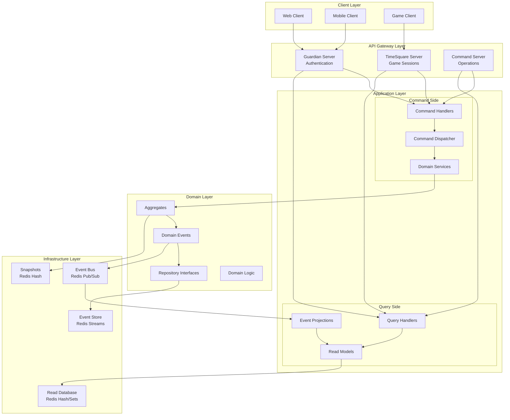

# DDD CQRS 아키텍처 설계 문서

## 개요

Defense Allies Server는 Domain-Driven Design (DDD)와 Command Query Responsibility Segregation (CQRS) 패턴을 기반으로 구축됩니다. 이벤트 소싱(Event Sourcing)을 지원하며, Redis를 주요 영구 저장소로 사용합니다.

## 아키텍처 원칙

### 1. Domain-Driven Design (DDD)
- **Bounded Context**: 각 도메인 영역을 명확히 분리
- **Aggregate**: 비즈니스 불변성을 보장하는 도메인 객체 집합
- **Domain Events**: 도메인 내 중요한 변화를 나타내는 이벤트
- **Repository Pattern**: 도메인 객체의 영속성 추상화

### 2. CQRS (Command Query Responsibility Segregation)
- **Command Side**: 상태 변경 작업 처리
- **Query Side**: 데이터 조회 작업 처리
- **Event Bus**: Command와 Query 간 비동기 통신
- **Read Models**: 조회 최적화된 데이터 모델

### 3. Event Sourcing
- **Event Store**: 모든 도메인 이벤트를 순차적으로 저장
- **Event Replay**: 이벤트 재생을 통한 상태 복원
- **Snapshots**: 성능 최적화를 위한 상태 스냅샷

## 시스템 아키텍처 다이어그램



## Bounded Context 설계

### 1. Authentication Context (Guardian)
**책임**: 사용자 인증, 권한 관리, 세션 관리

**Aggregates**:
- `User`: 사용자 정보 및 인증 상태
- `Session`: 사용자 세션 관리

**Commands**:
- `RegisterUser`
- `AuthenticateUser`
- `RefreshToken`
- `LogoutUser`

**Events**:
- `UserRegistered`
- `UserAuthenticated`
- `TokenRefreshed`
- `UserLoggedOut`

### 2. Game Context (TimeSquare)
**책임**: 게임 세션, 매치메이킹, 실시간 게임 상태

**Aggregates**:
- `GameSession`: 게임 세션 상태 관리
- `Player`: 게임 내 플레이어 상태
- `Match`: 매치메이킹 및 게임 매치

**Commands**:
- `CreateGameSession`
- `JoinGameSession`
- `PlaceTower`
- `StartWave`
- `EndGame`

**Events**:
- `GameSessionCreated`
- `PlayerJoined`
- `TowerPlaced`
- `WaveStarted`
- `GameEnded`

### 3. Operations Context (Command)
**책임**: 시스템 운영, 모니터링, 관리 기능

**Aggregates**:
- `SystemMetrics`: 시스템 성능 지표
- `GameStatistics`: 게임 통계 정보
- `Configuration`: 시스템 설정

**Commands**:
- `UpdateConfiguration`
- `GenerateReport`
- `PerformMaintenance`

**Events**:
- `ConfigurationUpdated`
- `ReportGenerated`
- `MaintenancePerformed`

## CQRS 구현 구조 (External Packages)

### Command Side 구조
```
pkg/
├── cqrs/                   # Core CQRS Framework
│   ├── aggregate_root.go   # go.cqrs 호환 인터페이스
│   ├── command.go          # Command 인터페이스
│   ├── command_handler.go  # CommandHandler 인터페이스
│   ├── command_dispatcher.go # CommandDispatcher 인터페이스
│   ├── event_message.go    # EventMessage 인터페이스
│   ├── domain_event.go     # DomainEvent 확장 인터페이스
│   ├── repository.go       # Repository 인터페이스들
│   ├── event_bus.go        # EventBus 인터페이스
│   └── storage_strategy.go # 저장 전략 인터페이스
├── application/
│   ├── auth/
│   │   ├── commands/       # Auth Command 정의
│   │   │   ├── register_user.go
│   │   │   ├── authenticate_user.go
│   │   │   └── logout_user.go
│   │   └── handlers/       # Auth Command Handlers
│   │       ├── register_user_handler.go
│   │       ├── authenticate_user_handler.go
│   │       └── logout_user_handler.go
│   ├── game/
│   │   ├── commands/       # Game Command 정의
│   │   │   ├── create_game_session.go
│   │   │   ├── join_game_session.go
│   │   │   └── place_tower.go
│   │   └── handlers/       # Game Command Handlers
│   │       ├── create_game_session_handler.go
│   │       ├── join_game_session_handler.go
│   │       └── place_tower_handler.go
│   └── ops/
│       ├── commands/       # Operations Command 정의
│       └── handlers/       # Operations Command Handlers
├── domain/
│   ├── auth/
│   │   ├── user_aggregate.go      # User Aggregate
│   │   ├── session_aggregate.go   # Session Aggregate
│   │   ├── user_repository.go     # Repository 인터페이스
│   │   └── events/               # Domain Events
│   │       ├── user_registered.go
│   │       ├── user_authenticated.go
│   │       └── user_logged_out.go
│   ├── game/
│   │   ├── game_session_aggregate.go  # GameSession Aggregate
│   │   ├── player_aggregate.go        # Player Aggregate
│   │   ├── match_aggregate.go         # Match Aggregate
│   │   └── events/                   # Game Events
│   │       ├── game_session_created.go
│   │       ├── player_joined.go
│   │       └── tower_placed.go
│   └── ops/
│       ├── system_metrics_aggregate.go
│       └── events/
└── infrastructure/
    ├── eventstore/         # Event Store 구현
    │   ├── redis_event_store.go
    │   ├── stream_namer.go
    │   └── event_compactor.go
    ├── repositories/       # Repository 구현체들
    │   ├── event_sourced_repository.go
    │   ├── state_based_repository.go
    │   ├── hybrid_repository.go
    │   └── redis_user_repository.go
    ├── eventbus/           # Event Bus 구현
    │   ├── redis_event_bus.go
    │   ├── subscription_manager.go
    │   └── event_stream.go
    └── serialization/      # 직렬화 구현체들
        ├── json_serializer.go
        ├── bson_serializer.go
        └── protobuf_serializer.go
```

### Query Side 구조
```
pkg/
├── cqrs/                   # Core CQRS Framework (공통)
│   ├── query.go            # Query 인터페이스
│   ├── query_handler.go    # QueryHandler 인터페이스
│   ├── query_dispatcher.go # QueryDispatcher 인터페이스
│   ├── read_model.go       # ReadModel 인터페이스
│   └── projection.go       # Projection 인터페이스
├── application/
│   ├── auth/
│   │   └── queries/        # Auth Query 정의 및 핸들러
│   │       ├── get_user.go
│   │       ├── get_user_handler.go
│   │       ├── get_session.go
│   │       └── get_session_handler.go
│   ├── game/
│   │   └── queries/        # Game Query 정의 및 핸들러
│   │       ├── get_game_session.go
│   │       ├── get_game_session_handler.go
│   │       ├── list_active_sessions.go
│   │       └── list_active_sessions_handler.go
│   ├── ops/
│   │   └── queries/        # Operations Query 정의 및 핸들러
│   └── projections/        # Event Projections
│       ├── user_projection_handler.go
│       ├── game_session_projection_handler.go
│       └── statistics_projection_handler.go
├── readmodels/             # Read Models (Query 최적화)
│   ├── auth/
│   │   ├── user_read_model.go
│   │   └── session_read_model.go
│   ├── game/
│   │   ├── game_session_read_model.go
│   │   ├── player_read_model.go
│   │   └── match_read_model.go
│   └── ops/
│       ├── system_metrics_read_model.go
│       └── game_statistics_read_model.go
└── infrastructure/
    ├── readstore/          # Read Store 구현
    │   ├── redis_read_store.go
    │   ├── projection_manager.go
    │   └── index_manager.go
    └── projectors/         # Projection 구현체들
        ├── user_projector.go
        ├── game_session_projector.go
        └── statistics_projector.go
```

## Event Sourcing 설계

### Event Store 구조 (Redis Streams)
```
Stream Key Pattern: "events:{aggregate_type}:{aggregate_id}"
Example: "events:user:550e8400-e29b-41d4-a716-446655440000"

Event Entry Structure:
{
  "event_id": "01234567-89ab-cdef-0123-456789abcdef",
  "event_type": "UserRegistered",
  "aggregate_id": "550e8400-e29b-41d4-a716-446655440000",
  "aggregate_version": 1,
  "event_data": "{\"username\":\"player1\",\"email\":\"player1@example.com\"}",
  "metadata": "{\"timestamp\":\"2024-01-01T00:00:00Z\",\"user_id\":\"admin\"}",
  "created_at": "2024-01-01T00:00:00Z"
}
```

### Snapshot 구조 (Redis Hash)
```
Snapshot Key Pattern: "snapshots:{aggregate_type}:{aggregate_id}"
Example: "snapshots:user:550e8400-e29b-41d4-a716-446655440000"

Snapshot Structure:
{
  "aggregate_id": "550e8400-e29b-41d4-a716-446655440000",
  "aggregate_version": 100,
  "snapshot_data": "{\"id\":\"550e8400...\",\"username\":\"player1\",\"status\":\"active\"}",
  "created_at": "2024-01-01T00:00:00Z"
}
```

### Read Models 구조 (Redis Hash/Sets)
```
User Read Model: "readmodel:user:{user_id}"
{
  "id": "550e8400-e29b-41d4-a716-446655440000",
  "username": "player1",
  "email": "player1@example.com",
  "status": "active",
  "last_login": "2024-01-01T00:00:00Z",
  "created_at": "2024-01-01T00:00:00Z"
}

Game Session Read Model: "readmodel:game_session:{session_id}"
{
  "id": "session123",
  "status": "active",
  "players": ["player1", "player2"],
  "current_wave": 5,
  "difficulty": "normal",
  "created_at": "2024-01-01T00:00:00Z"
}

Active Sessions Index: "index:active_sessions"
Set containing active session IDs
```

## 핵심 인터페이스 설계 (go.cqrs 기반 확장)

### 1. AggregateRoot Interface (go.cqrs 호환)
```go
// go.cqrs의 AggregateRoot 인터페이스를 기반으로 한 핵심 인터페이스
type AggregateRoot interface {
    // 기본 식별자 및 버전 관리
    AggregateID() string
    OriginalVersion() int  // 로드 시점의 버전
    CurrentVersion() int   // 현재 버전
    IncrementVersion()     // 버전 증가

    // 이벤트 적용 및 추적
    Apply(event EventMessage, isNew bool) // 이벤트 적용
    TrackChange(event EventMessage)       // 변경사항 추적
    GetChanges() []EventMessage           // 미커밋 변경사항 조회
    ClearChanges()                        // 변경사항 초기화
}

// Defense Allies 확장 인터페이스
type Aggregate interface {
    AggregateRoot

    // 추가 메타데이터
    AggregateType() string    // Aggregate 타입 식별
    CreatedAt() time.Time     // 생성 시간
    UpdatedAt() time.Time     // 마지막 업데이트 시간

    // 유효성 검증
    Validate() error          // 비즈니스 규칙 검증

    // 상태 관리
    IsDeleted() bool          // 삭제 상태 확인
    MarkAsDeleted()           // 소프트 삭제 마킹
}

// 이벤트 소싱을 지원하는 Aggregate (선택적)
type EventSourcedAggregate interface {
    Aggregate

    // 이벤트 히스토리 관리
    LoadFromHistory(events []EventMessage) error
    ApplyEvent(event EventMessage) error

    // 스냅샷 지원
    CreateSnapshot() (SnapshotData, error)
    LoadFromSnapshot(snapshot SnapshotData) error
    ShouldCreateSnapshot() bool // 스냅샷 생성 조건 확인

    // 이벤트 재생 최적화
    GetLastSnapshotVersion() int
    CanReplayFrom(version int) bool
}

// 상태 기반 Aggregate (일반적인 CRUD 방식)
type StateBasedAggregate interface {
    Aggregate

    // 직접 상태 로드/저장
    LoadState() error
    SaveState() error

    // 상태 비교 (Optimistic Concurrency Control)
    HasChanged() bool
    GetStateHash() string // 상태 변경 감지용
}

// 하이브리드 Aggregate (이벤트 소싱 + 상태 저장)
type HybridAggregate interface {
    EventSourcedAggregate
    StateBasedAggregate

    // 하이브리드 전용 기능
    SyncStateFromEvents() error      // 이벤트에서 상태 동기화
    ValidateStateConsistency() error // 상태 일관성 검증
    GetStorageStrategy() StorageStrategy
}
```

### 2. EventMessage Interface (go.cqrs 호환)
```go
// go.cqrs의 EventMessage 인터페이스 확장 (직렬화 제거)
type EventMessage interface {
    // 기본 이벤트 정보
    EventID() string
    EventType() string
    AggregateID() string
    AggregateType() string
    Version() int

    // 이벤트 데이터 (직렬화는 별도 처리)
    EventData() interface{}

    // 메타데이터
    Metadata() map[string]interface{}
    Timestamp() time.Time
}

// Defense Allies 확장 DomainEvent
type DomainEvent interface {
    EventMessage

    // 추가 도메인 정보
    CausationID() string    // 원인이 된 커맨드 ID
    CorrelationID() string  // 연관 추적 ID
    UserID() string         // 이벤트 발생시킨 사용자

    // 이벤트 분류
    IsSystemEvent() bool    // 시스템 이벤트 여부
    GetEventCategory() EventCategory
    GetPriority() EventPriority

    // 검증 및 보안
    ValidateEvent() error
    GetChecksum() string    // 무결성 검증용
}

// 이벤트 분류
type EventCategory int
const (
    UserAction EventCategory = iota
    SystemEvent
    IntegrationEvent
    DomainEvent
)

type EventPriority int
const (
    Low EventPriority = iota
    Normal
    High
    Critical
)
```

### 3. Command Interface (go.cqrs 확장)
```go
// 기본 Command 인터페이스 (직렬화 제거)
type Command interface {
    // 기본 식별 정보
    CommandID() string        // 커맨드 고유 ID
    CommandType() string      // 커맨드 타입
    AggregateID() string      // 대상 Aggregate ID
    AggregateType() string    // 대상 Aggregate 타입

    // 메타데이터
    Timestamp() time.Time     // 커맨드 생성 시간
    UserID() string          // 커맨드 실행 사용자
    CorrelationID() string   // 추적용 상관관계 ID

    // 검증
    Validate() error         // 커맨드 유효성 검증

    // 데이터 접근 (직렬화는 별도 처리)
    GetData() interface{}    // 커맨드 데이터 반환
}

// 커맨드 실행 결과
type CommandResult struct {
    Success       bool              // 성공 여부
    Error         error             // 에러 정보
    Events        []EventMessage    // 발생한 이벤트들
    AggregateID   string           // 처리된 Aggregate ID
    Version       int              // 처리 후 Aggregate 버전
    Data          interface{}      // 응답 데이터 (필요시)
    ExecutionTime time.Duration    // 실행 시간
}

// 커맨드 핸들러 인터페이스
type CommandHandler interface {
    Handle(ctx context.Context, command Command) (*CommandResult, error)
    CanHandle(commandType string) bool
    GetHandlerName() string
}

// 커맨드 디스패처
type CommandDispatcher interface {
    Dispatch(ctx context.Context, command Command) (*CommandResult, error)
    RegisterHandler(commandType string, handler CommandHandler) error
    UnregisterHandler(commandType string) error
}
```

### 4. BaseAggregate Implementation (go.cqrs 스타일)
```go
// go.cqrs 스타일의 기본 Aggregate 구현체
type BaseAggregate struct {
    id              string
    originalVersion int
    currentVersion  int
    changes         []EventMessage
    createdAt       time.Time
    updatedAt       time.Time
    deleted         bool
}

// AggregateRoot 인터페이스 구현
func (a *BaseAggregate) AggregateID() string {
    return a.id
}

func (a *BaseAggregate) OriginalVersion() int {
    return a.originalVersion
}

func (a *BaseAggregate) CurrentVersion() int {
    return a.currentVersion
}

func (a *BaseAggregate) IncrementVersion() {
    a.currentVersion++
    a.updatedAt = time.Now()
}

func (a *BaseAggregate) Apply(event EventMessage, isNew bool) {
    // 이벤트를 Aggregate에 적용
    if isNew {
        a.TrackChange(event)
    }
    a.IncrementVersion()
}

func (a *BaseAggregate) TrackChange(event EventMessage) {
    a.changes = append(a.changes, event)
}

func (a *BaseAggregate) GetChanges() []EventMessage {
    return a.changes
}

func (a *BaseAggregate) ClearChanges() {
    a.changes = nil
}

// Defense Allies 확장 메서드들
func (a *BaseAggregate) CreatedAt() time.Time {
    return a.createdAt
}

func (a *BaseAggregate) UpdatedAt() time.Time {
    return a.updatedAt
}

func (a *BaseAggregate) IsDeleted() bool {
    return a.deleted
}

func (a *BaseAggregate) MarkAsDeleted() {
    a.deleted = true
    a.updatedAt = time.Now()
}

func (a *BaseAggregate) Validate() error {
    if a.id == "" {
        return errors.New("aggregate ID cannot be empty")
    }
    return nil
}
```

### 5. SnapshotData Interface
```go
// 스냅샷 데이터 인터페이스 (직렬화 제거)
type SnapshotData interface {
    AggregateID() string
    AggregateType() string
    Version() int
    Data() interface{}      // 스냅샷 데이터 (직렬화는 별도 처리)
    Timestamp() time.Time

    // 검증
    Validate() error
    GetChecksum() string    // 무결성 검증용
}

// 스냅샷 저장소 인터페이스
type SnapshotStore interface {
    Save(snapshot SnapshotData) error
    Load(aggregateID string) (SnapshotData, error)
    Delete(aggregateID string) error
    Exists(aggregateID string) bool
}
```

### 6. Repository Interface (go.cqrs 확장)
```go
// 기본 Repository 인터페이스 (go.cqrs 호환)
type Repository interface {
    Save(ctx context.Context, aggregate AggregateRoot, expectedVersion int) error
    GetByID(ctx context.Context, id string) (AggregateRoot, error)
    GetVersion(ctx context.Context, id string) (int, error)
    Exists(ctx context.Context, id string) bool
}

// 이벤트 소싱 Repository (선택적)
type EventSourcedRepository interface {
    Repository

    // 이벤트 스토어 관련
    SaveEvents(ctx context.Context, aggregateID string, events []EventMessage, expectedVersion int) error
    GetEventHistory(ctx context.Context, aggregateID string, fromVersion int) ([]EventMessage, error)
    GetEventStream(ctx context.Context, aggregateID string) (<-chan EventMessage, error)

    // 스냅샷 관련
    SaveSnapshot(ctx context.Context, snapshot SnapshotData) error
    GetSnapshot(ctx context.Context, aggregateID string) (SnapshotData, error)
    DeleteSnapshot(ctx context.Context, aggregateID string) error

    // 최적화
    GetLastEventVersion(ctx context.Context, aggregateID string) (int, error)
    CompactEvents(ctx context.Context, aggregateID string, beforeVersion int) error
}

// 상태 기반 Repository (일반적인 CRUD)
type StateBasedRepository interface {
    Repository

    // CRUD 작업
    Create(ctx context.Context, aggregate AggregateRoot) error
    Update(ctx context.Context, aggregate AggregateRoot) error
    Delete(ctx context.Context, id string) error

    // 조회 기능
    FindBy(ctx context.Context, criteria QueryCriteria) ([]AggregateRoot, error)
    Count(ctx context.Context, criteria QueryCriteria) (int64, error)

    // 배치 작업
    SaveBatch(ctx context.Context, aggregates []AggregateRoot) error
    DeleteBatch(ctx context.Context, ids []string) error
}

// 하이브리드 Repository
type HybridRepository interface {
    EventSourcedRepository
    StateBasedRepository

    // 하이브리드 전용
    SyncStateFromEvents(ctx context.Context, aggregateID string) error
    ValidateConsistency(ctx context.Context, aggregateID string) error
    GetStorageMetrics(ctx context.Context, aggregateID string) (*StorageMetrics, error)
}

// 조회 조건
type QueryCriteria struct {
    Filters   map[string]interface{}
    SortBy    string
    SortOrder SortOrder
    Limit     int
    Offset    int
}

type SortOrder int
const (
    Ascending SortOrder = iota
    Descending
)

// 저장소 메트릭
type StorageMetrics struct {
    EventCount    int64
    SnapshotCount int64
    StateSize     int64
    LastAccessed  time.Time
}
```

### 7. Event Bus Interface (go.cqrs 확장)
```go
// 이벤트 버스 인터페이스
type EventBus interface {
    // 이벤트 발행
    Publish(ctx context.Context, event EventMessage, options ...EventPublishOptions) error
    PublishBatch(ctx context.Context, events []EventMessage, options ...EventPublishOptions) error

    // 구독 관리
    Subscribe(eventType string, handler EventHandler) (SubscriptionID, error)
    SubscribeAll(handler EventHandler) (SubscriptionID, error)
    Unsubscribe(subscriptionID SubscriptionID) error

    // 생명주기
    Start(ctx context.Context) error
    Stop(ctx context.Context) error

    // 상태 확인
    IsRunning() bool
    GetMetrics() *EventBusMetrics
}

// 이벤트 핸들러 (go.cqrs 확장)
type EventHandler interface {
    Handle(ctx context.Context, event EventMessage) error
    CanHandle(eventType string) bool
    GetHandlerName() string
    GetHandlerType() HandlerType
}

// 핸들러 타입
type HandlerType int
const (
    ProjectionHandler HandlerType = iota
    ProcessManagerHandler
    SagaHandler
    NotificationHandler
)

// 구독 ID
type SubscriptionID string

// 이벤트 발행 옵션
type EventPublishOptions struct {
    Persistent    bool          // 이벤트 소싱용 영구 저장 여부
    Immediate     bool          // 즉시 발행 여부
    Async         bool          // 비동기 처리 여부
    Retry         *RetryPolicy  // 재시도 정책
    Timeout       time.Duration // 타임아웃
    Priority      EventPriority // 우선순위
    PartitionKey  string        // 파티션 키 (순서 보장용)
}

// 재시도 정책
type RetryPolicy struct {
    MaxAttempts int
    Delay       time.Duration
    BackoffType BackoffType
}

type BackoffType int
const (
    FixedBackoff BackoffType = iota
    ExponentialBackoff
    LinearBackoff
)

// 이벤트 버스 메트릭
type EventBusMetrics struct {
    PublishedEvents   int64
    ProcessedEvents   int64
    FailedEvents      int64
    ActiveSubscribers int
    AverageLatency    time.Duration
    LastEventTime     time.Time
}

// 이벤트 스트림 인터페이스
type EventStream interface {
    Subscribe(ctx context.Context, fromPosition StreamPosition) (<-chan EventMessage, error)
    GetPosition() StreamPosition
    Close() error
}

type StreamPosition struct {
    Offset    int64
    Timestamp time.Time
}
```

### 10. Query & Projection Interfaces (CQRS Query Side)
```go
// Query 인터페이스
type Query interface {
    // 기본 식별 정보
    QueryID() string         // 쿼리 고유 ID
    QueryType() string       // 쿼리 타입

    // 메타데이터
    Timestamp() time.Time    // 쿼리 생성 시간
    UserID() string         // 쿼리 실행 사용자
    CorrelationID() string  // 추적용 상관관계 ID

    // 쿼리 조건
    GetCriteria() interface{} // 쿼리 조건
    GetPagination() *Pagination // 페이징 정보
    GetSorting() *Sorting      // 정렬 정보

    // 검증
    Validate() error         // 쿼리 유효성 검증
}

// 페이징 정보
type Pagination struct {
    Page     int `json:"page"`
    PageSize int `json:"page_size"`
    Offset   int `json:"offset"`
    Limit    int `json:"limit"`
}

// 정렬 정보
type Sorting struct {
    Field string    `json:"field"`
    Order SortOrder `json:"order"`
}

// 쿼리 결과
type QueryResult struct {
    Success    bool        `json:"success"`
    Data       interface{} `json:"data"`
    Error      error       `json:"error,omitempty"`
    TotalCount int64       `json:"total_count,omitempty"`
    Page       int         `json:"page,omitempty"`
    PageSize   int         `json:"page_size,omitempty"`
    ExecutionTime time.Duration `json:"execution_time"`
}

// 쿼리 핸들러 인터페이스
type QueryHandler interface {
    Handle(ctx context.Context, query Query) (*QueryResult, error)
    CanHandle(queryType string) bool
    GetHandlerName() string
}

// 쿼리 디스패처
type QueryDispatcher interface {
    Dispatch(ctx context.Context, query Query) (*QueryResult, error)
    RegisterHandler(queryType string, handler QueryHandler) error
    UnregisterHandler(queryType string) error
}

// Read Model 인터페이스
type ReadModel interface {
    GetID() string
    GetType() string
    GetVersion() int
    GetData() interface{}
    GetLastUpdated() time.Time

    // 검증
    Validate() error
}

// Projection 인터페이스
type Projection interface {
    // 프로젝션 정보
    GetProjectionName() string
    GetVersion() string
    GetLastProcessedEvent() string

    // 이벤트 처리
    CanHandle(eventType string) bool
    Project(ctx context.Context, event EventMessage) error

    // 상태 관리
    GetState() ProjectionState
    Reset(ctx context.Context) error
    Rebuild(ctx context.Context) error
}

// 프로젝션 상태
type ProjectionState int

const (
    ProjectionStopped ProjectionState = iota
    ProjectionRunning
    ProjectionCatchingUp
    ProjectionFaulted
    ProjectionRebuilding
)

func (ps ProjectionState) String() string {
    switch ps {
    case ProjectionStopped:
        return "stopped"
    case ProjectionRunning:
        return "running"
    case ProjectionCatchingUp:
        return "catching_up"
    case ProjectionFaulted:
        return "faulted"
    case ProjectionRebuilding:
        return "rebuilding"
    default:
        return "unknown"
    }
}

// 프로젝션 매니저
type ProjectionManager interface {
    // 프로젝션 관리
    RegisterProjection(projection Projection) error
    UnregisterProjection(projectionName string) error

    // 생명주기
    Start(ctx context.Context) error
    Stop(ctx context.Context) error

    // 상태 관리
    GetProjectionState(projectionName string) (ProjectionState, error)
    ResetProjection(ctx context.Context, projectionName string) error
    RebuildProjection(ctx context.Context, projectionName string) error

    // 모니터링
    GetMetrics() *ProjectionMetrics
}

// 프로젝션 메트릭
type ProjectionMetrics struct {
    TotalProjections     int
    RunningProjections   int
    FaultedProjections   int
    ProcessedEvents      int64
    AverageProcessingTime time.Duration
    LastProcessedEvent   time.Time
    Errors               []ProjectionError
}

// 프로젝션 에러
type ProjectionError struct {
    ProjectionName string
    EventID        string
    EventType      string
    Error          error
    Timestamp      time.Time
    RetryCount     int
}

// Read Store 인터페이스
type ReadStore interface {
    // 기본 CRUD
    Save(ctx context.Context, readModel ReadModel) error
    GetByID(ctx context.Context, id string, modelType string) (ReadModel, error)
    Delete(ctx context.Context, id string, modelType string) error

    // 쿼리
    Query(ctx context.Context, criteria QueryCriteria) ([]ReadModel, error)
    Count(ctx context.Context, criteria QueryCriteria) (int64, error)

    // 배치 작업
    SaveBatch(ctx context.Context, readModels []ReadModel) error
    DeleteBatch(ctx context.Context, ids []string, modelType string) error

    // 인덱스 관리
    CreateIndex(ctx context.Context, modelType string, fields []string) error
    DropIndex(ctx context.Context, modelType string, indexName string) error
}
```

### 8. Storage Strategy Interface (저장 방식 선택)
```go
// 저장 전략을 선택할 수 있는 인터페이스
type StorageStrategy interface {
    GetRepositoryType(aggregateType string) RepositoryType
    CreateRepository(aggregateType string) (Repository, error)
    GetConfiguration() *StorageConfiguration
    ValidateConfiguration() error
}

type RepositoryType int

const (
    EventSourced RepositoryType = iota
    StateBased
    Hybrid // 이벤트 소싱 + 상태 저장 혼합
)

func (rt RepositoryType) String() string {
    switch rt {
    case EventSourced:
        return "event_sourced"
    case StateBased:
        return "state_based"
    case Hybrid:
        return "hybrid"
    default:
        return "unknown"
    }
}

// 설정 기반 저장 전략
type ConfigurableStorageStrategy struct {
    DefaultType         RepositoryType
    AggregateStrategies map[string]RepositoryType
    Configuration       *StorageConfiguration

    // 팩토리 함수들
    EventSourcedFactory func(string) (EventSourcedRepository, error)
    StateBasedFactory   func(string) (StateBasedRepository, error)
    HybridFactory       func(string) (HybridRepository, error)
}

// 저장소 설정
type StorageConfiguration struct {
    // Redis 설정
    Redis *RedisConfig

    // 이벤트 소싱 설정
    EventSourcing *EventSourcingConfig

    // 성능 설정
    Performance *PerformanceConfig
}

type RedisConfig struct {
    Host         string
    Port         int
    Database     int
    Password     string
    PoolSize     int
    MaxRetries   int
    DialTimeout  time.Duration
    ReadTimeout  time.Duration
    WriteTimeout time.Duration
}

type EventSourcingConfig struct {
    SnapshotFrequency int
    EnableCompression bool
    CompactionPolicy  *CompactionPolicy
    RetentionPolicy   *RetentionPolicy
}

type CompactionPolicy struct {
    Enabled           bool
    MinEventsToCompact int
    CompactionInterval time.Duration
}

type RetentionPolicy struct {
    Enabled        bool
    RetentionDays  int
    ArchiveEnabled bool
    ArchiveStorage string
}

type PerformanceConfig struct {
    BatchSize           int
    CacheSize           int
    CacheTTL            time.Duration
    ConnectionPoolSize  int
    MaxConcurrentOps    int
}

// 저장소 팩토리 인터페이스
type RepositoryFactory interface {
    CreateEventSourcedRepository(aggregateType string) (EventSourcedRepository, error)
    CreateStateBasedRepository(aggregateType string) (StateBasedRepository, error)
    CreateHybridRepository(aggregateType string) (HybridRepository, error)
    GetSupportedTypes() []RepositoryType
}
```

### 9. Serialization Interfaces (유연한 직렬화)
```go
// 직렬화 인터페이스 - 다양한 포맷 지원
type Serializer interface {
    Serialize(data interface{}) ([]byte, error)
    Deserialize(data []byte, target interface{}) error
    GetFormat() SerializationFormat
    GetContentType() string
}

// 직렬화 포맷
type SerializationFormat int

const (
    JSON SerializationFormat = iota
    BSON
    Protobuf
    MessagePack
    Avro
    Custom
)

func (sf SerializationFormat) String() string {
    switch sf {
    case JSON:
        return "json"
    case BSON:
        return "bson"
    case Protobuf:
        return "protobuf"
    case MessagePack:
        return "messagepack"
    case Avro:
        return "avro"
    case Custom:
        return "custom"
    default:
        return "unknown"
    }
}

// Command 직렬화 인터페이스
type CommandSerializer interface {
    Serializer
    SerializeCommand(command Command) ([]byte, error)
    DeserializeCommand(data []byte, commandType string) (Command, error)
    GetSupportedCommandTypes() []string
}

// Event 직렬화 인터페이스
type EventSerializer interface {
    Serializer
    SerializeEvent(event EventMessage) ([]byte, error)
    DeserializeEvent(data []byte, eventType string) (EventMessage, error)
    GetSupportedEventTypes() []string
}

// Snapshot 직렬화 인터페이스
type SnapshotSerializer interface {
    Serializer
    SerializeSnapshot(snapshot SnapshotData) ([]byte, error)
    DeserializeSnapshot(data []byte, aggregateType string) (SnapshotData, error)
    GetSupportedAggregateTypes() []string
}

// Aggregate 상태 직렬화 인터페이스
type AggregateSerializer interface {
    Serializer
    SerializeAggregate(aggregate AggregateRoot) ([]byte, error)
    DeserializeAggregate(data []byte, aggregateType string) (AggregateRoot, error)
    GetSupportedAggregateTypes() []string
}

// 직렬화 팩토리
type SerializerFactory interface {
    CreateCommandSerializer(format SerializationFormat) (CommandSerializer, error)
    CreateEventSerializer(format SerializationFormat) (EventSerializer, error)
    CreateSnapshotSerializer(format SerializationFormat) (SnapshotSerializer, error)
    CreateAggregateSerializer(format SerializationFormat) (AggregateSerializer, error)
    GetSupportedFormats() []SerializationFormat
}

// 직렬화 설정
type SerializationConfig struct {
    DefaultFormat     SerializationFormat
    CommandFormat     SerializationFormat
    EventFormat       SerializationFormat
    SnapshotFormat    SerializationFormat
    AggregateFormat   SerializationFormat

    // 압축 설정
    EnableCompression bool
    CompressionLevel  int
    CompressionType   CompressionType

    // 스키마 검증
    EnableSchemaValidation bool
    SchemaRegistry         SchemaRegistry
}

type CompressionType int

const (
    NoCompression CompressionType = iota
    Gzip
    Zlib
    LZ4
    Snappy
)

// 스키마 레지스트리 인터페이스
type SchemaRegistry interface {
    RegisterSchema(schemaType string, schema interface{}) error
    GetSchema(schemaType string) (interface{}, error)
    ValidateData(schemaType string, data interface{}) error
    GetSchemaVersion(schemaType string) (string, error)
}

// 직렬화된 데이터 래퍼
type SerializedData struct {
    Data        []byte
    Format      SerializationFormat
    ContentType string
    Compressed  bool
    Checksum    string
    SchemaType  string
    Version     string
    Metadata    map[string]interface{}
}

// 직렬화 메트릭
type SerializationMetrics struct {
    SerializationCount   int64
    DeserializationCount int64
    AverageSerializeTime time.Duration
    AverageDeserializeTime time.Duration
    CompressionRatio     float64
    ErrorCount           int64
    LastError            error
    LastErrorTime        time.Time
}
```

## Redis 기반 구현 전략 (유연한 저장 방식)

### 1. Event Store (Redis Streams) - 선택적 이벤트 소싱
- **사용 시기**: 감사 추적, 복잡한 비즈니스 로직, 시간 여행 디버깅이 필요한 경우
- **장점**: 순서 보장, 고성능, 내장 백프레셔 지원
- **구현**: 각 Aggregate별로 별도 Stream 생성
- **파티셔닝**: Aggregate Type과 ID 기반 키 분산
- **설정 예시**:
  ```yaml
  aggregates:
    user: event_sourced      # 사용자는 이벤트 소싱
    game_session: hybrid     # 게임 세션은 혼합 방식
    player_stats: state_based # 플레이어 통계는 상태 기반
  ```

### 2. State Store (Redis Hash) - 일반적인 CRUD
- **사용 시기**: 단순한 CRUD 작업, 빠른 조회가 중요한 경우
- **장점**: 직관적인 구조, 빠른 개발, 낮은 복잡성
- **구현**: Aggregate별 Hash 키 사용
- **키 패턴**: `state:{aggregate_type}:{aggregate_id}`
- **예시**:
  ```
  state:player_stats:user123 -> {
    "level": 15,
    "experience": 2500,
    "last_updated": "2024-01-01T00:00:00Z"
  }
  ```

### 3. Read Models (Redis Hash/Sets)
- **장점**: 빠른 조회, 복잡한 쿼리 지원
- **구현**: 각 Read Model별로 Hash 구조 사용
- **인덱싱**: Set을 활용한 보조 인덱스 구현
- **이벤트 소싱과 무관**: 모든 저장 방식에서 동일하게 사용

### 4. Event Bus (Redis Pub/Sub)
- **장점**: 실시간 이벤트 전파, 다중 구독자 지원
- **구현**: 이벤트 타입별 채널 분리
- **신뢰성**: At-least-once 전달 보장
- **이벤트 소싱과 무관**: 도메인 이벤트는 저장 방식과 관계없이 발행

### 5. Snapshots (Redis Hash) - 이벤트 소싱 전용
- **사용 시기**: 이벤트 소싱 사용 시 성능 최적화
- **장점**: 빠른 복원, 메모리 효율성
- **구현**: 주기적 스냅샷 생성 (예: 100개 이벤트마다)
- **압축**: JSON 압축을 통한 저장 공간 최적화

### 6. Hybrid Storage (혼합 방식)
- **사용 시기**: 이벤트 소싱의 장점과 상태 기반의 성능을 모두 원하는 경우
- **구현**:
  - 중요한 이벤트는 Event Store에 저장
  - 현재 상태는 State Store에 저장
  - 필요시 이벤트 재생으로 상태 복원
- **예시**: 게임 세션 (중요한 액션은 이벤트로, 현재 상태는 빠른 조회용)

## 성능 최적화 전략

### 1. Event Batching
- 여러 이벤트를 배치로 처리하여 Redis 호출 최소화
- Pipeline을 활용한 대량 데이터 처리

### 2. Connection Pooling
- Redis 연결 풀 관리로 연결 오버헤드 최소화
- 적절한 풀 크기 설정 (CPU 코어 수 * 2)

### 3. Caching Strategy
- 자주 조회되는 Read Model 메모리 캐싱
- LRU 캐시를 활용한 메모리 관리

### 4. Async Processing
- 이벤트 처리를 비동기로 수행
- Worker Pool 패턴을 활용한 병렬 처리

## 기술 스택 및 의존성

### Core Dependencies
```go
// go.mod
module github.com/defense-allies/server

go 1.21

require (
    github.com/jetbasrawi/go.cqrs v0.0.0-20190102102051-c5ac0e7c0b8a
    github.com/redis/go-redis/v9 v9.3.0
    github.com/google/uuid v1.4.0
    github.com/stretchr/testify v1.8.4
    github.com/gin-gonic/gin v1.9.1
    github.com/golang-jwt/jwt/v5 v5.2.0
    go.uber.org/zap v1.26.0
    github.com/spf13/viper v1.17.0
)
```

### 패키지 구조 매핑
- **go.cqrs**: 기본 CQRS 인터페이스 및 구현체 참조
- **redis**: Event Store, Read Models, Event Bus 구현
- **uuid**: UUIDv7 기반 고유 ID 생성
- **testify**: TDD 기반 테스트 프레임워크
- **gin**: HTTP 라우팅 및 미들웨어
- **jwt**: 인증 토큰 관리
- **zap**: 구조화된 로깅
- **viper**: 설정 관리

## 구현 TODO 리스트

### Phase 1: 기반 인프라 구축 (2-3주)

#### 1.1 Core CQRS Framework (go.cqrs 기반)
- [ ] **핵심 인터페이스 정의 (go.cqrs 호환)**
  - [x] `pkg/cqrs/aggregate_root.go` - AggregateRoot 기본 인터페이스 (go.cqrs 호환)
    - ### 1. AggregateRoot Interface (go.cqrs 호환)
  - [ ] `pkg/cqrs/aggregate.go` - Defense Allies 확장 Aggregate 인터페이스
    - ### 1. AggregateRoot Interface (go.cqrs 호환)
  - [ ] `pkg/cqrs/event_sourced_aggregate.go` - 이벤트 소싱 Aggregate (선택적)
    - ### 1. AggregateRoot Interface (go.cqrs 호환)
  - [ ] `pkg/cqrs/state_based_aggregate.go` - 상태 기반 Aggregate
    - ### 1. AggregateRoot Interface (go.cqrs 호환)
  - [ ] `pkg/cqrs/hybrid_aggregate.go` - 하이브리드 Aggregate
    - ### 1. AggregateRoot Interface (go.cqrs 호환)
  - [x] `pkg/cqrs/event_message.go` - EventMessage 인터페이스 (go.cqrs 호환)
    - ### 2. EventMessage Interface (go.cqrs 확장)
  - [ ] `pkg/cqrs/domain_event.go` - DomainEvent 확장 인터페이스
    - ### 2. EventMessage Interface (go.cqrs 확장)
  - [x] `pkg/cqrs/command.go` - Command 인터페이스
    - ### 3. Command Interface (go.cqrs 확장)
  - [x] `pkg/cqrs/snapshot.go` - SnapshotData 인터페이스
    - ### 5. SnapshotData Interface

- [x] **Repository 인터페이스들**
  - [x] `pkg/cqrs/repository.go` - 기본 Repository 인터페이스
    - ### 6. Repository Interface (go.cqrs 확장)
  - [ ] `pkg/cqrs/event_sourced_repository.go` - 이벤트 소싱 Repository
    - ### 6. Repository Interface (go.cqrs 확장)
  - [ ] `pkg/cqrs/state_based_repository.go` - 상태 기반 Repository
    - ### 6. Repository Interface (go.cqrs 확장)
  - [ ] `pkg/cqrs/hybrid_repository.go` - 하이브리드 Repository
    - ### 6. Repository Interface (go.cqrs 확장)
  - [ ] `pkg/cqrs/repository_factory.go` - Repository 팩토리
    - ### 8. Storage Strategy Interface (저장 방식 선택)

- [x] **Event Bus 및 핸들러**
  - [x] `pkg/cqrs/event_bus.go` - EventBus 인터페이스
    - ### 7. Event Bus Interface (go.cqrs 확장)
  - [ ] `pkg/cqrs/event_handler.go` - EventHandler 인터페이스
    - ### 7. Event Bus Interface (go.cqrs 확장)
  - [ ] `pkg/cqrs/event_stream.go` - EventStream 인터페이스
    - ### 7. Event Bus Interface (go.cqrs 확장)
  - [ ] `pkg/cqrs/command_handler.go` - CommandHandler 인터페이스
    - ### 3. Command Interface (go.cqrs 확장)
  - [x] `pkg/cqrs/command_dispatcher.go` - CommandDispatcher 인터페이스
    - ### 3. Command Interface (go.cqrs 확장)

- [x] **Query Side 인터페이스**
  - [x] `pkg/cqrs/query.go` - Query 인터페이스
    - ### 10. Query & Projection Interfaces (CQRS Query Side)
  - [ ] `pkg/cqrs/query_handler.go` - QueryHandler 인터페이스
    - ### 10. Query & Projection Interfaces (CQRS Query Side)
  - [x] `pkg/cqrs/query_dispatcher.go` - QueryDispatcher 인터페이스
    - ### 10. Query & Projection Interfaces (CQRS Query Side)
  - [ ] `pkg/cqrs/read_model.go` - ReadModel 인터페이스
    - ### 10. Query & Projection Interfaces (CQRS Query Side)
  - [x] `pkg/cqrs/projection.go` - Projection 인터페이스
    - ### 10. Query & Projection Interfaces (CQRS Query Side)
  - [ ] `pkg/cqrs/projection_manager.go` - ProjectionManager 인터페이스
    - ### 10. Query & Projection Interfaces (CQRS Query Side)
  - [ ] `pkg/cqrs/read_store.go` - ReadStore 인터페이스
    - ### 10. Query & Projection Interfaces (CQRS Query Side)

- [x] **저장 전략 및 설정**
  - [x] `pkg/cqrs/storage_strategy.go` - 저장 전략 인터페이스
    - ### 8. Storage Strategy Interface (저장 방식 선택)
  - [ ] `pkg/cqrs/storage_configuration.go` - 저장소 설정 구조체
    - ### 8. Storage Strategy Interface (저장 방식 선택)
  - [ ] `pkg/cqrs/repository_type.go` - Repository 타입 정의
    - ### 8. Storage Strategy Interface (저장 방식 선택)

- [ ] **기본 구현체 작성 (go.cqrs 스타일)**
  - [x] `pkg/cqrs/base_aggregate.go` - BaseAggregate 구조체 (go.cqrs 호환)
    - ### 4. BaseAggregate Implementation (go.cqrs 스타일)
  - [x] `pkg/cqrs/base_event_message.go` - 기본 EventMessage 구현체
    - ### 2. EventMessage Interface (go.cqrs 확장)
  - [x] `pkg/cqrs/base_command.go` - 기본 Command 구현체
    - ### 3. Command Interface (go.cqrs 확장)
  - [x] `pkg/cqrs/base_query.go` - 기본 Query 구현체
    - ### 10. Query & Projection Interfaces (CQRS Query Side)
  - [x] `pkg/cqrs/base_read_model.go` - 기본 ReadModel 구현체
    - ### 10. Query & Projection Interfaces (CQRS Query Side)
  - [x] `pkg/cqrs/base_snapshot.go` - 기본 SnapshotData 구현체
    - ### 5. SnapshotData Interface
  - [x] `pkg/cqrs/configurable_storage_strategy.go` - 설정 기반 저장 전략
    - ### 8. Storage Strategy Interface (저장 방식 선택)
  - [x] `pkg/cqrs/in_memory_event_bus.go` - 인메모리 EventBus (테스트용)
    - ### 7. Event Bus Interface (go.cqrs 확장)
  - [x] `pkg/cqrs/in_memory_query_dispatcher.go` - 인메모리 QueryDispatcher (테스트용)
    - ### 10. Query & Projection Interfaces (CQRS Query Side)
  - [x] `pkg/cqrs/in_memory_projection_manager.go` - 인메모리 ProjectionManager (테스트용)
    - ### 10. Query & Projection Interfaces (CQRS Query Side)

- [ ] **직렬화 인터페이스 및 구현체**
  - [ ] `pkg/cqrs/serialization/serializer.go` - 기본 Serializer 인터페이스
    - ### 9. Serialization Interfaces (유연한 직렬화)
  - [ ] `pkg/cqrs/serialization/command_serializer.go` - Command 직렬화 인터페이스
    - ### 9. Serialization Interfaces (유연한 직렬화)
  - [ ] `pkg/cqrs/serialization/event_serializer.go` - Event 직렬화 인터페이스
    - ### 9. Serialization Interfaces (유연한 직렬화)
  - [ ] `pkg/cqrs/serialization/snapshot_serializer.go` - Snapshot 직렬화 인터페이스
    - ### 9. Serialization Interfaces (유연한 직렬화)
  - [ ] `pkg/cqrs/serialization/aggregate_serializer.go` - Aggregate 직렬화 인터페이스
    - ### 9. Serialization Interfaces (유연한 직렬화)
  - [ ] `pkg/cqrs/serialization/serializer_factory.go` - 직렬화 팩토리
    - ### 9. Serialization Interfaces (유연한 직렬화)
  - [ ] `pkg/cqrs/serialization/schema_registry.go` - 스키마 레지스트리
    - ### 9. Serialization Interfaces (유연한 직렬화)
  - [ ] `pkg/cqrs/serialization/serialization_config.go` - 직렬화 설정
    - ### 9. Serialization Interfaces (유연한 직렬화)

#### 1.2 Redis Infrastructure
- [ ] **Event Store 구현 (선택적 이벤트 소싱)**
  - [ ] `pkg/infrastructure/eventstore/redis_event_store.go`
    - ### Event Store 구조 (Redis Streams)
  - [ ] `pkg/infrastructure/eventstore/stream_namer.go`
    - ### Event Store 구조 (Redis Streams)
  - [ ] `pkg/infrastructure/eventstore/event_compactor.go`
    - ### Event Store 구조 (Redis Streams)

- [ ] **State Store 구현 (일반적인 CRUD)**
  - [ ] `pkg/infrastructure/statestore/redis_state_store.go`
    - ### 2. State Store (Redis Hash) - 일반적인 CRUD
  - [ ] `pkg/infrastructure/statestore/key_namer.go`
    - ### 2. State Store (Redis Hash) - 일반적인 CRUD
  - [ ] `pkg/infrastructure/statestore/state_cache.go`
    - ### 2. State Store (Redis Hash) - 일반적인 CRUD

- [ ] **Event Bus 구현**
  - [ ] `pkg/infrastructure/eventbus/redis_event_bus.go`
    - ### 4. Event Bus (Redis Pub/Sub)
  - [ ] `pkg/infrastructure/eventbus/subscription_manager.go`
    - ### 4. Event Bus (Redis Pub/Sub)
  - [ ] `pkg/infrastructure/eventbus/message_handler.go`
    - ### 4. Event Bus (Redis Pub/Sub)
  - [ ] `pkg/infrastructure/eventbus/event_stream.go`
    - ### 4. Event Bus (Redis Pub/Sub)

- [ ] **Read Store 구현**
  - [ ] `pkg/infrastructure/readstore/redis_read_store.go`
    - ### 3. Read Models (Redis Hash/Sets)
  - [ ] `pkg/infrastructure/readstore/projection_manager.go`
    - ### 3. Read Models (Redis Hash/Sets)
  - [ ] `pkg/infrastructure/readstore/index_manager.go`
    - ### 3. Read Models (Redis Hash/Sets)

- [ ] **Repository 구현체들**
  - [ ] `pkg/infrastructure/repositories/event_sourced_repository.go`
    - ### 6. Repository Interface (go.cqrs 확장)
  - [ ] `pkg/infrastructure/repositories/state_based_repository.go`
    - ### 6. Repository Interface (go.cqrs 확장)
  - [ ] `pkg/infrastructure/repositories/hybrid_repository.go`
    - ### 6. Repository Interface (go.cqrs 확장)
  - [ ] `pkg/infrastructure/repositories/repository_factory_impl.go`
    - ### 8. Storage Strategy Interface (저장 방식 선택)

- [ ] **직렬화 구현체들 (다양한 포맷 지원)**
  - [ ] `pkg/infrastructure/serialization/json_serializer.go` - JSON 직렬화
    - ### 9. Serialization Interfaces (유연한 직렬화)
  - [ ] `pkg/infrastructure/serialization/bson_serializer.go` - BSON 직렬화
    - ### 9. Serialization Interfaces (유연한 직렬화)
  - [ ] `pkg/infrastructure/serialization/protobuf_serializer.go` - Protobuf 직렬화
    - ### 9. Serialization Interfaces (유연한 직렬화)
  - [ ] `pkg/infrastructure/serialization/messagepack_serializer.go` - MessagePack 직렬화
    - ### 9. Serialization Interfaces (유연한 직렬화)
  - [ ] `pkg/infrastructure/serialization/compressed_serializer.go` - 압축 지원
    - ### 9. Serialization Interfaces (유연한 직렬화)
  - [ ] `pkg/infrastructure/serialization/schema_validator.go` - 스키마 검증
    - ### 9. Serialization Interfaces (유연한 직렬화)
  - [ ] `pkg/infrastructure/serialization/serializer_factory_impl.go` - 팩토리 구현체
    - ### 9. Serialization Interfaces (유연한 직렬화)

#### 1.3 Configuration & Utilities
- [ ] **설정 관리**
  - [ ] `pkg/config/cqrs_config.go` - CQRS 설정
    - ### 8. Storage Strategy Interface (저장 방식 선택)
  - [ ] `pkg/config/redis_config.go` - Redis 설정
    - ### Redis 기반 구현 전략 (유연한 저장 방식)
  - [ ] `configs/cqrs.yaml` - 설정 파일 (저장 전략 포함)
    - ### 설정 파일 예시 (`configs/cqrs.yaml`)

- [ ] **유틸리티**
  - [ ] `pkg/uuid/generator.go` - UUIDv7 생성기
    - 기존 UUID 생성기 활용
  - [ ] `pkg/logging/cqrs_logger.go` - CQRS 전용 로거
    - 기존 로깅 시스템 확장
  - [ ] `pkg/metrics/cqrs_metrics.go` - CQRS 메트릭 수집
    - ### 성능 최적화 전략

**설정 파일 예시 (`configs/cqrs.yaml`)**:
```yaml
cqrs:
  # 기본 저장 전략
  default_storage: state_based

  # Aggregate별 저장 전략 설정
  aggregates:
    user: event_sourced           # 사용자: 이벤트 소싱 (감사 추적 필요)
    session: state_based          # 세션: 상태 기반 (빠른 조회)
    game_session: hybrid          # 게임 세션: 혼합 방식
    player_stats: state_based     # 플레이어 통계: 상태 기반
    system_metrics: event_sourced # 시스템 메트릭: 이벤트 소싱 (분석용)

  # 이벤트 소싱 설정
  event_sourcing:
    snapshot_frequency: 100       # 100개 이벤트마다 스냅샷
    enable_compression: true      # 이벤트 압축 활성화
    compaction_policy:
      enabled: true
      min_events_to_compact: 1000
      compaction_interval: "24h"
    retention_policy:
      enabled: true
      retention_days: 365
      archive_enabled: true
      archive_storage: "s3"

  # Event Bus 설정
  event_bus:
    buffer_size: 1000            # 이벤트 버퍼 크기
    worker_count: 4              # 이벤트 처리 워커 수
    retry_attempts: 3            # 재시도 횟수

  # 직렬화 설정
  serialization:
    default_format: json          # 기본 직렬화 포맷
    command_format: json          # 커맨드 직렬화 포맷
    event_format: json            # 이벤트 직렬화 포맷
    snapshot_format: bson         # 스냅샷 직렬화 포맷 (압축 효율)
    aggregate_format: json        # Aggregate 상태 직렬화 포맷

    # 압축 설정
    enable_compression: true
    compression_level: 6          # 1-9 (높을수록 압축률 높음)
    compression_type: gzip        # gzip, zlib, lz4, snappy

    # 스키마 검증
    enable_schema_validation: true
    schema_registry:
      type: "redis"              # redis, file, http
      connection: "redis://localhost:6379/1"

    # 포맷별 설정
    formats:
      json:
        pretty_print: false      # 개발환경에서는 true
        escape_html: false
      protobuf:
        use_proto3: true
        enable_reflection: true
      messagepack:
        use_bin_type: true

redis:
  host: localhost
  port: 6379
  db: 0
  pool_size: 10
  max_retries: 3
  dial_timeout: "5s"
  read_timeout: "3s"
  write_timeout: "3s"

# 성능 설정
performance:
  batch_size: 100              # 배치 처리 크기
  cache_size: 10000            # 캐시 크기
  cache_ttl: "1h"              # 캐시 TTL
  connection_pool_size: 20     # 연결 풀 크기
  max_concurrent_ops: 50       # 최대 동시 작업 수
```

### Phase 2: Domain Layer 구현 (3-4주)

#### 2.1 Authentication Domain
- [ ] **Aggregates**
  - [ ] `pkg/domain/auth/user_aggregate.go`
  - [ ] `pkg/domain/auth/session_aggregate.go`

- [ ] **Events**
  - [ ] `pkg/domain/auth/events/user_registered.go`
  - [ ] `pkg/domain/auth/events/user_authenticated.go`
  - [ ] `pkg/domain/auth/events/token_refreshed.go`
  - [ ] `pkg/domain/auth/events/user_logged_out.go`

- [ ] **Commands**
  - [ ] `pkg/application/auth/commands/register_user.go`
  - [ ] `pkg/application/auth/commands/authenticate_user.go`
  - [ ] `pkg/application/auth/commands/refresh_token.go`
  - [ ] `pkg/application/auth/commands/logout_user.go`

- [ ] **Repositories**
  - [ ] `pkg/domain/auth/user_repository.go` - 인터페이스
  - [ ] `pkg/infrastructure/repositories/redis_user_repository.go` - 구현

#### 2.2 Game Domain
- [ ] **Aggregates**
  - [ ] `pkg/domain/game/game_session_aggregate.go`
  - [ ] `pkg/domain/game/player_aggregate.go`
  - [ ] `pkg/domain/game/match_aggregate.go`

- [ ] **Events**
  - [ ] `pkg/domain/game/events/game_session_created.go`
  - [ ] `pkg/domain/game/events/player_joined.go`
  - [ ] `pkg/domain/game/events/tower_placed.go`
  - [ ] `pkg/domain/game/events/wave_started.go`
  - [ ] `pkg/domain/game/events/game_ended.go`

- [ ] **Commands**
  - [ ] `pkg/application/game/commands/create_game_session.go`
  - [ ] `pkg/application/game/commands/join_game_session.go`
  - [ ] `pkg/application/game/commands/place_tower.go`
  - [ ] `pkg/application/game/commands/start_wave.go`
  - [ ] `pkg/application/game/commands/end_game.go`

#### 2.3 Operations Domain
- [ ] **Aggregates**
  - [ ] `pkg/domain/ops/system_metrics_aggregate.go`
  - [ ] `pkg/domain/ops/game_statistics_aggregate.go`
  - [ ] `pkg/domain/ops/configuration_aggregate.go`

- [ ] **Events & Commands**
  - [ ] Operations 관련 이벤트 및 커맨드 구현

### Phase 3: Application Layer 구현 (2-3주)

#### 3.1 Command Handlers
- [ ] **Authentication Handlers**
  - [ ] `pkg/application/auth/handlers/register_user_handler.go`
  - [ ] `pkg/application/auth/handlers/authenticate_user_handler.go`
  - [ ] `pkg/application/auth/handlers/refresh_token_handler.go`
  - [ ] `pkg/application/auth/handlers/logout_user_handler.go`

- [ ] **Game Handlers**
  - [ ] `pkg/application/game/handlers/create_game_session_handler.go`
  - [ ] `pkg/application/game/handlers/join_game_session_handler.go`
  - [ ] `pkg/application/game/handlers/place_tower_handler.go`
  - [ ] `pkg/application/game/handlers/start_wave_handler.go`
  - [ ] `pkg/application/game/handlers/end_game_handler.go`

#### 3.2 Query Handlers & Read Models
- [ ] **Read Models**
  - [ ] `pkg/readmodels/auth/user_read_model.go`
  - [ ] `pkg/readmodels/auth/session_read_model.go`
  - [ ] `pkg/readmodels/game/game_session_read_model.go`
  - [ ] `pkg/readmodels/game/player_read_model.go`

- [ ] **Query Handlers**
  - [ ] `pkg/application/auth/queries/get_user_handler.go`
  - [ ] `pkg/application/game/queries/get_game_session_handler.go`
  - [ ] `pkg/application/game/queries/list_active_sessions_handler.go`

#### 3.3 Event Projections
- [ ] **Projection Handlers**
  - [ ] `pkg/application/projections/user_projection_handler.go`
  - [ ] `pkg/application/projections/game_session_projection_handler.go`
  - [ ] `pkg/application/projections/statistics_projection_handler.go`

### Phase 4: Integration & Testing (2-3주)

#### 4.1 ServerApp Integration
- [ ] **CQRS ServerApp 구현**
  - [ ] `pkg/serverapp/cqrs/cqrs_app.go`
  - [ ] `pkg/serverapp/cqrs/command_routes.go`
  - [ ] `pkg/serverapp/cqrs/query_routes.go`
  - [ ] `pkg/serverapp/cqrs/event_routes.go`

- [ ] **기존 ServerApp과 통합**
  - [ ] Guardian Server에 Auth CQRS 통합
  - [ ] TimeSquare Server에 Game CQRS 통합
  - [ ] Command Server에 Ops CQRS 통합

#### 4.2 Testing Infrastructure
- [ ] **Unit Tests**
  - [ ] Aggregate 테스트
  - [ ] Command Handler 테스트
  - [ ] Event Handler 테스트
  - [ ] Repository 테스트

- [ ] **Integration Tests**
  - [ ] Redis Event Store 테스트
  - [ ] Event Bus 테스트
  - [ ] End-to-End 시나리오 테스트

- [ ] **Performance Tests**
  - [ ] Event Store 성능 테스트
  - [ ] Read Model 조회 성능 테스트
  - [ ] 동시성 테스트

### Phase 5: 모니터링 & 운영 (1-2주)

#### 5.1 Monitoring & Observability
- [ ] **메트릭 수집**
  - [ ] Command 처리 시간 메트릭
  - [ ] Event 처리 시간 메트릭
  - [ ] Redis 연결 상태 메트릭

- [ ] **로깅 강화**
  - [ ] CQRS 전용 로그 포맷
  - [ ] 이벤트 추적 로깅
  - [ ] 에러 상황 로깅

#### 5.2 Documentation & Examples
- [ ] **API 문서화**
  - [ ] Command API 문서
  - [ ] Query API 문서
  - [ ] Event Schema 문서

- [ ] **예제 코드**
  - [ ] 기본 사용법 예제
  - [ ] 복잡한 시나리오 예제
  - [ ] 성능 최적화 예제

## 예상 일정 및 리소스

### 총 개발 기간: 10-15주
- **Phase 1**: 2-3주 (기반 인프라)
- **Phase 2**: 3-4주 (Domain Layer)
- **Phase 3**: 2-3주 (Application Layer)
- **Phase 4**: 2-3주 (Integration & Testing)
- **Phase 5**: 1-2주 (모니터링 & 운영)

### 필요 리소스
- **개발자**: 1명 (풀타임)
- **Redis 인스턴스**: 개발/테스트/프로덕션 환경
- **테스트 환경**: Docker 기반 통합 테스트 환경

### 위험 요소 및 대응 방안
1. **Redis 성능 이슈**: 벤치마크 테스트 및 최적화
2. **이벤트 순서 보장**: Redis Streams 특성 활용
3. **복잡성 증가**: 단계별 구현 및 충분한 테스트
4. **기존 시스템과의 호환성**: 점진적 마이그레이션 전략
