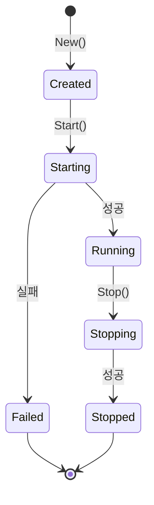

# ServerApp 설계 문서

## 개요

ServerApp은 Defense Allies Server의 가장 작은 단위의 개념적인 서버 컴포넌트입니다. 각 ServerApp은 독립적인 기능을 담당하며, HTTP Mux에 등록되어 라우팅을 처리할 수 있습니다.

## 설계 원칙

### 1. 단일 책임 원칙 (Single Responsibility Principle)
- 각 ServerApp은 하나의 명확한 책임을 가집니다
- 예: PlayerApp, MatchApp, GameApp, EventApp 등

### 2. 독립성 (Independence)
- 각 ServerApp은 독립적으로 시작/종료될 수 있습니다
- 다른 ServerApp에 대한 직접적인 의존성을 최소화합니다

### 3. 확장성 (Scalability)
- 새로운 기능은 새로운 ServerApp으로 추가할 수 있습니다
- 기존 ServerApp을 수정하지 않고 기능을 확장할 수 있습니다

## ServerApp 인터페이스

```go
type ServerApp interface {
    // Name 서버앱의 이름을 반환합니다
    Name() string
    
    // RegisterRoutes HTTP Mux에 라우트를 등록합니다
    RegisterRoutes(mux *http.ServeMux)
    
    // Start 서버앱을 시작합니다
    Start(ctx context.Context) error
    
    // Stop 서버앱을 graceful하게 종료합니다
    Stop(ctx context.Context) error
    
    // Health 서버앱의 상태를 확인합니다
    Health() HealthStatus
}
```

## HealthStatus 구조체

```go
type HealthStatus struct {
    Status  string            `json:"status"`  // "healthy", "unhealthy", "degraded"
    Message string            `json:"message,omitempty"`
    Details map[string]string `json:"details,omitempty"`
}
```

## ServerApp 생명주기



## 구현 예시

### 1. PlayerApp
- 플레이어 등록, 로그인, 프로필 관리
- 라우트: `/api/v1/players/*`

### 2. MatchApp
- 매치메이킹, 게임 세션 생성
- 라우트: `/api/v1/matches/*`

### 3. GameApp
- 게임 로직, 상태 관리
- 라우트: `/api/v1/games/*`

### 4. EventApp
- SSE 이벤트 스트리밍
- 라우트: `/api/v1/events/*`

### 5. HealthApp
- 헬스체크, 메트릭
- 라우트: `/health`, `/metrics`

## 디렉토리 구조

```
internal/
├── serverapp/
│   ├── interface.go          # ServerApp 인터페이스 정의
│   ├── base.go              # 기본 구현체
│   ├── manager.go           # ServerApp 관리자
│   ├── player/              # PlayerApp 구현
│   │   ├── app.go
│   │   ├── handlers.go
│   │   └── routes.go
│   ├── match/               # MatchApp 구현
│   │   ├── app.go
│   │   ├── handlers.go
│   │   └── routes.go
│   ├── game/                # GameApp 구현
│   │   ├── app.go
│   │   ├── handlers.go
│   │   └── routes.go
│   ├── event/               # EventApp 구현
│   │   ├── app.go
│   │   ├── handlers.go
│   │   └── routes.go
│   └── health/              # HealthApp 구현
│       ├── app.go
│       ├── handlers.go
│       └── routes.go
```

## ServerApp Manager

ServerApp Manager는 여러 ServerApp을 관리하는 컴포넌트입니다.

```go
type Manager struct {
    apps []ServerApp
    mux  *http.ServeMux
}

func (m *Manager) Register(app ServerApp) error
func (m *Manager) StartAll(ctx context.Context) error
func (m *Manager) StopAll(ctx context.Context) error
func (m *Manager) GetMux() *http.ServeMux
func (m *Manager) HealthCheck() map[string]HealthStatus
```

## 설정 관리

각 ServerApp은 독립적인 설정을 가질 수 있습니다.

```go
type AppConfig struct {
    Name     string                 `yaml:"name"`
    Enabled  bool                   `yaml:"enabled"`
    Settings map[string]interface{} `yaml:"settings"`
}

type Config struct {
    Apps []AppConfig `yaml:"apps"`
}
```

## 에러 처리

### 1. 시작 실패
- 하나의 ServerApp 시작이 실패해도 다른 앱들은 계속 실행
- 실패한 앱은 로그에 기록하고 상태를 "failed"로 설정

### 2. 런타임 에러
- 각 ServerApp은 자체적으로 에러를 처리
- 복구 가능한 에러는 자동으로 복구 시도
- 복구 불가능한 에러는 상태를 "unhealthy"로 변경

### 3. 종료 처리
- Graceful shutdown 지원
- 진행 중인 요청은 완료될 때까지 대기
- 타임아웃 후 강제 종료

## 모니터링

### 1. 헬스체크
- 각 ServerApp의 상태를 주기적으로 확인
- `/health` 엔드포인트에서 전체 상태 제공

### 2. 메트릭
- 각 ServerApp별 요청 수, 응답 시간 등 수집
- Prometheus 형식으로 `/metrics` 엔드포인트에서 제공

### 3. 로깅
- 구조화된 로깅 (JSON 형식)
- 각 ServerApp별 로그 레벨 설정 가능

## 테스트 전략

### 1. 단위 테스트
- 각 ServerApp의 핸들러 테스트
- 모킹을 통한 의존성 격리

### 2. 통합 테스트
- ServerApp Manager를 통한 전체 시스템 테스트
- Redis 테스트 컨테이너 활용

### 3. 부하 테스트
- 각 ServerApp별 성능 테스트
- 동시 요청 처리 능력 검증

## 보안 고려사항

### 1. 인증/인가
- 각 ServerApp별로 필요한 인증 수준 설정
- JWT 토큰 기반 인증

### 2. 입력 검증
- 모든 입력 데이터에 대한 검증
- SQL Injection, XSS 등 방어

### 3. 레이트 리미팅
- 각 엔드포인트별 요청 제한
- Redis를 활용한 분산 레이트 리미팅

## 배포 전략

### 1. 개발 환경
- 모든 ServerApp을 단일 프로세스에서 실행
- 빠른 개발 및 디버깅

### 2. 프로덕션 환경
- 필요에 따라 ServerApp별로 분리 배포 가능
- 로드 밸런서를 통한 트래픽 분산

### 3. 롤링 업데이트
- 무중단 배포 지원
- 헬스체크를 통한 배포 검증
