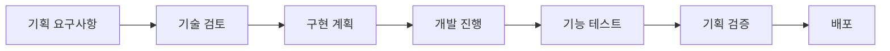
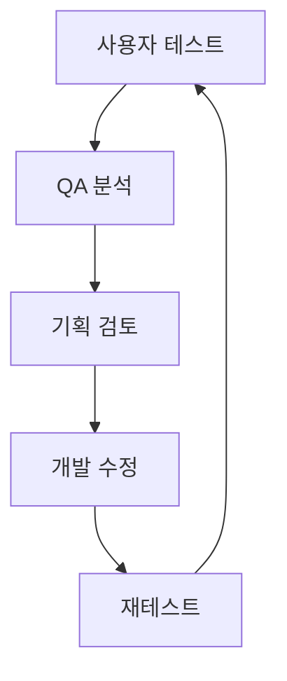

# Defense Allies 팀별 역할 및 책임

## 👥 팀 구성 및 역할 정의

### 🎮 게임 기획팀

#### 📋 주요 책임
- **게임 시스템 설계**: 종족, 환경, 난이도 시스템의 상세 기획
- **밸런싱**: 수치 설계 및 지속적인 밸런스 조정
- **사용자 경험**: 플레이어 여정 설계 및 개선
- **컨텐츠 기획**: 스토리, 이벤트, 시즌 컨텐츠 기획

#### 🎯 핵심 업무

**종족 시스템 기획**
- [ ] 8개 종족의 고유 특성 및 능력 설계
- [ ] 종족 간 밸런스 매트릭스 작성 및 관리
- [ ] 종족별 타워 트리 및 업그레이드 경로 설계
- [ ] 종족 조합 시너지 효과 정의

**환경 시스템 기획**
- [ ] 시간대/날씨/지형 조합별 효과 설계
- [ ] 환경 변화 시나리오 및 타이밍 설계
- [ ] 트레이드오프 메커니즘 설계
- [ ] 환경 적응 가이드 및 힌트 시스템

**난이도 시스템 기획**
- [ ] 1-100 레벨별 상세 스펙 정의
- [ ] 학습 곡선 및 진행도 설계
- [ ] 적응형 난이도 알고리즘 요구사항 정의
- [ ] 보상 체계 및 언락 컨텐츠 설계

**협력 메커니즘 기획**
- [ ] 종족 간 협력 방식 설계
- [ ] 협력 성공/실패 조건 정의
- [ ] 협력 인센티브 및 페널티 시스템
- [ ] 팀워크 측정 지표 설계

#### 📊 산출물
- 종족별 상세 스펙 시트
- 환경 효과 매트릭스
- 난이도별 밸런싱 테이블
- 협력 메커니즘 플로우차트
- 사용자 시나리오 및 여정 맵

### 💻 백엔드 개발팀

#### 📋 주요 책임
- **서버 아키텍처**: 기존 서버 구조 확장 및 최적화
- **게임 로직**: 핵심 게임 시스템 구현
- **데이터 관리**: Redis 기반 데이터 모델링 및 관리
- **성능 최적화**: 실시간 처리 및 확장성 보장

#### 🎯 핵심 업무

**서버 아키텍처 확장**
```go
// GuardianApp (인증 전용)
- AuthService: 플레이어 인증 및 JWT 관리
- SessionService: 로그인 세션 관리
- SecurityService: 보안 및 권한 검증

// TimeSquareApp 확장
- RaceService: 종족 시스템 관리
- EnvironmentService: 환경 시스템 관리
- DifficultyService: 난이도 조절 시스템
- CooperationService: 협력 메커니즘 처리
- PlayerProfileService: 플레이어 게임 데이터 관리

// CommandApp 확장
- AnalyticsService: 게임 데이터 분석
- BalancingService: 실시간 밸런싱 도구
- AdminService: 관리자 도구 및 모니터링
```

**데이터 모델링**
- [ ] 사용자 인증 데이터 스키마 (GuardianApp)
- [ ] 종족 시스템 Redis 스키마 설계 (TimeSquareApp)
- [ ] 환경 데이터 구조 최적화 (TimeSquareApp)
- [ ] 난이도 진행도 추적 시스템 (TimeSquareApp)
- [ ] 실시간 게임 상태 동기화 (TimeSquareApp)
- [ ] 관리자 도구 데이터 구조 (CommandApp)

**핵심 시스템 구현**
- [ ] 사용자 인증 및 JWT 시스템 (GuardianApp)
- [ ] 종족별 타워 시스템 (TimeSquareApp)
- [ ] 환경 효과 적용 엔진 (TimeSquareApp)
- [ ] 적응형 난이도 알고리즘 (TimeSquareApp)
- [ ] 실시간 협력 처리 시스템 (TimeSquareApp)
- [ ] 게임 데이터 분석 시스템 (CommandApp)

**성능 최적화**
- [ ] 인증 처리 속도 최적화 (GuardianApp)
- [ ] JWT 토큰 검증 성능 개선 (GuardianApp)
- [ ] Redis 쿼리 최적화 (TimeSquareApp)
- [ ] 실시간 이벤트 스트리밍 최적화 (TimeSquareApp)
- [ ] 게임 로직 처리 성능 개선 (TimeSquareApp)
- [ ] 메모리 사용량 최적화 (모든 서버)
- [ ] 동시 접속자 확장성 보장 (모든 서버)
- [ ] 분석 쿼리 최적화 (CommandApp)

#### 📊 산출물
- **GuardianApp**: 인증 시스템 문서, 보안 가이드
- **TimeSquareApp**: 게임 로직 문서, Redis 스키마, 실시간 시스템 문서
- **CommandApp**: 관리자 도구 문서, 분석 시스템 문서
- **공통**: API 명세서, 성능 테스트 결과, 배포 가이드

### 🎨 프론트엔드/클라이언트 개발팀

#### 📋 주요 책임
- **사용자 인터페이스**: 종족 및 환경 정보 표시
- **게임 화면**: 실시간 게임 UI/UX 구현
- **사용자 경험**: 직관적이고 접근성 높은 인터페이스
- **클라이언트 최적화**: 성능 및 반응성 최적화

#### 🎯 핵심 업무

**종족 시스템 UI**
- [ ] 종족 선택 화면 구현
- [ ] 종족별 정보 표시 시스템
- [ ] 종족 비교 및 추천 도구
- [ ] 종족별 테마 UI 적용

**환경 시스템 UI**
- [ ] 실시간 환경 상태 표시
- [ ] 환경 효과 시각화
- [ ] 환경 변화 알림 시스템
- [ ] 적응 가이드 표시

**게임 내 UI**
- [ ] 종족별 HUD 요소
- [ ] 협력 인터페이스
- [ ] 난이도 정보 표시
- [ ] 실시간 피드백 시스템

**사용자 경험 최적화**
- [ ] 접근성 개선
- [ ] 모바일 최적화
- [ ] 다국어 지원
- [ ] 사용자 가이드 시스템

#### 📊 산출물
- UI/UX 디자인 가이드
- 종족별 UI 컴포넌트 라이브러리
- 사용자 테스트 결과 보고서
- 접근성 준수 체크리스트
- 클라이언트 성능 최적화 보고서

### 🧪 QA/테스트팀

#### 📋 주요 책임
- **기능 테스트**: 모든 게임 시스템 기능 검증
- **밸런스 테스트**: 종족 및 환경 밸런스 검증
- **사용자 테스트**: 실제 플레이어 경험 검증
- **성능 테스트**: 서버 및 클라이언트 성능 검증

#### 🎯 핵심 업무

**시스템 기능 테스트**
- [ ] 종족 시스템 기능 검증
- [ ] 환경 시스템 동작 확인
- [ ] 난이도 시스템 정확성 검증
- [ ] 협력 메커니즘 테스트

**밸런스 테스트**
- [ ] 종족 간 승률 분석
- [ ] 환경별 종족 성능 측정
- [ ] 난이도별 클리어율 분석
- [ ] 협력 효과 측정

**사용자 경험 테스트**
- [ ] 신규 사용자 온보딩 테스트
- [ ] 학습 곡선 검증
- [ ] 사용자 만족도 조사
- [ ] 접근성 테스트

**성능 및 안정성 테스트**
- [ ] 동시 접속자 부하 테스트
- [ ] 실시간 동기화 안정성 테스트
- [ ] 메모리 누수 및 성능 테스트
- [ ] 크로스 플랫폼 호환성 테스트

#### 📊 산출물
- 테스트 케이스 문서
- 밸런스 분석 보고서
- 사용자 테스트 결과 보고서
- 성능 테스트 결과 보고서
- 버그 리포트 및 개선 제안

## 🤝 팀 간 협업 프로세스

### 📅 정기 미팅 일정

#### 일일 스탠드업 (매일 오전 9:30)
- 각 팀별 진행 상황 공유
- 블로커 및 의존성 이슈 논의
- 당일 우선순위 조율

#### 주간 기획 리뷰 (매주 월요일)
- 기획팀 주도로 주간 목표 설정
- 각 팀별 작업 계획 조율
- 밸런싱 이슈 및 개선사항 논의

#### 격주 통합 테스트 (격주 금요일)
- 전체 시스템 통합 테스트
- 크로스팀 이슈 해결
- 다음 스프린트 계획 수립

### 🔄 작업 플로우

#### 기획 → 개발 플로우


#### 피드백 루프


### 📋 의사결정 프로세스

#### 기획 변경 승인 프로세스
1. **제안**: 기획팀 또는 다른 팀에서 변경 제안
2. **영향도 분석**: 각 팀별 영향도 및 공수 산정
3. **우선순위 평가**: 비즈니스 가치 및 기술적 복잡도 고려
4. **승인/거부**: 프로젝트 리더 최종 결정
5. **실행 계획**: 승인 시 상세 실행 계획 수립

#### 긴급 이슈 대응 프로세스
1. **이슈 발견**: QA팀 또는 개발팀에서 발견
2. **심각도 평가**: 크리티컬/높음/보통/낮음 분류
3. **대응팀 구성**: 심각도에 따른 대응팀 구성
4. **해결 및 검증**: 빠른 해결 및 테스트
5. **사후 분석**: 재발 방지 대책 수립

## 📊 성과 측정 및 KPI

### 팀별 핵심 지표

#### 기획팀 KPI
- 밸런싱 정확도 (목표 승률 대비 실제 승률 차이)
- 사용자 만족도 (플레이테스트 점수)
- 기획 변경 빈도 (안정성 지표)
- 컨텐츠 완성도 (일정 준수율)

#### 개발팀 KPI
- 코드 품질 (테스트 커버리지, 버그 밀도)
- 성능 지표 (응답 시간, 처리량)
- 일정 준수율 (계획 대비 실제 완료율)
- 기술 부채 관리 (리팩토링 비율)

#### QA팀 KPI
- 버그 발견율 (출시 전 버그 발견 비율)
- 테스트 커버리지 (기능 테스트 완료율)
- 사용자 이슈 예측률 (실제 사용자 이슈 대비)
- 테스트 자동화율 (자동화된 테스트 비율)

### 전체 프로젝트 KPI
- 일정 준수율 (마일스톤 달성률)
- 품질 지표 (크리티컬 버그 수)
- 사용자 만족도 (베타 테스트 피드백)
- 팀 협업 효율성 (크로스팀 이슈 해결 시간)
