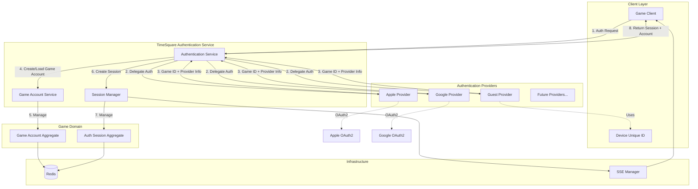
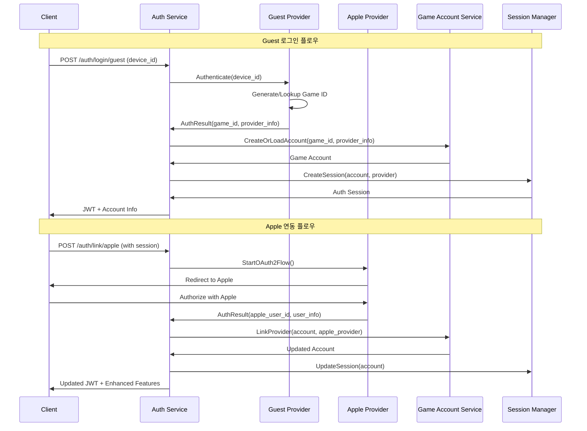
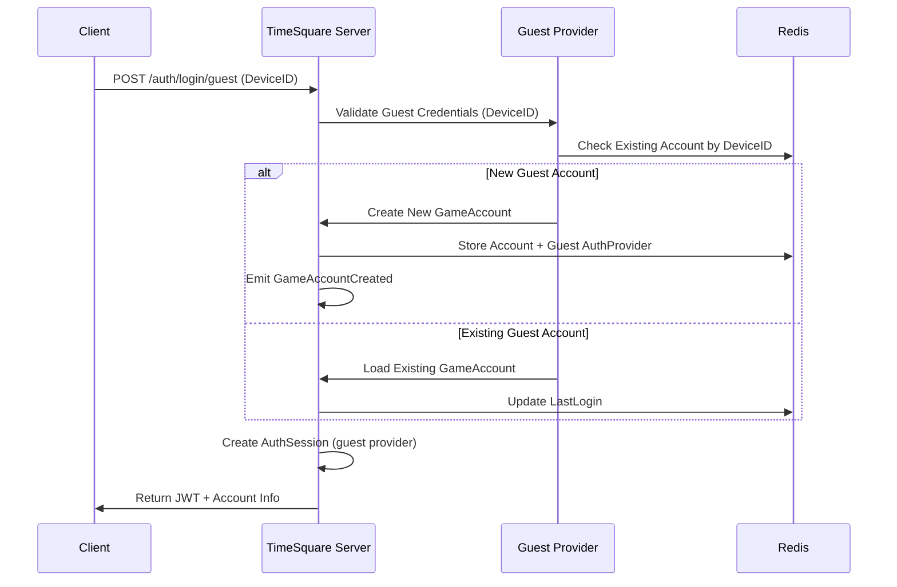
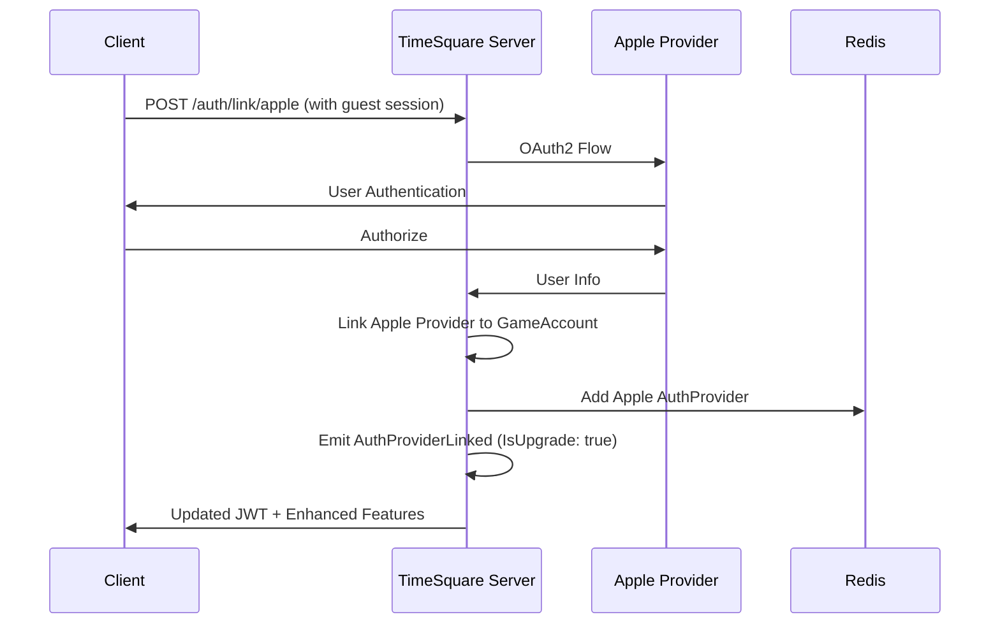

# 통합 인증 시스템 설계 (게스트 우선)

## 📋 개요

Defense Allies 게임 계정 인증 시스템은 **통합된 인증 제공자 패턴**을 사용하여 게스트, Apple, Google 등 모든 인증 방식을 일관되게 처리합니다. **게스트를 첫 번째 인증 제공자**로 우선 지원하여 즉시 게임 플레이가 가능합니다.

## 🎯 설계 목표

### 핵심 목표
- **즉시 게임 플레이**: 게스트 인증으로 복잡한 가입 없이 바로 시작
- **통합 인증 아키텍처**: 모든 인증 제공자를 동일한 패턴으로 처리
- **점진적 연동**: 게스트 → 외부 플랫폼으로 단계적 업그레이드
- **메타데이터 관리**: 기기 정보는 게임 계정의 메타데이터로 관리

### 지원 인증 제공자
- **Guest Provider**: 기기 기반 익명 인증 (1차 우선)
- **Apple Provider**: Apple Sign In (2차)
- **Google Provider**: Google OAuth2 (2차)
- **Steam Provider**: Steam OpenID (추후)
- **Discord Provider**: Discord OAuth2 (추후)

## 🏗️ 시스템 아키텍처

### 전체 시스템 관계도


### 인증 제공자별 처리 플로우


### 핵심 설계 원칙

#### 인증 분리 원칙
- **Authentication ≠ Account**: 인증 처리와 게임 계정 관리 분리
- **Provider Abstraction**: 모든 인증 제공자 동일한 인터페이스
- **Game ID Generation**: 제공자별 고유 게임 ID 생성 규칙
- **Progressive Linking**: 단계적 제공자 연동 지원

#### 아키텍처 원칙  
- **Single Responsibility**: 각 컴포넌트의 명확한 역할 분담
- **Provider Pattern**: 확장 가능한 인증 제공자 시스템
- **Metadata-Driven**: 제공자별 정보를 메타데이터로 관리
- **CQRS + Event Sourcing**: 일관된 도메인 패턴 적용

## 🗂️ 데이터 스키마

### 핵심 Aggregate 구조

#### GameAccount Aggregate (통합)
```yaml
GameAccount:
  ID: string                      # 게임 계정 고유 ID
  Username: string                # 게임 내 사용자명
  DisplayName: string             # 표시명
  Status: enum                    # Active | Suspended | Deleted
  
  # 연결된 인증 제공자들 (Guest 포함)
  AuthProviders: map[string]AuthProvider
    guest: 
      ProviderType: "guest"
      ExternalID: string          # DeviceID
      LinkedAt: timestamp
      LastUsedAt: timestamp
      IsPrimary: boolean          # 최초 생성 제공자
    apple:
      ProviderType: "apple" 
      ExternalID: string          # Apple User ID
      Email: string
      LinkedAt: timestamp
      LastUsedAt: timestamp
    google:
      ProviderType: "google"
      ExternalID: string          # Google User ID
      Email: string
      LinkedAt: timestamp
      LastUsedAt: timestamp
  
  # 게임 계정 메타데이터
  Metadata:
    DeviceInfo:                   # 최초 생성 기기 정보
      DeviceID: string
      DeviceType: enum            # iOS | Android | Web | Desktop  
      Platform: string            # "iOS 17.0", "Chrome 120"
      Model: string               # "iPhone 15 Pro"
      Language: string            # "ko-KR"
      Timezone: string            # "Asia/Seoul"
    CreationInfo:
      IPAddress: string
      UserAgent: string
      CreatedVia: enum            # Guest | Apple | Google
  
  CreatedAt: timestamp
  UpdatedAt: timestamp
  LastLoginAt: timestamp
```

#### AuthSession Aggregate (통합)
```yaml
AuthSession:
  ID: string                      # 세션 ID
  GameAccountID: string           # 게임 계정 ID
  ProviderType: enum              # guest | apple | google
  ProviderSessionID: string       # 제공자별 세션 식별자
  
  SessionToken: string            # JWT 토큰
  RefreshToken: string            # 갱신 토큰
  Status: enum                    # Active | Expired | Revoked
  
  CreatedAt: timestamp
  ExpiresAt: timestamp
  LastActivityAt: timestamp
  
  ClientInfo:
    DeviceID: string              # 현재 세션 기기
    UserAgent: string
    IPAddress: string
```

### 이벤트 스키마 (통합)

#### 핵심 Domain Events
```yaml
GameAccountCreated:
  GameAccountID: string
  InitialProvider: enum          # guest | apple | google
  ExternalID: string            # DeviceID 또는 Provider User ID
  Username: string
  CreatedAt: timestamp

AuthProviderLinked:
  GameAccountID: string
  ProviderType: enum            # guest | apple | google
  ExternalID: string
  Email: string                 # 있는 경우
  IsUpgrade: boolean            # Guest → 다른 제공자 업그레이드 여부
  LinkedAt: timestamp

AuthSessionStarted:
  SessionID: string
  GameAccountID: string
  ProviderType: enum            # 사용된 인증 제공자
  IsNewAccount: boolean
  ExpiresAt: timestamp
```

## 🔄 핵심 플로우

### 1. 게스트 로그인 플로우 (Provider Pattern)


### 2. 추가 제공자 연동 플로우 (동일 패턴)


## 📱 핵심 API 엔드포인트 (통합 패턴)

### 통합 인증 API

```yaml
# 제공자별 로그인 (Guest 포함)
POST /auth/login/{provider}:
  # provider: guest | apple | google
  Request:
    # Guest의 경우
    device_id: string            # Guest Provider용
    device_info: object
    # Apple/Google의 경우  
    code: string                 # OAuth2 authorization code
    redirect_uri: string
  Response:
    is_new_account: boolean
    game_account: object
    session: object
    linked_providers: array

# 추가 제공자 연동
POST /auth/link/{provider}:
  # 기존 세션에 새 제공자 연결
  Headers:
    Authorization: Bearer {token}
  Request:
    redirect_uri: string         # OAuth2용
  Response:
    auth_url: string            # OAuth2 인증 URL
    link_session_id: string

# 계정 정보 조회
GET /account/profile:
  Response:
    game_account: object
    auth_providers: map          # 연결된 모든 제공자
    metadata: object             # 기기 정보 등
    capabilities: array          # 사용 가능한 기능
```

## 🔧 JWT 토큰 스키마 (통합)

### 기본 토큰 구조
```yaml
JWT Payload:
  sub: string                    # GameAccount ID
  primary_provider: enum         # guest | apple | google
  linked_providers: array        # 연결된 모든 제공자
  is_guest_only: boolean         # Guest만 연결된 상태
  permissions: array             # 계정 유형별 권한
  device_id: string              # 현재 세션 기기 (메타데이터)
```

### 권한 체계
```yaml
Guest Only Account:
  permissions: 
    - game.play
    - account.read
    - account.link_provider

Multi-Provider Account:
  permissions:
    - game.play
    - game.invite
    - account.read
    - account.update
    - friends.manage
    - leaderboard.participate
```

## 📈 구현 목표 (통합 접근법)

### Phase 1: 통합 인증 기반 구조 (1-2주)
**목표**: 모든 제공자를 위한 통합 아키텍처 구축
- GameAccount Aggregate (Provider-agnostic)
- AuthProvider 패턴 구현
- Guest Provider 구현 (DeviceID 기반)
- 통합 JWT 토큰 시스템
- 메타데이터 관리 시스템

### Phase 2: SSE 실시간 통신 (1주)  
**목표**: 제공자 연동 상태 실시간 알림
- SSE 연결 관리
- AuthProvider 이벤트 전송
- 연동 진행상황 알림
- 권한 변경 알림

### Phase 3: 외부 제공자 확장 (2-3주)
**목표**: Apple, Google 제공자 추가
- Apple Provider 구현
- Google Provider 구현  
- Provider Linking 로직
- 기능 권한 확장 시스템
- 실패 시 롤백 처리

### Phase 4: 최적화 및 보안 (1-2주)
**목표**: 프로덕션 준비 완료
- Provider별 보안 정책
- 메타데이터 정리 정책
- 성능 최적화
- 모니터링 강화

## 🎯 핵심 성공 지표

### 아키텍처 목표
- **Provider 확장성**: 새로운 인증 제공자 쉽게 추가 가능
- **일관된 사용자 경험**: 모든 제공자에서 동일한 UX
- **데이터 연속성**: 제공자 전환 시 완전한 데이터 보존

### 성능 목표
- **즉시 시작**: Guest 로그인 응답시간 < 100ms
- **확장성**: 동시 사용자 10,000명 지원
- **안정성**: 99.9% 업타임 및 데이터 일관성

이 통합 설계는 게스트를 포함한 모든 인증 제공자를 일관된 패턴으로 처리하여 확장성과 유지보수성을 확보하며, 기기 정보는 게임 계정의 메타데이터로 관리하여 깔끔한 아키텍처를 제공합니다.