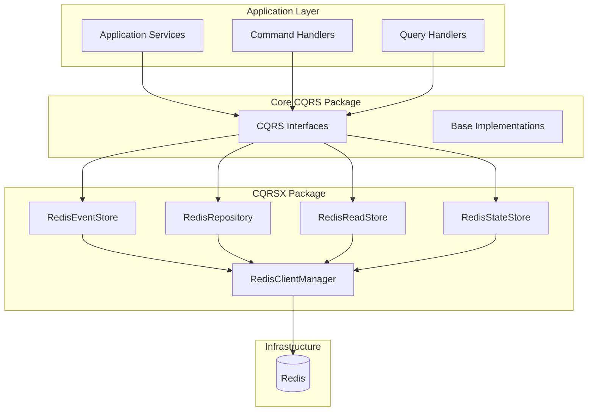

# CQRS Extensions (cqrsx) Package

## 개요

`cqrsx` 패키지는 Defense Allies Server의 CQRS 패턴 구현을 위한 Infrastructure Layer 구현체들을 제공합니다. 이 패키지는 core `cqrs` 패키지에서 정의된 인터페이스들의 실제 구현체들을 포함하며, 특히 Redis를 기반으로 한 고성능 저장소 구현체들을 제공합니다.

## 패키지 구조

```
cqrsx/
├── README.md                    # 이 문서
├── storage_strategy.go          # Storage Strategy 구현체 및 설정
├── redis_client.go             # Redis 클라이언트 관리자
├── redis_client_test.go        # Redis 클라이언트 테스트
├── redis_event_store.go        # Redis 기반 Event Store 구현체
├── redis_event_store_test.go   # Event Store 테스트
├── redis_read_store.go         # Redis 기반 Read Store 구현체
├── redis_repository.go         # Redis 기반 Repository 구현체
├── redis_state_store.go        # Redis 기반 State Store 구현체
├── mongo_client.go             # MongoDB 클라이언트 관리자
├── mongo_client_test.go        # MongoDB 클라이언트 테스트
├── mongo_event_store.go        # MongoDB 기반 Event Store 구현체
├── mongo_read_store.go         # MongoDB 기반 Read Store 구현체
├── mongo_repository.go         # MongoDB 기반 Repository 구현체
├── mongo_snapshot_store.go     # MongoDB 기반 Snapshot Store 구현체
└── mongo_state_store.go        # MongoDB 기반 State Store 구현체
```

## 제공하는 구현체들

### 1. ConfigurableStorageStrategy
CQRS 패턴을 위한 유연한 저장 전략 구현체입니다.

**주요 기능:**
- Aggregate 타입별 저장 전략 선택 (Event Sourcing, State-based, Hybrid)
- 설정 기반 Repository 팩토리 관리
- 런타임 전략 변경 지원
- 포괄적인 설정 검증

### 2. StorageConfiguration
모든 저장소 메커니즘을 위한 포괄적인 설정 구조체입니다.

**포함 설정:**
- **RedisConfig**: Redis 연결 및 운영 설정
- **MongoConfig**: MongoDB 연결 및 운영 설정
- **EventSourcingConfig**: Event Sourcing 특화 설정
- **PerformanceConfig**: 성능 튜닝 설정

### 3. MongoClientManager
MongoDB 연결을 관리하고 Event Sourcing 스키마를 자동 생성하는 클라이언트 관리자입니다.

**주요 기능:**
- MongoDB 연결 풀 관리
- **표준 Event Sourcing 스키마 자동 생성** (개발자가 DB 스키마를 고려할 필요 없음)
- 성능 메트릭 수집 (연결 수, 명령 수, 에러 수, 평균 지연시간)
- 자동 인덱스 생성 (events, snapshots, read_models 컬렉션)
- 설정 검증 및 연결 테스트

### 4. RedisClientManager
Redis 연결을 관리하고 성능 메트릭을 추적하는 클라이언트 관리자입니다.

**주요 기능:**
- Redis 연결 풀 관리
- 성능 메트릭 수집 (연결 수, 명령 수, 에러 수, 평균 지연시간)
- 자동 재연결 및 에러 처리
- 설정 검증

### 5. MongoDB Event Sourcing 구현체들

#### MongoEventStore
**표준 Event Sourcing 스키마를 사용하는** MongoDB 기반 이벤트 저장소입니다.

**주요 기능:**
- **미리 정의된 표준 스키마** (개발자가 설계할 필요 없음)
- 이벤트 순차 저장 및 조회
- 낙관적 동시성 제어 (Optimistic Concurrency Control)
- MongoDB 트랜잭션 지원
- 이벤트 압축 및 정리 기능
- 이벤트 타입별 조회 (프로젝션용)

#### MongoSnapshotStore
**개발자가 직접 구현하는 부분** - 스냅샷 직렬화/역직렬화만 구현하면 됩니다.

**주요 기능:**
- **표준 스냅샷 스키마** (개발자가 설계할 필요 없음)
- 커스터마이징 가능한 직렬화 인터페이스
- 기본 JSON 직렬화 제공
- 스냅샷 버전 관리
- 자동 스냅샷 정리

### 6. Redis Event Sourcing 구현체들

#### RedisEventStore
Event Sourcing을 위한 Redis 기반 이벤트 저장소 구현체입니다.

**주요 기능:**
- 이벤트 순차 저장 및 조회
- 낙관적 동시성 제어 (Optimistic Concurrency Control)
- 이벤트 스트림 관리
- JSON 직렬화/역직렬화
- 배치 저장 지원

### 3. RedisReadStore
CQRS Query Side를 위한 Redis 기반 Read Model 저장소입니다.

**주요 기능:**
- Read Model 저장 및 조회
- 인덱싱 지원
- 배치 작업 지원
- 쿼리 최적화
- TTL(Time To Live) 지원

### 4. RedisRepository
Aggregate Root를 위한 Redis 기반 Repository 구현체입니다.

**주요 기능:**
- Aggregate 저장 및 로드
- 이벤트 소싱 지원
- 스냅샷 기능
- 버전 관리
- 트랜잭션 지원

### 5. RedisStateStore
상태 기반 저장을 위한 Redis 구현체입니다.

**주요 기능:**
- 상태 직접 저장
- 빠른 조회 성능
- 캐싱 지원
- 만료 시간 설정

## 사용법

### 기본 설정

```go
import (
    "defense-allies-server/pkg/cqrs"
    "defense-allies-server/pkg/cqrs/cqrsx"
)

// MongoDB 설정 (표준 Event Sourcing 스키마 자동 생성)
mongoConfig := &cqrsx.StorageConfiguration{
    MongoDB: &cqrsx.MongoConfig{
        URI:                    "mongodb://localhost:27017",
        Database:               "defense_allies_events",
        MaxPoolSize:            100,
        ConnectTimeout:         10 * time.Second,
        SocketTimeout:          30 * time.Second,
        ServerSelectionTimeout: 30 * time.Second,
    },
    EventSourcing: &cqrsx.EventSourcingConfig{
        SnapshotFrequency: 100,
        EnableCompression: true,
    },
    Performance: &cqrsx.PerformanceConfig{
        BatchSize:          50,
        CacheSize:          1000,
        CacheTTL:           10 * time.Minute,
        ConnectionPoolSize: 10,
        MaxConcurrentOps:   100,
    },
}

// Redis 설정 (기존 방식)
redisConfig := &cqrsx.StorageConfiguration{
    Redis: &cqrsx.RedisConfig{
        Host:         "localhost",
        Port:         6379,
        Password:     "",
        Database:     0,
        PoolSize:     10,
        MaxRetries:   3,
        DialTimeout:  5 * time.Second,
        ReadTimeout:  3 * time.Second,
        WriteTimeout: 3 * time.Second,
    },
    EventSourcing: &cqrsx.EventSourcingConfig{
        SnapshotFrequency: 100,
        EnableCompression: true,
    },
    Performance: &cqrsx.PerformanceConfig{
        BatchSize:          50,
        CacheSize:          1000,
        CacheTTL:           10 * time.Minute,
        ConnectionPoolSize: 10,
        MaxConcurrentOps:   100,
    },
}

// MongoDB 클라이언트 관리자 생성 (표준 스키마 자동 생성)
mongoClient, err := cqrsx.NewMongoClientManager(mongoConfig.MongoDB)
if err != nil {
    log.Fatal("Failed to create MongoDB client manager:", err)
}
defer mongoClient.Close(context.Background())

// 표준 Event Sourcing 스키마 초기화 (개발자가 DB 스키마를 고려할 필요 없음)
err = mongoClient.InitializeEventSourcingSchema(context.Background())
if err != nil {
    log.Fatal("Failed to initialize Event Sourcing schema:", err)
}

// Redis 클라이언트 관리자 생성 (기존 방식)
redisClient, err := cqrsx.NewRedisClientManager(redisConfig.Redis)
if err != nil {
    log.Fatal("Failed to create Redis client manager:", err)
}
defer redisClient.Close()

// Storage Strategy 생성
mongoStrategy := cqrsx.NewConfigurableStorageStrategy(cqrs.EventSourced, mongoConfig)
redisStrategy := cqrsx.NewConfigurableStorageStrategy(cqrs.EventSourced, redisConfig)
```

### MongoDB Event Sourcing 사용 (권장)

#### 기본 사용법 (기본 컬렉션 명)

```go
// 기본 컬렉션 명 사용: events, snapshots, read_models
mongoClient, err := cqrsx.NewMongoClientManager(mongoConfig)

// MongoDB Event Store 생성 (표준 스키마 사용)
eventStore := cqrsx.NewMongoEventStore(mongoClient, mongoClient.GetCollectionName("events"))

// MongoDB Snapshot Store 생성 (개발자는 직렬화만 구현)
snapshotStore := cqrsx.NewMongoSnapshotStore(mongoClient, mongoClient.GetCollectionName("snapshots"))
```

#### 컬렉션 명 prefix 사용

```go
// 모든 컬렉션에 prefix 적용: myapp_events, myapp_snapshots, myapp_read_models
mongoClient, err := cqrsx.NewMongoClientManagerWithPrefix(mongoConfig, "myapp")

// MongoDB Event Store 생성
eventStore := cqrsx.NewMongoEventStore(mongoClient, mongoClient.GetCollectionName("events"))
```

#### 커스텀 컬렉션 명 사용

```go
// 완전히 커스텀한 컬렉션 명 사용
customNames := &cqrsx.CollectionNames{
    Events:     "my_custom_events",
    Snapshots:  "my_custom_snapshots",
    ReadModels: "my_custom_read_models",
}

mongoClient, err := cqrsx.NewMongoClientManagerWithCollections(mongoConfig, "", customNames)

// MongoDB Event Store 생성
eventStore := cqrsx.NewMongoEventStore(mongoClient, mongoClient.GetCollectionName("events"))

// 커스텀 스냅샷 직렬화 구현 (선택사항)
type MyCustomSnapshotSerializer struct{}

func (s *MyCustomSnapshotSerializer) SerializeSnapshot(aggregate cqrs.AggregateRoot) ([]byte, error) {
    // 개발자가 구현하는 부분 - 스냅샷 직렬화 로직
    return json.Marshal(aggregate)
}

func (s *MyCustomSnapshotSerializer) DeserializeSnapshot(data []byte, aggregateType string) (cqrs.AggregateRoot, error) {
    // 개발자가 구현하는 부분 - 스냅샷 역직렬화 로직
    aggregate, err := cqrs.CreateAggregateInstance(aggregateType, "")
    if err != nil {
        return nil, err
    }
    err = json.Unmarshal(data, aggregate)
    return aggregate, err
}

// 커스텀 직렬화 설정 (선택사항)
snapshotStore.SetSerializer(&MyCustomSnapshotSerializer{})

// MongoDB Repository 생성
userRepo := cqrsx.NewMongoEventSourcedRepository(mongoClient, "User")
orderRepo := cqrsx.NewMongoHybridRepository(mongoClient, "Order") // Event + State 저장

// 이벤트 저장 (표준 스키마 자동 사용)
events := []cqrs.EventMessage{
    // ... your events
}
err = eventStore.SaveEvents(ctx, "user-123", events, expectedVersion)

// 이벤트 조회 (표준 스키마 자동 사용)
loadedEvents, err := eventStore.LoadEvents(ctx, "user-123", 0, -1)

// 스냅샷 저장 (개발자가 구현한 직렬화 사용)
err = snapshotStore.SaveSnapshot(ctx, userAggregate)
```

### Redis Event Sourcing 사용 (기존 방식)

```go
// Aggregate 타입별 전략 설정
redisStrategy.SetAggregateStrategy("User", cqrs.EventSourced)
redisStrategy.SetAggregateStrategy("Session", cqrs.StateBased)

// Repository 팩토리 설정
redisStrategy.SetEventSourcedFactory(func(aggregateType string) (cqrs.EventSourcedRepository, error) {
    return cqrsx.NewRedisRepository(redisClient, aggregateType), nil
})

redisStrategy.SetStateBasedFactory(func(aggregateType string) (cqrs.StateBasedRepository, error) {
    return cqrsx.NewRedisStateStore(redisClient, aggregateType), nil
})

// Repository 생성
userRepo, err := redisStrategy.CreateRepository("User")
sessionRepo, err := redisStrategy.CreateRepository("Session")
```

### Event Store 사용

```go
// Event Store 생성
eventStore := cqrsx.NewRedisEventStore(clientManager, "events")

// 이벤트 저장
events := []cqrs.EventMessage{
    // ... your events
}
err = eventStore.SaveEvents(ctx, "aggregate-123", events, expectedVersion)

// 이벤트 조회
loadedEvents, err := eventStore.LoadEvents(ctx, "aggregate-123", 0, -1)
```

### Repository 사용

```go
// Repository 생성
repo := cqrsx.NewRedisRepository(clientManager, "aggregates")

// Aggregate 저장
err = repo.Save(ctx, aggregate)

// Aggregate 로드
loadedAggregate, err := repo.Load(ctx, "aggregate-123")
```

### Read Store 사용

```go
// Read Store 생성
readStore := cqrsx.NewRedisReadStore(clientManager, "readmodels")

// Read Model 저장
err = readStore.Save(ctx, "user-123", userReadModel)

// Read Model 조회
loadedModel, err := readStore.Load(ctx, "user-123", &UserReadModel{})
```

## 아키텍처 통합

cqrsx 패키지는 core cqrs 패키지와 다음과 같이 통합됩니다:



## 성능 특징

### Redis 최적화
- **연결 풀링**: 효율적인 연결 관리
- **파이프라이닝**: 배치 작업 최적화
- **압축**: 대용량 데이터 압축 저장
- **인덱싱**: 빠른 검색을 위한 보조 인덱스

### 메트릭 수집
- 연결 상태 모니터링
- 명령 실행 통계
- 에러율 추적
- 지연시간 측정

## 테스트

각 구현체는 포괄적인 단위 테스트를 포함합니다:

```bash
# 전체 테스트 실행
go test ./pkg/cqrs/cqrsx/...

# 특정 구현체 테스트
go test ./pkg/cqrs/cqrsx/ -run TestRedisEventStore
go test ./pkg/cqrs/cqrsx/ -run TestRedisRepository
```

## 확장성

cqrsx 패키지는 다음과 같은 확장을 지원합니다:

1. **다른 저장소 구현체**: PostgreSQL, MongoDB 등
2. **캐싱 레이어**: 다중 레벨 캐싱
3. **샤딩**: 대용량 데이터 분산 저장
4. **복제**: 읽기 전용 복제본 지원

## 모범 사례

1. **연결 관리**: RedisClientManager를 싱글톤으로 사용
2. **에러 처리**: 적절한 재시도 로직 구현
3. **모니터링**: 메트릭을 통한 성능 모니터링
4. **테스트**: 통합 테스트에서 실제 Redis 인스턴스 사용

## 의존성

- `github.com/redis/go-redis/v9`: Redis 클라이언트
- `defense-allies-server/pkg/cqrs`: Core CQRS 인터페이스
- `encoding/json`: JSON 직렬화
- `context`: 컨텍스트 관리
