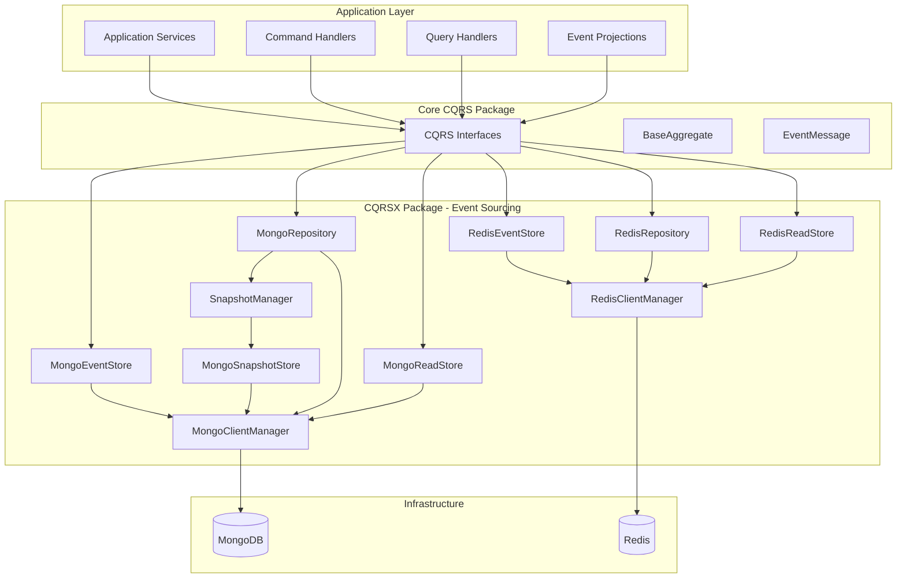

# CQRS Extensions (cqrsx) Package

## 개요

`cqrsx` 패키지는 Defense Allies Server의 **Event Sourcing** 구현을 위한 Infrastructure Layer를 제공합니다. 이 패키지는 core `cqrs` 패키지에서 정의된 인터페이스들의 실제 구현체들을 포함하며, Redis와 MongoDB를 기반으로 한 고성능 이벤트 소싱 시스템을 제공합니다.

## 핵심 철학

- **이벤트 소싱에 집중**: 모든 상태 변경을 이벤트로 저장하고 재생
- **스냅샷 최적화**: 대량 이벤트 재생 성능 최적화
- **읽기 모델 분리**: 쿼리 최적화를 위한 프로젝션 지원
- **이벤트 버전 관리**: 이벤트 스키마 진화 지원

## 패키지 구조

```
cqrsx/
├── README.md                    # 이 문서
├── interfaces.go               # 공통 인터페이스 정의
├── event_serializer.go         # 이벤트 직렬화/역직렬화
├── redis_client.go             # Redis 클라이언트 관리자
├── redis_client_test.go        # Redis 클라이언트 테스트
├── redis_event_store.go        # Redis 기반 Event Store 구현체
├── redis_event_store_test.go   # Event Store 테스트
├── redis_read_store.go         # Redis 기반 Read Store 구현체
├── redis_repository.go         # Redis 기반 Repository 구현체
├── mongo_client.go             # MongoDB 클라이언트 관리자
├── mongo_client_test.go        # MongoDB 클라이언트 테스트
├── mongo_event_store.go        # MongoDB 기반 Event Store 구현체
├── mongo_event_store_test.go   # MongoDB Event Store 테스트
├── mongo_read_store.go         # MongoDB 기반 Read Store 구현체
├── mongo_repository.go         # MongoDB 기반 Repository 구현체
├── mongo_snapshot_store.go     # MongoDB 기반 Snapshot Store 구현체
├── snapshot_manager.go         # 스냅샷 생성/관리 로직
├── snapshot_policies.go        # 스냅샷 생성 정책
├── snapshot_serializers.go     # 스냅샷 직렬화
└── examples/                   # 이벤트 소싱 예제들
    ├── 01-basic-event-sourcing/
    ├── 02-custom-collections/
    ├── 03-snapshots/
    ├── 04-read-models/
    └── 06-event-versioning/
```

## 핵심 구성 요소

### 1. 이벤트 저장소 (Event Store)

#### MongoEventStore
MongoDB 기반의 고성능 이벤트 저장소입니다.

**주요 기능:**
- **표준 Event Sourcing 스키마 자동 생성** (개발자가 DB 스키마를 고려할 필요 없음)
- 이벤트 순차 저장 및 조회
- 낙관적 동시성 제어 (Optimistic Concurrency Control)
- MongoDB 트랜잭션 지원
- 이벤트 압축 및 정리 기능
- 이벤트 타입별 조회 (프로젝션용)

#### RedisEventStore
Redis 기반의 빠른 이벤트 저장소입니다.

**주요 기능:**
- 이벤트 순차 저장 및 조회
- 낙관적 동시성 제어
- 이벤트 스트림 관리
- JSON 직렬화/역직렬화
- 배치 저장 지원

### 2. 스냅샷 시스템 (Snapshot System)

#### MongoSnapshotStore
MongoDB 기반의 스냅샷 저장소입니다.

**주요 기능:**
- **표준 스냅샷 스키마** (개발자가 설계할 필요 없음)
- 커스터마이징 가능한 직렬화 인터페이스
- 기본 JSON 직렬화 제공
- 스냅샷 버전 관리
- 자동 스냅샷 정리

#### SnapshotManager
스냅샷 생성과 관리를 담당합니다.

**주요 기능:**
- 자동 스냅샷 생성 정책
- 스냅샷 압축 및 최적화
- 스냅샷 기반 Aggregate 복원
- 성능 모니터링

### 3. 클라이언트 관리자

#### MongoClientManager
MongoDB 연결을 관리하고 Event Sourcing 스키마를 자동 생성합니다.

**주요 기능:**
- MongoDB 연결 풀 관리
- **표준 Event Sourcing 스키마 자동 생성**
- 성능 메트릭 수집
- 자동 인덱스 생성
- 설정 검증 및 연결 테스트

#### RedisClientManager
Redis 연결을 관리하고 성능 메트릭을 추적합니다.

**주요 기능:**
- Redis 연결 풀 관리
- 성능 메트릭 수집
- 자동 재연결 및 에러 처리
- 설정 검증

### 4. 읽기 모델 (Read Models)

#### MongoReadStore
MongoDB 기반의 읽기 모델 저장소입니다.

**주요 기능:**
- 프로젝션 기반 읽기 모델 저장
- 복잡한 쿼리 지원
- 인덱싱 최적화
- 집계 파이프라인 지원

#### RedisReadStore
Redis 기반의 고속 읽기 모델 저장소입니다.

**주요 기능:**
- 빠른 읽기 성능
- 캐싱 지원
- TTL(Time To Live) 지원
- 인메모리 집계

### 5. 리포지토리 (Repository)

#### MongoRepository
MongoDB 기반의 Aggregate Repository입니다.

**주요 기능:**
- 이벤트 소싱 기반 Aggregate 저장/로드
- 스냅샷 최적화
- 버전 관리
- 트랜잭션 지원

#### RedisRepository
Redis 기반의 Aggregate Repository입니다.

**주요 기능:**
- 고속 Aggregate 저장/로드
- 이벤트 스트림 관리
- 스냅샷 기능
- 버전 관리

### 6. 이벤트 직렬화 (Event Serialization)

#### EventSerializer
이벤트의 직렬화와 역직렬화를 담당합니다.

**주요 기능:**
- JSON 기반 이벤트 직렬화
- 이벤트 타입 관리
- 버전 호환성 지원
- 압축 지원

## 사용법

### 기본 설정

```go
import (
    "context"
    "log"
    "time"

    "cqrs"
    "cqrs/cqrsx"
)

// MongoDB 클라이언트 설정
mongoConfig := &cqrsx.MongoConfig{
    URI:                    "mongodb://localhost:27017",
    Database:               "defense_allies_events",
    MaxPoolSize:            100,
    ConnectTimeout:         10 * time.Second,
    SocketTimeout:          30 * time.Second,
    ServerSelectionTimeout: 30 * time.Second,
}

// Redis 클라이언트 설정
redisConfig := &cqrsx.RedisConfig{
    Host:         "localhost",
    Port:         6379,
    Password:     "",
    Database:     0,
    PoolSize:     10,
    MaxRetries:   3,
    DialTimeout:  5 * time.Second,
    ReadTimeout:  3 * time.Second,
    WriteTimeout: 3 * time.Second,
}

// MongoDB 클라이언트 관리자 생성
mongoClient, err := cqrsx.NewMongoClientManager(mongoConfig)
if err != nil {
    log.Fatal("Failed to create MongoDB client manager:", err)
}
defer mongoClient.Close(context.Background())

// 표준 Event Sourcing 스키마 초기화
err = mongoClient.InitializeEventSourcingSchema(context.Background())
if err != nil {
    log.Fatal("Failed to initialize Event Sourcing schema:", err)
}

// Redis 클라이언트 관리자 생성
redisClient, err := cqrsx.NewRedisClientManager(redisConfig)
if err != nil {
    log.Fatal("Failed to create Redis client manager:", err)
}
defer redisClient.Close()
```

### MongoDB Event Sourcing 사용 (권장)

```go
// MongoDB Event Store 생성
eventStore := cqrsx.NewMongoEventStore(mongoClient, "events")

// MongoDB Snapshot Store 생성
snapshotStore := cqrsx.NewMongoSnapshotStore(mongoClient, "snapshots")

// MongoDB Repository 생성
userRepo := cqrsx.NewMongoRepository(mongoClient, "User")

// 이벤트 저장
ctx := context.Background()
events := []cqrs.EventMessage{
    cqrs.NewBaseEventMessage("UserCreated", "user-123", "User", 1, map[string]interface{}{
        "email": "user@example.com",
        "name":  "John Doe",
    }),
    cqrs.NewBaseEventMessage("UserEmailUpdated", "user-123", "User", 2, map[string]interface{}{
        "email": "newemail@example.com",
    }),
}

err = eventStore.SaveEvents(ctx, "user-123", events, 0)
if err != nil {
    log.Fatal("Failed to save events:", err)
}

// 이벤트 조회
loadedEvents, err := eventStore.LoadEvents(ctx, "user-123", 0, -1)
if err != nil {
    log.Fatal("Failed to load events:", err)
}

// Aggregate 저장 (이벤트 소싱 기반)
user := domain.NewUser("user-123", "user@example.com", "John Doe")
err = userRepo.Save(ctx, user)
if err != nil {
    log.Fatal("Failed to save aggregate:", err)
}

// Aggregate 로드 (이벤트 재생)
loadedUser, err := userRepo.Load(ctx, "user-123")
if err != nil {
    log.Fatal("Failed to load aggregate:", err)
}
```

### Redis Event Sourcing 사용

```go
// Redis Event Store 생성
eventStore := cqrsx.NewRedisEventStore(redisClient, "events")

// Redis Repository 생성
userRepo := cqrsx.NewRedisRepository(redisClient, "User")

// 이벤트 저장
ctx := context.Background()
events := []cqrs.EventMessage{
    cqrs.NewBaseEventMessage("UserCreated", "user-456", "User", 1, map[string]interface{}{
        "email": "user@example.com",
        "name":  "Jane Doe",
    }),
}

err = eventStore.SaveEvents(ctx, "user-456", events, 0)
if err != nil {
    log.Fatal("Failed to save events:", err)
}

// 이벤트 조회
loadedEvents, err := eventStore.LoadEvents(ctx, "user-456", 0, -1)
if err != nil {
    log.Fatal("Failed to load events:", err)
}

// Aggregate 저장 및 로드
user := domain.NewUser("user-456", "user@example.com", "Jane Doe")
err = userRepo.Save(ctx, user)
if err != nil {
    log.Fatal("Failed to save aggregate:", err)
}

loadedUser, err := userRepo.Load(ctx, "user-456")
if err != nil {
    log.Fatal("Failed to load aggregate:", err)
}
```

### 스냅샷 사용

```go
// 스냅샷 정책 설정
policy := cqrsx.NewFrequencySnapshotPolicy(100) // 100개 이벤트마다 스냅샷 생성

// 스냅샷 매니저 생성
snapshotManager := cqrsx.NewSnapshotManager(snapshotStore, policy)

// 자동 스냅샷 생성
err = snapshotManager.CreateSnapshotIfNeeded(ctx, user)
if err != nil {
    log.Fatal("Failed to create snapshot:", err)
}

// 스냅샷에서 Aggregate 복원
restoredUser, err := snapshotManager.LoadFromSnapshot(ctx, "user-123", "User")
if err != nil {
    log.Fatal("Failed to load from snapshot:", err)
}
```

### 읽기 모델 사용

```go
// MongoDB Read Store 생성
readStore := cqrsx.NewMongoReadStore(mongoClient, "user_read_models")

// 읽기 모델 저장
userReadModel := &UserReadModel{
    ID:    "user-123",
    Email: "user@example.com",
    Name:  "John Doe",
    Status: "active",
}

err = readStore.Save(ctx, "user-123", userReadModel)
if err != nil {
    log.Fatal("Failed to save read model:", err)
}

// 읽기 모델 조회
var loadedReadModel UserReadModel
err = readStore.Load(ctx, "user-123", &loadedReadModel)
if err != nil {
    log.Fatal("Failed to load read model:", err)
}
```

## 이벤트 소싱 아키텍처

cqrsx 패키지는 core cqrs 패키지와 다음과 같이 통합됩니다:



## 이벤트 소싱 특징

### MongoDB 최적화
- **표준 스키마**: 개발자가 DB 스키마를 고려할 필요 없음
- **트랜잭션 지원**: ACID 보장
- **인덱싱**: 이벤트 조회 성능 최적화
- **집계 파이프라인**: 복잡한 프로젝션 지원

### Redis 최적화
- **고속 이벤트 스트림**: 실시간 이벤트 처리
- **연결 풀링**: 효율적인 연결 관리
- **파이프라이닝**: 배치 작업 최적화
- **메모리 최적화**: 압축 및 TTL 지원

### 스냅샷 최적화
- **자동 스냅샷 생성**: 정책 기반 스냅샷 관리
- **압축**: 스냅샷 크기 최적화
- **버전 관리**: 스냅샷 호환성 보장
- **성능 모니터링**: 스냅샷 효과 측정

## 예제

cqrsx 패키지는 다양한 이벤트 소싱 예제를 제공합니다:

- **01-basic-event-sourcing**: 기본 이벤트 소싱 구현
- **02-custom-collections**: 커스텀 컬렉션 사용
- **03-snapshots**: 스냅샷 시스템 활용
- **04-read-models**: 읽기 모델 프로젝션
- **06-event-versioning**: 이벤트 버전 관리

```bash
# 예제 실행
cd examples/01-basic-event-sourcing
go run main.go

# 스냅샷 예제 실행
cd examples/03-snapshots
go run main.go
```

## 테스트

```bash
# 전체 테스트 실행
go test ./pkg/cqrs/cqrsx/...

# 이벤트 저장소 테스트
go test ./pkg/cqrs/cqrsx/ -run TestMongoEventStore
go test ./pkg/cqrs/cqrsx/ -run TestRedisEventStore

# 클라이언트 관리자 테스트
go test ./pkg/cqrs/cqrsx/ -run TestMongoClientManager
go test ./pkg/cqrs/cqrsx/ -run TestRedisClientManager
```

## 모범 사례

### 이벤트 설계
1. **이벤트 불변성**: 한번 저장된 이벤트는 수정하지 않음
2. **이벤트 버전 관리**: 스키마 변경 시 버전 관리
3. **이벤트 크기 최적화**: 필요한 데이터만 포함
4. **이벤트 명명 규칙**: 일관된 이벤트 이름 사용

### 스냅샷 전략
1. **적절한 빈도**: 너무 자주/드물게 생성하지 않음
2. **압축 활용**: 스냅샷 크기 최적화
3. **호환성 유지**: 스냅샷 스키마 변경 시 호환성 고려

### 성능 최적화
1. **배치 처리**: 여러 이벤트를 한번에 저장
2. **인덱스 활용**: 적절한 인덱스 설계
3. **연결 풀 관리**: 클라이언트 매니저 재사용
4. **모니터링**: 성능 메트릭 추적

## 의존성

- `go.mongodb.org/mongo-driver`: MongoDB 클라이언트
- `github.com/redis/go-redis/v9`: Redis 클라이언트
- `cqrs`: Core CQRS 인터페이스
- `encoding/json`: JSON 직렬화
- `context`: 컨텍스트 관리
